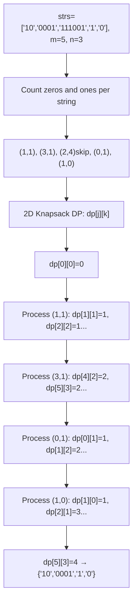
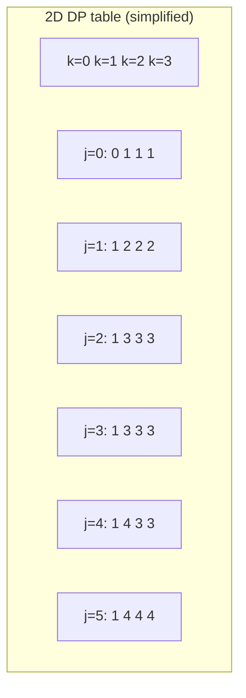
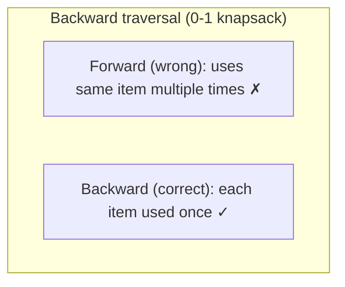

# LeetCode 474. Ones and Zeroes（一和零） — **中等**

## 考点
数组, 字符串, 动态规划

## 题目描述
给你一个二进制字符串数组 strs 和两个整数 m 和 n。

请你找出并返回 strs 的最大子集的长度，该子集中最多有 m 个 0 和 n 个 1。

如果 x 的所有元素也是 y 的元素，集合 x 是集合 y 的子集。

**示例 1:**
```
输入：strs = ["10", "0001", "111001", "1", "0"], m = 5, n = 3
输出：4
解释：最多有 5 个 0 和 3 个 1 的最大子集是 {"10","0001","1","0"} ，因此答案是 4 。
其他满足题意但较小的子集包括 {"0001","1"} 和 {"10","1","0"} 。{"111001"} 不满足题意，因为它含 4 个 1 ，大于 n 的值 3 。
```

**示例 2:**
```
输入：strs = ["10", "0", "1"], m = 1, n = 1
输出：2
解释：最大的子集是 {"0", "1"} ，所以答案是 2 。
```

**约束条件:**
- 1 <= strs.length <= 600
- 1 <= strs[i].length <= 100
- strs[i] 仅由 '0' 和 '1' 组成
- 1 <= m, n <= 100

## 图解







## 解题思路

### 核心思路

这是一个**二维费用的 0-1 背包问题**。每个字符串是一个「物品」，它消耗两种资源：`zeros` 个 0 和 `ones` 个 1。背包有两种容量限制：最多 m 个 0 和 n 个 1。

### 算法步骤

1. 预处理：统计每个字符串中 `0` 和 `1` 的个数 `(zeros, ones)`
2. 定义 `dp[j][k]`：使用 j 个 0 和 k 个 1 时，最多能选几个字符串
3. 初始化 `dp` 全为 0
4. 遍历每个字符串的 `(zeros, ones)`：
   - 倒序遍历 `j` 从 m 到 zeros（防止重复使用同一字符串）
   - 倒序遍历 `k` 从 n 到 ones
   - `dp[j][k] = max(dp[j][k], dp[j-zeros][k-ones] + 1)`
5. 返回 `dp[m][n]`

### 图解示例

```
strs = ["10", "0001", "111001", "1", "0"], m = 5, n = 3

预处理每个字符串的(0数, 1数):
  "10"      → (1, 1)
  "0001"    → (3, 1)
  "111001"  → (2, 4) → 1的个数4 > n=3，此物品直接跳过
  "1"       → (0, 1)
  "0"       → (1, 0)

有效物品: (1,1), (3,1), (0,1), (1,0)

dp 表 (j=0的数量, k=1的数量):

初始 dp 全为 0

处理 (1,1) "10":
        k=0  1  2  3
  j=0 [ 0,  0, 0, 0 ]
  j=1 [ 0,  1, 0, 0 ]  ← dp[1][1]=max(0, dp[0][0]+1)=1
  j=2 [ 0,  1, 0, 0 ]
  j=3 [ 0,  1, 0, 0 ]
  j=4 [ 0,  1, 0, 0 ]
  j=5 [ 0,  1, 0, 0 ]

处理 (3,1) "0001":
        k=0  1  2  3
  j=0 [ 0,  0, 0, 0 ]
  j=1 [ 0,  1, 0, 0 ]
  j=2 [ 0,  1, 0, 0 ]
  j=3 [ 0,  1, 0, 0 ]
  j=4 [ 0,  2, 0, 0 ]  ← dp[4][2]=max(dp[4][2], dp[1][1]+1)=2
  j=5 [ 0,  2, 0, 0 ]  ← 同理

处理 (0,1) "1":
        k=0  1  2  3
  j=0 [ 0,  1, 0, 0 ]  ← dp[0][1]=max(dp[0][1], dp[0][0]+1)=1
  j=1 [ 0,  2, 0, 0 ]  ← dp[1][2]=max(dp[1][2], dp[1][1]+1)=2
  ...
  j=5 [ 0,  3, 1, 1 ]  ← dp[5][3]=max(dp[5][3], dp[5][2]+1)=2

处理 (1,0) "0":
        k=0  1  2  3
  j=0 [ 0,  1, 0, 0 ]
  j=1 [ 1,  2, 0, 0 ]  ← dp[1][0]=1, dp[1][1]=max(1, dp[0][1]+1)=2
  j=2 [ 1,  3, 0, 0 ]  ← dp[2][1]=max(2, dp[1][1]+1)=3
  ...
  j=5 [ 1,  4, 2, 2 ]  ← dp[5][3]=max(2, dp[4][3]+1)=... 最终 dp[5][3]=4

结果: dp[5][3] = 4
子集: {"10","0001","1","0"}
```

### 逐步追踪

| 物品 | (0,1数) | j=5,k=3的更新 | 备注 |
|------|---------|-------------|------|
| "10" | (1,1) | dp[5][3]=max(0,dp[4][2]+1)=1 | |
| "0001" | (3,1) | dp[5][3]=max(1,dp[2][2]+1) | dp[2][2]由上一轮推导为1 |
| "111001" | (2,4) | 跳过（1的个数超限） | |
| "1" | (0,1) | dp[5][3]=max(1,dp[5][2]+1) | 逐步累加 |
| "0" | (1,0) | dp[5][3]=max(?,dp[4][3]+1) | 最终=4 |

### 边界情况

- 空字符串数组：返回 0
- m=0 或 n=0：只能选不含对应字符的字符串
- 某个字符串的 0/1 数量超过限制：该字符串永远无法入选，可跳过
- 所有字符串都超限：返回 0

### 复杂度分析

- **时间复杂度**：O(L × m × n)，L = strs.length。最坏 600 × 100 × 100 = 6×10⁶
- **空间复杂度**：O(m × n)，dp 二维数组

### 方法对比

| 方法 | 时间复杂度 | 空间复杂度 | 说明 |
|------|-----------|-----------|------|
| 二维背包 DP | O(L·m·n) | O(m·n) | 标准解法 |
| DFS + 记忆化 | O(L·m·n) | O(L·m·n) | 递归思路，空间较大 |
| 三维 DP (dp[i][j][k]) | O(L·m·n) | O(L·m·n) | 最直观但空间浪费 |
