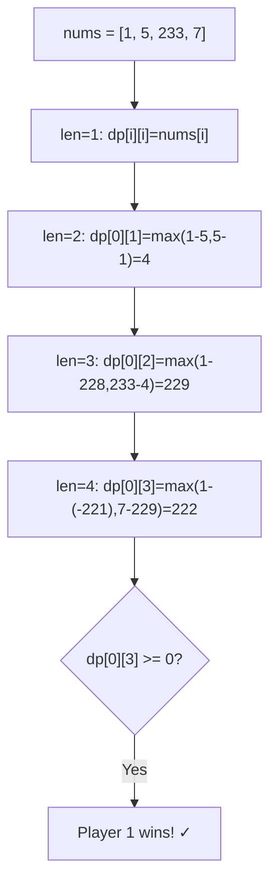
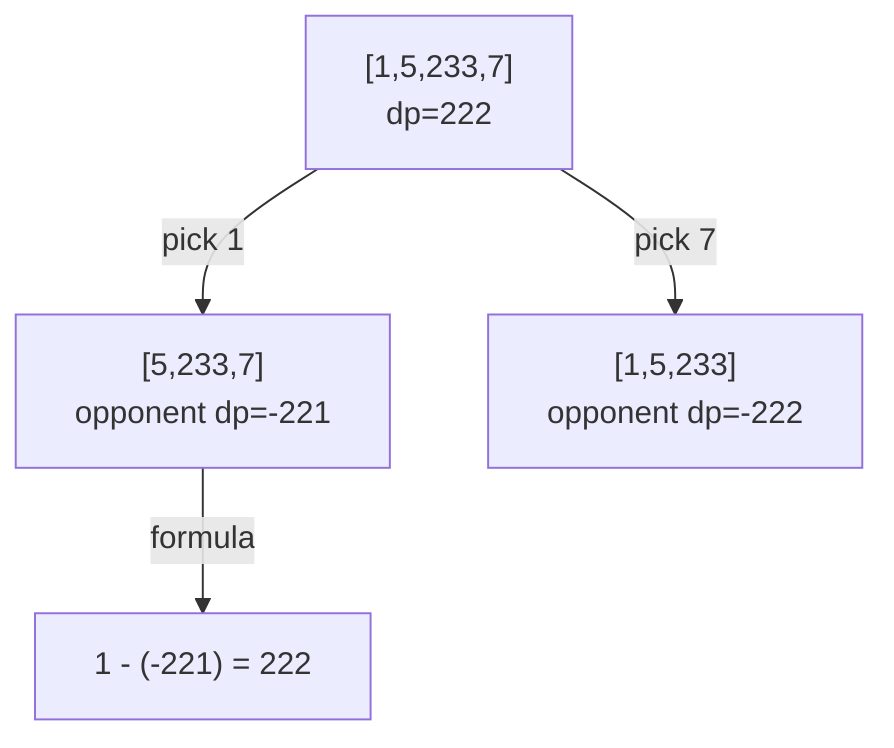
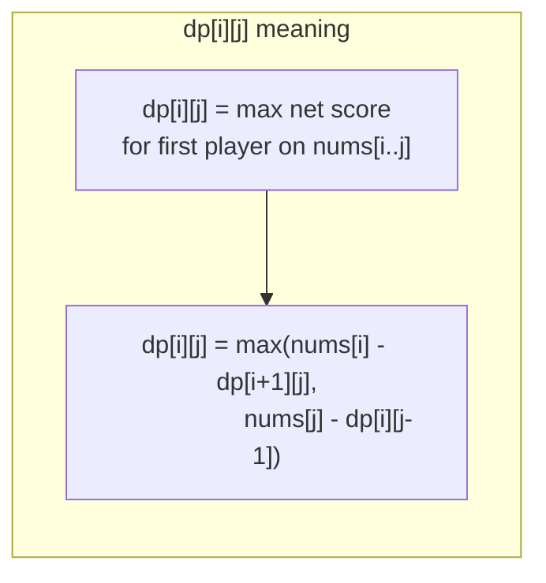

# LeetCode 486. Predict the Winner（预测赢家） — **中等**

## 考点
递归, 数组, 数学, 动态规划, 博弈论

## 题目描述
给你一个整数数组 nums。玩家 1 和玩家 2 基于这个数组设计了一个游戏。

玩家 1 和玩家 2 轮流进行自己的回合，玩家 1 先手。开始时，两个玩家的初始分值都是 0。每一回合，玩家从数组的任意一端（即 nums[0] 或 nums[nums.length - 1]）取走一个数字，取到的数字将会从数组中移除。玩家选中的数字将会加到他的得分上。当数组中没有剩余数字可取时，游戏结束。

如果玩家 1 能成为赢家，返回 true。如果两个玩家得分相等，同样认为玩家 1 是赢家，也返回 true。你可以假设每个玩家的玩法都会使他的分数最大化。

**示例 1:**
```
输入：nums = [1,5,2]
输出：false
解释：一开始，玩家 1 可以从 1 和 2 中选择。
如果他选择 2（或者 1 ），那么玩家 2 可以从 1（或者 2）和 5 中选择。如果玩家 2 选择了 5 ，那么玩家 1 最后只剩下 1 可以选。
所以，玩家 1 的最终分数为 1+1=2，而玩家 2 为 5。
因此，玩家 1 永远不会成为赢家，返回 false。
```

**示例 2:**
```
输入：nums = [1,5,233,7]
输出：true
解释：玩家 1 一开始选择 1。然后玩家 2 必须从 5 和 7 中进行选择。无论玩家 2 选择了哪个，玩家 1 都可以选择 233。
最终，玩家 1（234 分）比玩家 2（12 分）获得更多的分数，所以返回 true。
```

**约束条件:**
- 1 <= nums.length <= 20
- 0 <= nums[i] <= 10^7

## 图解







## 解题思路

### 核心思路

**博弈型动态规划**。定义 `dp[i][j]` 为当数组剩下 `nums[i..j]` 时，**当前先手玩家能够获得的最大净胜分**（即先手得分 - 后手得分）。

### 算法步骤

1. 定义 `dp[i][j]`：子数组 `nums[i..j]` 中先手能获得的最大净胜分
2. 初始化 `dp[i][i] = nums[i]`（只剩一个数，先手直接拿走）
3. 按区间长度 `len` 从 2 到 n 递推：
   - `dp[i][j] = max(nums[i] - dp[i+1][j], nums[j] - dp[i][j-1])`
   - 解释：选 nums[i] 则净胜分 = nums[i] - 对手在 `[i+1,j]` 的最优净胜分
   - 同理选 nums[j]：净胜分 = nums[j] - 对手在 `[i,j-1]` 的最优净胜分
4. 返回 `dp[0][n-1] >= 0`

### 图解示例

```
nums = [1, 5, 233, 7]

dp 表计算过程（按区间长度递推）：

len=1 (初始化):
  dp[0][0]=1    dp[1][1]=5    dp[2][2]=233    dp[3][3]=7

len=2:
  dp[0][1] = max(1 - dp[1][1], 5 - dp[0][0]) = max(1-5, 5-1) = max(-4, 4) = 4
            └─选1,对手得净胜5→净胜-4    └─选5,对手得净胜1→净胜4
  dp[1][2] = max(5 - 233, 233 - 5) = max(-228, 228) = 228
  dp[2][3] = max(233 - 7, 7 - 233) = max(226, -226) = 226

len=3:
  dp[0][2] = max(1 - dp[1][2], 233 - dp[0][1])
           = max(1 - 228, 233 - 4) = max(-227, 229) = 229
  dp[1][3] = max(5 - dp[2][3], 7 - dp[1][2])
           = max(5 - 226, 7 - 228) = max(-221, -221) = -221

len=4:
  dp[0][3] = max(1 - dp[1][3], 7 - dp[0][2])
           = max(1 - (-221), 7 - 229) = max(222, -222) = 222

dp[0][3] = 222 >= 0 → Alice 获胜, 返回 true
```

```
决策树可视化:

                 [1,5,233,7]
                  /         \
          选1→[5,233,7]    选7→[1,5,233]
              dp=222.         dp=-222.
              
      选1后的子问题:
      [5,233,7] → Bob 作为先手
      如果 Bob 表现最优，他在 [5,233,7] 的净胜分是 -221
      (说明 Alice 在这个子问题中比 Bob 多 221)
      Alice 拿走 1 后净胜分 = 1 + 221 = 222...实际公式是 1 - (-221) = 222 ✓
```

### 逐步追踪（dp 表）

| len | i | j | 选nums[i] | 选nums[j] | dp[i][j] |
|-----|---|---|-----------|-----------|----------|
| 1 | 0 | 0 | - | - | 1 |
| 1 | 1 | 1 | - | - | 5 |
| 1 | 2 | 2 | - | - | 233 |
| 1 | 3 | 3 | - | - | 7 |
| 2 | 0 | 1 | 1-5=-4 | 5-1=4 | 4 |
| 2 | 1 | 2 | 5-233=-228 | 233-5=228 | 228 |
| 2 | 2 | 3 | 233-7=226 | 7-233=-226 | 226 |
| 3 | 0 | 2 | 1-228=-227 | 233-4=229 | 229 |
| 3 | 1 | 3 | 5-226=-221 | 7-228=-221 | -221 |
| 4 | 0 | 3 | 1-(-221)=222 | 7-229=-222 | 222 |

### 边界情况

- `n = 1`：先手直接赢，返回 true
- `n = 2`：选较大的那个，净胜分 = max - min >= 0 恒成立
- 数学性质：只要先手可以控制选择，如果总数不同即可获胜（但 DP 方法是通用的）

### 复杂度分析

- **时间复杂度**：O(n²)，填充 n×n 的 dp 表
- **空间复杂度**：O(n²)，可优化至 O(n) 使用一维滚动数组

### 方法对比

| 方法 | 时间复杂度 | 空间复杂度 | 说明 |
|------|-----------|-----------|------|
| 区间 DP | O(n²) | O(n²) | 通用解法 |
| 一维滚动 DP | O(n²) | O(n) | 空间优化版 |
| 记忆化递归 | O(n²) | O(n²) | 自顶向下 |
| 数学法（仅本题） | O(1) | O(1) | 先手总能赢（但需要验证） |
