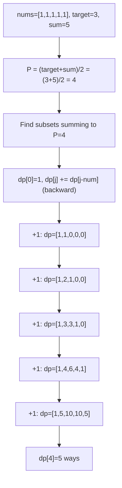
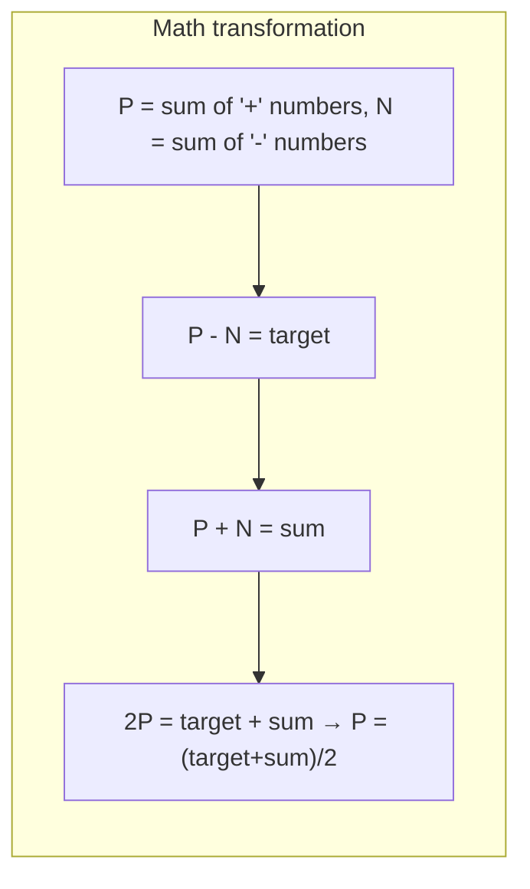
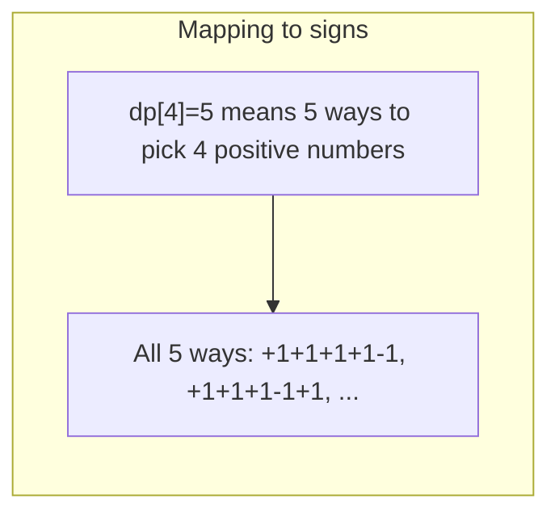

# LeetCode 494. Target Sum（目标和） — **中等**

## 考点
数组, 动态规划, 回溯

## 题目描述
给你一个非负整数数组 nums 和一个整数 target。

向数组中的每个整数前添加 '+' 或 '-'，然后串联起所有整数，可以构造一个表达式：
- 例如，nums = [2, 1]，可以在 2 之前添加 '+'，在 1 之前添加 '-'，然后串联起来得到表达式 "+2-1"。

返回可以通过上述方法构造的、运算结果等于 target 的不同表达式的数目。

**示例 1:**
```
输入：nums = [1,1,1,1,1], target = 3
输出：5
解释：一共有 5 种方法让最终目标和为 3。
-1 +1 +1 +1 +1 = 3
+1 -1 +1 +1 +1 = 3
+1 +1 -1 +1 +1 = 3
+1 +1 +1 -1 +1 = 3
+1 +1 +1 +1 -1 = 3
```

**示例 2:**
```
输入：nums = [1], target = 1
输出：1
```

**约束条件:**
- 1 <= nums.length <= 20
- 0 <= nums[i] <= 1000
- 0 <= sum(nums[i]) <= 1000
- -1000 <= target <= 1000

## 图解







## 解题思路

### 核心思路

将问题**转化为 0-1 背包求方案数**。设添加 `+` 号数字之和为 P，添加 `-` 号数字之和为 N，总和为 sum。

```
P - N = target
P + N = sum
⇒ 2P = target + sum
⇒ P = (target + sum) / 2
```

问题变为：在 nums 中选择一些数字使其和恰好等于 P，求方案数。

### 算法步骤

1. 计算 `sum = Σ nums[i]`
2. 若 `(target + sum)` 为奇数，或 `abs(target) > sum`：返回 0
3. 设 `P = (target + sum) / 2`
4. 定义 `dp[j]`：选出和为 j 的子集的方案数，`dp[0] = 1`
5. 遍历每个 `num`：
   - 倒序遍历 j 从 P 到 num：`dp[j] += dp[j - num]`
6. 返回 `dp[P]`

### 图解示例

```
nums = [1,1,1,1,1], target = 3
sum = 5, P = (3+5)/2 = 4

问题: 选出和为 4 的子集有几种方案？

dp 数组演变:

初始: dp = [1, 0, 0, 0, 0]  (dp[0]=1, 空集)

处理 num=1 (倒序):
  dp[4] += dp[3] = 0
  dp[3] += dp[2] = 0
  dp[2] += dp[1] = 0
  dp[1] += dp[0] = 1
  dp = [1, 1, 0, 0, 0]

处理 num=1:
  dp[4] += dp[3] = 0
  dp[3] += dp[2] = 0
  dp[2] += dp[1] = 1
  dp[1] += dp[0] = 1
  dp = [1, 2, 1, 0, 0]

处理 num=1:
  dp[4] += dp[3] = 0
  dp[3] += dp[2] = 1
  dp[2] += dp[1] = 2
  dp[1] += dp[0] = 1
  dp = [1, 3, 3, 1, 0]

处理 num=1:
  dp[4] += dp[3] = 1
  dp[3] += dp[2] = 3
  dp[2] += dp[1] = 3
  dp[1] += dp[0] = 1
  dp = [1, 4, 6, 4, 1]

处理 num=1:
  dp[4] += dp[3] = 4
  dp[3] += dp[2] = 6
  dp[2] += dp[1] = 4
  dp[1] += dp[0] = 1
  dp = [1, 5, 10, 10, 5]

结果: dp[4] = 5

验证 (选出 4 个元素的和):
  选 4 个 1: 共 C(5,4)=5 种 ✓
```

```
符号分配对应关系:
  P=4 意味着选 4 个正号, N=1 意味着 1 个负号
  +1+1+1+1-1 = 3 ✓
  +1+1+1-1+1 = 3 ✓
  +1+1-1+1+1 = 3 ✓
  +1-1+1+1+1 = 3 ✓
  -1+1+1+1+1 = 3 ✓
```

### 逐步追踪

以 `nums = [1,2,1], target = 0` 为例：
`sum = 4, P = (0+4)/2 = 2`

| 处理 num | j 遍历方向 | dp[4] | dp[3] | dp[2] | dp[1] | dp[0] |
|----------|-----------|-------|-------|-------|-------|-------|
| 初始 | - | 0 | 0 | 0 | 0 | 1 |
| 1 | P→1 | 0+dp[3] | 0+dp[2] | 0+dp[1]=1 | 0+dp[0]=1 | 1 |
| 2 | P→2 | 0+dp[2] | 0+dp[1] | 1+dp[0]=2 | 1 | 1 |
| 1 | P→1 | 0+dp[3] | 0+dp[2] | 2+dp[1]=3 | 1+dp[0]=2 | 1 |

结果 dp[2] = 3
对应方案: (+1+2-1), (+1-2+1), (-1+2+1) → 都等于 0

### 边界情况

- `target > sum` 或 `target < -sum`：不可能，返回 0
- `(target + sum)` 是奇数：无法整除，返回 0
- 有 0 元素：每个 0 可选 `+` 或 `-`，方案数翻倍
- `P < 0`：同样不可能，返回 0

### 复杂度分析

- **时间复杂度**：O(n × P)，其中 P = (target+sum)/2
- **空间复杂度**：O(P)，一维 dp 数组

### 方法对比

| 方法 | 时间复杂度 | 空间复杂度 | 说明 |
|------|-----------|-----------|------|
| 0-1 背包 DP | O(n·P) | O(P) | 最优解 |
| DFS + 记忆化 | O(n·sum) | O(n·sum) | 递归搜索每种符号组合 |
| 回溯 | O(2^n) | O(n) | 暴力，仅在 n≤20 时可行 |
