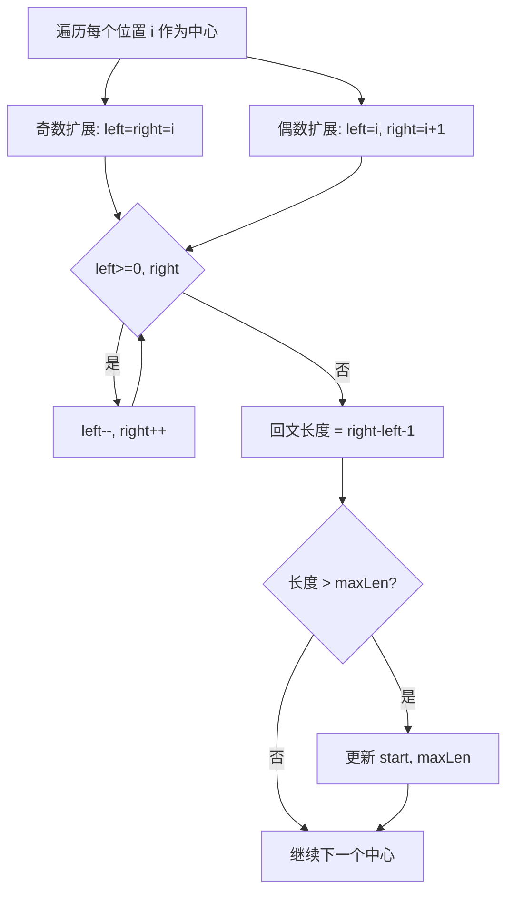

# LeetCode 5. Longest Palindromic Substring（最长回文子串） — **中等**

## 考点
String, Dynamic Programming, Two Pointers

## 题目描述
给你一个字符串 `s`，找到 `s` 中最长的回文子串。

**示例 1：**
```
输入：s = "babad"
输出："bab"
解释："aba" 同样是符合题意的答案。
```

**示例 2：**
```
输入：s = "cbbd"
输出："bb"
```

**提示：**
- `1 <= s.length <= 1000`
- `s` 仅由数字和英文字母组成

## 图解



## 解题思路

### 核心思路
回文串是关于中心对称的。与其枚举所有子串再判断是否为回文，不如从每个可能的"中心"出发，向两边扩展，找到以该中心的最长回文。这样每个中心只需要 O(n) 时间。

### 算法步骤

**方法一：动态规划**

1. 定义 `dp[i][j]` 表示 `s[i..j]` 是否为回文子串
2. 初始化：所有长度为 1 的子串都是回文，`dp[i][i] = true`
3. 初始化：长度为 2 的子串，如果 `s[i] == s[i+1]` 则是回文
4. 按子串长度从 3 到 n 填充 DP 表：
   - `dp[i][j] = (s[i] == s[j]) && dp[i+1][j-1]`
   - 如果 `dp[i][j]` 为 true 且长度更大，更新结果

**方法二：中心扩展法（推荐，空间最优）**

1. 遍历字符串每个位置 i，将 i 作为回文中心
2. 对每个中心，分两种情况扩展：
   - **奇数长度回文**：以 `i` 为中心，`left = i, right = i`
   - **偶数长度回文**：以 `i` 和 `i+1` 之间为中心，`left = i, right = i + 1`
3. 扩展过程：只要 `left >= 0` 且 `right < n` 且 `s[left] == s[right]`：
   - `left--`（向左扩展）
   - `right++`（向右扩展）
4. 扩展停止后，当前回文长度为 `right - left - 1`
5. 更新最长回文的起始位置 `start = left + 1` 和最大长度 `maxLen`
6. 最终返回 `s.substring(start, start + maxLen)`

### 图解示例

以输入 `s = "babad"` 为例，使用中心扩展法：

```
字符串： b  a  b  a  d
索引：   0  1  2  3  4

═══════════════════════════════════════
中心 i=0, 字符='b'

  奇数扩展 {0,0}:
      b       → "b" (长1), maxLen=1, start=0
      ↑
  偶数扩展 {0,1}:
      b a     → s[0]!=s[1], 停止

═══════════════════════════════════════
中心 i=1, 字符='a'

  奇数扩展 {1,1}:
      a       → "a" (长1)
      ↑
  偶数扩展 {1,2}:
      b a b   → s[1]!=s[2], 停止

═══════════════════════════════════════
中心 i=2, 字符='b'

  奇数扩展 {2,2} → {1,3} → {0,4}:
      Step 1:    [b]         → "b" (长1)
                  ↑
      Step 2:   [a b a]      → "aba" (长3), s[1]==s[3]='a'
                 ↑   ↑
      Step 3:  [b a b a]     → s[0]!=s[4]('b'≠'d'), 停止
                ↑     ↑
      回文 "aba", 长度3, maxLen=3, start=1

  偶数扩展 {2,3}:
      b a     → s[2]!=s[3], 停止

═══════════════════════════════════════
中心 i=3, 字符='a'

  奇数扩展 {3,3}:
          a   → "a" (长1)
          ↑
  偶数扩展 {3,4}:
        a d   → s[3]!=s[4], 停止

═══════════════════════════════════════
中心 i=4, 字符='d'

  奇数扩展 {4,4}:
            d → "d" (长1)
            ↑
  偶数扩展: 越界，停止

最终结果：maxLen=3, start=1 → "bab"（或 "aba" 取决于先找到哪个）
```

### 逐步追踪（DP 方法）

以输入 `s = "cbbd"` 为例：

```
DP 表初始化：
    c  b  b  d
c   1  ?  ?  ?
b   -  1  ?  ?
b   -  -  1  ?
d   -  -  -  1

按长度遍历：

长度=2:
  子串 "cb"(0,1): s[0]!=s[1] → dp[0][1]=0
  子串 "bb"(1,2): s[1]==s[2] → dp[1][2]=1, maxLen=2, start=1
  子串 "bd"(2,3): s[2]!=s[3] → dp[2][3]=0

长度=3:
  子串 "cbb"(0,2): s[0]!=s[2] → dp[0][2]=0
  子串 "bbd"(1,3): s[1]!=s[3] → dp[1][3]=0

长度=4:
  子串 "cbbd"(0,3): s[0]!=s[3] → dp[0][3]=0

最终 DP 表：
    c  b  b  d
c   1  0  0  0
b   -  1  1  0
b   -  -  1  0
d   -  -  -  1

maxLen=2, start=1 → "bb"
```

### 边界情况

1. **字符串长度为 1**（如 "a"）：直接返回 "a"
2. **整个字符串是回文**（如 "racecar"）：中心扩展会扩展到整个字符串
3. **无长度 >1 的回文**（如 "abcd"）：返回第一个字符或任意一个字符
4. **最长回文在末尾**（如 "aabbaa"）：中心扩展能正确处理
5. **多个相同长度的回文**：返回先找到的那个（都正确）

### 复杂度分析

**中心扩展法：**
- 时间复杂度：O(n²) — 共 2n-1 个中心，每个中心最多扩展 O(n) 次
- 空间复杂度：O(1) — 只使用几个变量

**动态规划法：**
- 时间复杂度：O(n²) — 填充 n × n 的 DP 表
- 空间复杂度：O(n²) — DP 表（可优化到 O(n)）

### 方法对比

| 方法 | 时间复杂度 | 空间复杂度 | 优点 | 缺点 |
|------|-----------|-----------|------|------|
| 暴力枚举所有子串 | O(n³) | O(1) | 最直观 | 太慢 |
| 动态规划 | O(n²) | O(n²) | 思路清晰 | 空间大 |
| 中心扩展 | O(n²) | O(1) | 空间最优，代码简洁 | — |
| Manacher 算法 | O(n) | O(n) | 线性时间 | 代码复杂，不常考 |

推荐在实际面试中使用中心扩展法，代码简洁且空间最优。
