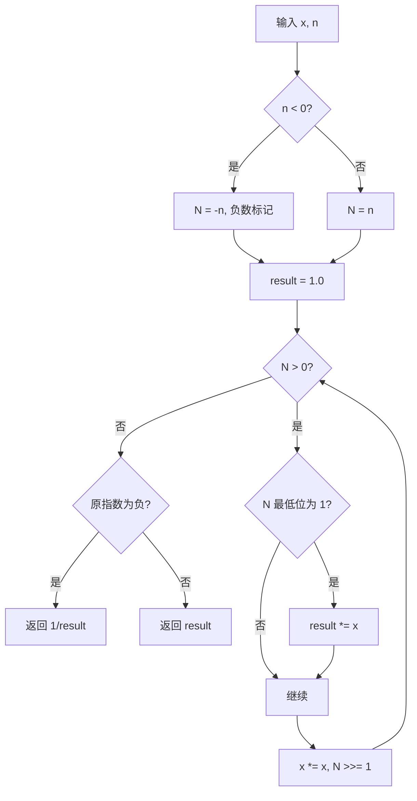

# LeetCode 50. Pow(x, n)（Pow(x, n)） — **中等**

## 考点
Recursion, Math

## 题目描述
实现 `pow(x, n)`，即计算 `x` 的整数 `n` 次幂函数（即 `x^n`）。

### 示例 1
```
输入：x = 2.00000, n = 10
输出：1024.00000
```

### 示例 2
```
输入：x = 2.10000, n = 3
输出：9.26100
```

### 示例 3
```
输入：x = 2.00000, n = -2
输出：0.25000
解释：2^(-2) = 1/(2^2) = 1/4 = 0.25
```

### 约束
- `-100.0 < x < 100.0`
- `-2^31 <= n <= 2^31 - 1`
- `n` 是一个整数
- 要么 `x` 不为零，要么 `n > 0`
- `-10^4 <= x^n <= 10^4`

## 图解



## 解题思路

### 核心思路
快速幂是分治思想的经典应用。指数运算 `x^n` 可以利用指数的二进制性质，每次将问题规模减半，将 O(n) 的朴素累乘优化为 O(log n)。

**核心洞察：** 任何整数 n 都可以二进制分解。例如 n = 13 = 1101₂ = 8 + 4 + 1，所以 x^13 = x^8 × x^4 × x^1。遍历 n 的二进制位，x 持续平方，遇到 1 就累乘。

### 算法步骤（迭代法）

1. 处理负指数：若 n < 0，记录符号，将 n 转为正数（注意 INT_MIN 溢出，用 long）
2. 初始化 result = 1.0
3. 当 n > 0 时循环：
   - 若 n 的当前最低位为 1（n % 2 == 1）：result *= x
   - x *= x（底数平方）
   - n >>= 1（指数右移一位）
4. 若原始指数为负，返回 1 / result；否则返回 result

### 图解示例

**例子：x = 2.0, n = 10**

```
n 的二进制: 1010₂
        ┌─┬─┬─┬─┐
        │1│0│1│0│  <-- 从右往左遍历每一位
        └─┴─┴─┴─┘
         ↓ ↓ ↓ ↓
x 自平方: x → x^2 → x^4 → x^8
累乘:             ↑       ↑
   x^2  (n bit=1)  x^8  (n bit=1)
                 
结果 = x^2 × x^8 = x^10 = 1024
```

**例子：x = 2.0, n = -2**

```
n = -2  →  转为正数 n = 2  →  计算 2^2 = 4
                    ↓
              返回 1/4 = 0.25
```

### 逐步追踪

**输入：x = 3.0, n = 5 (二进制: 101)**

| 轮次 | n (当前) | n的末位 | x (累积) | result | 操作 |
|------|---------|---------|----------|--------|------|
| 初始 | 5       | -       | 3.0      | 1.0    | - |
| 1    | 5       | 1 (奇数)| 3.0      | **3.0** | result *= x; x *= x; n >>= 1 |
| 2    | 2       | 0 (偶数)| 9.0      | 3.0    | x *= x; n >>= 1 |
| 3    | 1       | 1 (奇数)| 81.0     | **243.0** | result *= x; x *= x; n >>= 1 |
| 4    | 0       | -       | -        | 243.0   | 循环结束 |

### 边界情况

| 情况 | 输入 | 处理方式 | 结果 |
|------|------|----------|------|
| n = 0 | x=2.0, n=0 | 直接返回 1.0 | 1.0 |
| n 为负数 | x=2.0, n=-3 | 转为正数计算再取倒数 | 0.125 |
| n = INT_MIN | x=2.0, n=-2^31 | 用 long 存储，避免溢出 | 0.0 |
| x = 1.0 | x=1.0, n=10000 | 直接返回 1.0（剪枝） | 1.0 |
| x = -1.0 | x=-1.0, n=10000 | 偶数次幂为正 | 1.0 |
| x = 0.0 | x=0.0, n=5 | 直接返回 0 | 0.0 |

### 方法对比

**方法一：递归分治（直观但需栈空间）**
```
pow(x, n):
  if n == 0: return 1
  half = pow(x, n/2)
  if n % 2 == 0: return half * half
  else: return half * half * x
```

**方法二：迭代快速幂（推荐）**
```
pow(x, n):
  if x == 1.0: return 1.0
  long N = abs((long)n)  // 防止溢出
  result = 1.0
  while N > 0:
    if N & 1: result *= x
    x *= x
    N >>= 1
  return n < 0 ? 1/result : result
```

### 复杂度分析

- **迭代法：** 时间复杂度 O(log n)，空间复杂度 O(1)
- **递归法：** 时间复杂度 O(log n)，空间复杂度 O(log n)（递归栈深度）
- 每次循环指数 n 减半，对数级别循环次数
