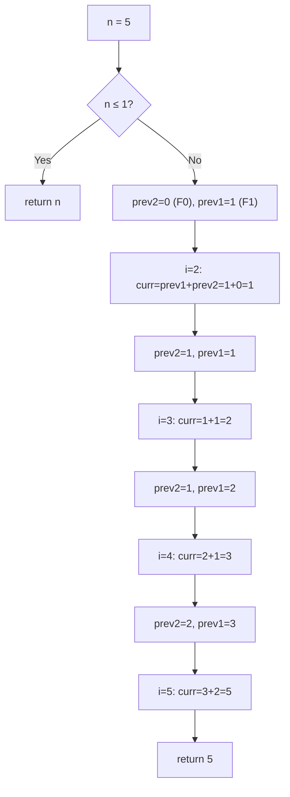
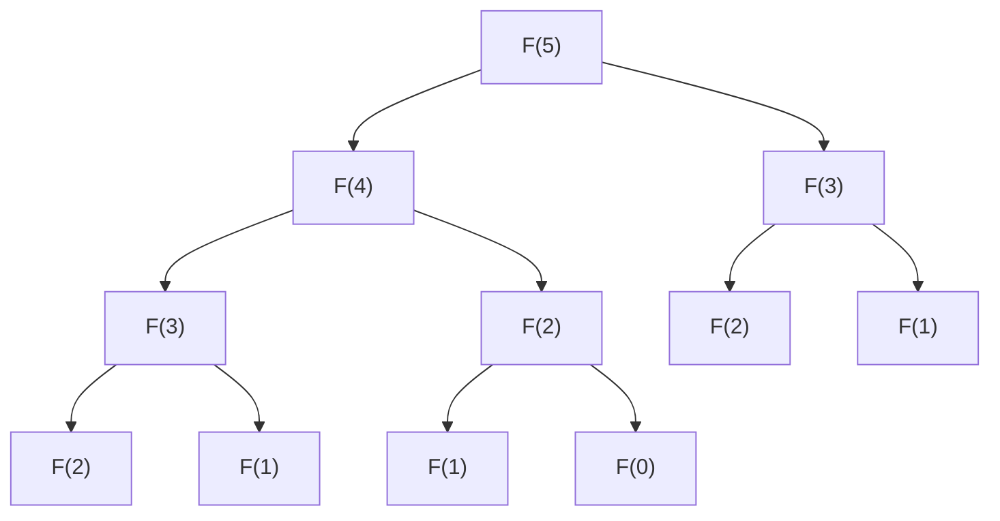

# LeetCode 509. Fibonacci Number（斐波那契数） — **简单**

## 考点
递归, 记忆化搜索, 数学, 动态规划

## 题目描述
斐波那契数（通常用 F(n) 表示）形成的序列称为斐波那契数列。该数列由 0 和 1 开始，后面的每一项数字都是前面两项数字的和。也就是：
- F(0) = 0，F(1) = 1
- F(n) = F(n - 1) + F(n - 2)，其中 n > 1

给定 n，请计算 F(n)。

**示例 1:**
```
输入：n = 2
输出：1
解释：F(2) = F(1) + F(0) = 1 + 0 = 1
```

**示例 2:**
```
输入：n = 3
输出：2
解释：F(3) = F(2) + F(1) = 1 + 1 = 2
```

**示例 3:**
```
输入：n = 4
输出：3
解释：F(4) = F(3) + F(2) = 2 + 1 = 3
```

**约束条件:**
- 0 <= n <= 30

## 图解






## 解题思路

### 核心思路

斐波那契数列经典入门题，展示多种 DP 技巧。最简单的迭代法：用两个变量滚动，从底向上递推。数学上：F(n) = F(n-1) + F(n-2)，F(0)=0，F(1)=1。

### 算法步骤

**方法一：迭代滚动变量（推荐）**

1. 若 n ≤ 1，返回 n
2. `prev2 = 0`（F(0)），`prev1 = 1`（F(1)）
3. 循环 i 从 2 到 n：
   - `curr = prev1 + prev2`
   - `prev2 = prev1`，`prev1 = curr`
4. 返回 prev1

**方法二：递归 + 记忆化**

1. 维护数组 memo[n+1]，memo[0]=0, memo[1]=1
2. `fib(k) = memo[k] 已计算 ? memo[k] : memo[k] = fib(k-1) + fib(k-2)`

**方法三：矩阵快速幂**

利用 $$\begin{pmatrix} F(n) \\ F(n-1) \end{pmatrix} = \begin{pmatrix} 1 & 1 \\ 1 & 0 \end{pmatrix}^{n-1} \begin{pmatrix} F(1) \\ F(0) \end{pmatrix}$$ 在 O(log n) 内求解。

### 图解示例

```
n = 5

迭代法追踪:
  i=2: curr = prev1 + prev2 = 1 + 0 = 1
        prev2=1, prev1=1
  i=3: curr = 1 + 1 = 2
        prev2=1, prev1=2
  i=4: curr = 2 + 1 = 3
        prev2=2, prev1=3
  i=5: curr = 3 + 2 = 5
        prev2=3, prev1=5

结果: F(5) = 5
```

```
递归树 (n=5):

                    F(5)
                  /      \
              F(4)        F(3)
             /    \       /    \
         F(3)     F(2)  F(2)   F(1)
        /    \    /  \   /  \
     F(2)  F(1) F(1) F(0) F(1) F(0)
    /   \
 F(1)  F(0)

无记忆化: 大量重复计算 (F(2) 计算了 3 次!)
记忆化:    每个 F(k) 只计算一次
```

```
迭代过程可视化:
  n=0: 0  (prev1=0)
  n=1: 1  (prev1=1, prev2=0)
  n=2: 0 → 1 → (0+1=1)
        ↓   ↓
       p2  p1
  n=3: 1 → 1 → (1+1=2)
        ↓   ↓
       p2  p1
  n=4: 1 → 2 → (1+2=3)
        ↓   ↓
       p2  p1
  n=5: 2 → 3 → (2+3=5)
        ↓   ↓
       p2  p1
```

### 逐步追踪

| n | prev2 (F(i-2)) | prev1 (F(i-1)) | curr = prev1+prev2 |
|---|----------------|----------------|-------------------|
| 0 | - | 0 | F(0)=0 |
| 1 | 0 | 1 | F(1)=1 |
| 2 | 0 | 1 | 1 |
| 3 | 1 | 1 | 2 |
| 4 | 1 | 2 | 3 |
| 5 | 2 | 3 | 5 |
| 6 | 3 | 5 | 8 |
| 7 | 5 | 8 | 13 |
| .. | .. | .. | .. |

### 边界情况

- `n = 0`：返回 0
- `n = 1`：返回 1
- `n = 30`：F(30) = 832040，在 int 范围内

### 复杂度分析

| 方法 | 时间复杂度 | 空间复杂度 |
|------|-----------|-----------|
| 迭代滚动 | O(n) | O(1) |
| 递归+记忆化 | O(n) | O(n) |
| 递归无记忆化 | O(2ⁿ) | O(n) |
| 矩阵快速幂 | O(log n) | O(1) |
| 通项公式(Binet) | O(1) | O(1) |

### 方法对比

| 方法 | 优点 | 缺点 |
|------|------|------|
| 迭代滚动 | 最优空间 | n 大到溢出时需要大整数 |
| 递归+记忆化 | 直观 | 需要 O(n) 空间 |
| 矩阵快速幂 | O(log n) | 代码复杂，n 小的时候杀鸡用牛刀 |
| Binet 公式 | O(1) | 浮点精度问题，不精确 |
