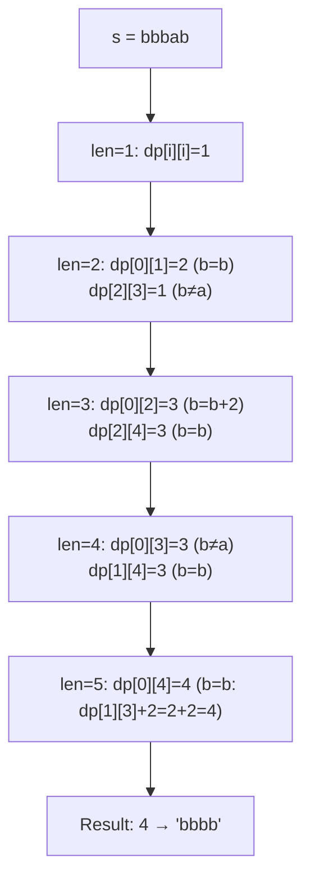
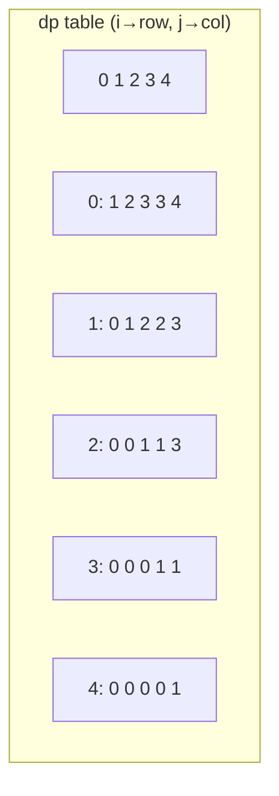
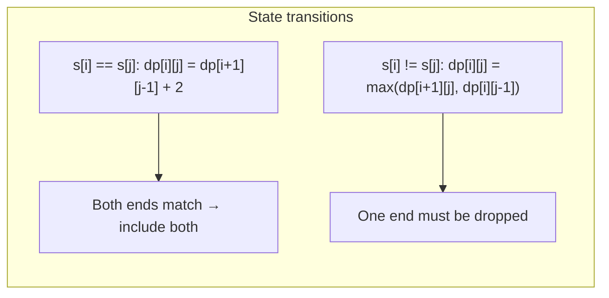

# LeetCode 516. Longest Palindromic Subsequence（最长回文子序列） — **中等**

## 考点
字符串, 动态规划

## 题目描述
给你一个字符串 s，找出其中最长的回文子序列，并返回该序列的长度。

子序列定义为：不改变剩余字符顺序的情况下，删除某些字符或者不删除任何字符形成的一个序列。

**示例 1:**
```
输入：s = "bbbab"
输出：4
解释：一个可能的最长回文子序列是 "bbbb"。
```

**示例 2:**
```
输入：s = "cbbd"
输出：2
解释：一个可能的最长回文子序列是 "bb"。
```

**约束条件:**
- 1 <= s.length <= 1000
- s 仅由小写英文字母组成

## 图解







## 解题思路

### 核心思路

**区间 DP**。`dp[i][j]` 表示子串 `s[i..j]` 中最长回文子序列的长度。核心递推：首尾字符相同时可以同时加入回文，否则至少舍弃一端。

### 算法步骤

1. 定义 `dp[i][j]`：`s[i..j]` 的最长回文子序列长度
2. 初始化 `dp[i][i] = 1`（单字符回文长度 1）
3. 按区间长度 `len` 从 2 到 n 遍历：
   - 若 `s[i] == s[j]`：`dp[i][j] = dp[i+1][j-1] + 2`
   - 若 `s[i] != s[j]`：`dp[i][j] = max(dp[i+1][j], dp[i][j-1])`
4. 返回 `dp[0][n-1]`

**空间优化**：`dp[i][j]` 只依赖 `dp[i+1][j-1]`、`dp[i+1][j]`、`dp[i][j-1]`，可使用一维滚动数组优化到 O(n)。

### 图解示例

```
s = "bbbab", n = 5

dp 表填充过程:

len=1: dp[i][i] = 1
  dp[0][0]=1  dp[1][1]=1  dp[2][2]=1  dp[3][3]=1  dp[4][4]=1

len=2:
  dp[0][1]: s[0]='b', s[1]='b' → 相同 → dp[1][0]+2
            但 dp[1][0] 是无效区间(i>j), 视为 0 → dp[0][1]=2
  dp[1][2]: s[1]='b', s[2]='b' → 相同 → dp[0][0]? 不,是dp[2][1]+2=0+2=2
            实际: dp[1][2] = dp[2][1] + 2 = 0 + 2 = 2
  dp[2][3]: 'b' vs 'a' → 不同 → max(dp[3][3], dp[2][2]) = max(1,1) = 1
  dp[3][4]: 'a' vs 'b' → 不同 → max(dp[4][4], dp[3][3]) = max(1,1) = 1

len=3:
  dp[0][2]: 'b' vs 'b' → 相同 → dp[1][1]+2 = 1+2 = 3
  dp[1][3]: 'b' vs 'a' → 不同 → max(dp[2][3], dp[1][2]) = max(1,2) = 2
  dp[2][4]: 'b' vs 'b' → 相同 → dp[3][3]+2 = 1+2 = 3

len=4:
  dp[0][3]: 'b' vs 'a' → 不同 → max(dp[1][3], dp[0][2]) = max(2,3) = 3
  dp[1][4]: 'b' vs 'b' → 相同 → dp[2][3]+2 = 1+2 = 3

len=5:
  dp[0][4]: 'b' vs 'b' → 相同 → dp[1][3]+2 = 2+2 = 4

dp 表 (j→):
      0  1  2  3  4
  0 [ 1  2  3  3  4 ]
  1 [ 0  1  2  2  3 ]  (下三角部分为0或未使用)
  2 [ 0  0  1  1  3 ]
  3 [ 0  0  0  1  1 ]
  4 [ 0  0  0  0  1 ]

结果: dp[0][4] = 4, 对应 "bbbb"
```

```
子序列构造: s = "bbbab"

选择 s[0]='b', s[1]='b', s[2]='b', s[4]='b'
        跳过 s[3]='a'
        得到 "bbbb"
```

### 逐步追踪

| len | i | j | s[i] | s[j] | 相同? | 公式 | dp[i][j] |
|-----|---|---|------|------|-------|------|----------|
| 1 | 0-4 | 0-4 | - | - | - | base | 1 |
| 2 | 0 | 1 | b | b | Y | dp[1][0]+2=2 | 2 |
| 2 | 1 | 2 | b | b | Y | dp[2][1]+2=2 | 2 |
| 2 | 2 | 3 | b | a | N | max(1,1)=1 | 1 |
| 2 | 3 | 4 | a | b | N | max(1,1)=1 | 1 |
| 3 | 0 | 2 | b | b | Y | dp[1][1]+2=3 | 3 |
| 3 | 1 | 3 | b | a | N | max(1,2)=2 | 2 |
| 3 | 2 | 4 | b | b | Y | dp[3][3]+2=3 | 3 |
| 4 | 0 | 3 | b | a | N | max(2,3)=3 | 3 |
| 4 | 1 | 4 | b | b | Y | dp[2][3]+2=3 | 3 |
| 5 | 0 | 4 | b | b | Y | dp[1][3]+2=4 | 4 |

### 边界情况

- 空字符串：返回 0
- 单个字符：返回 1（本身就是回文）
- 全部相同字符如 "aaaa"：返回 n
- 无回文：返回 1（单字符永远是回文）

### 复杂度分析

- **时间复杂度**：O(n²)，填充 n×n/2 个 dp 状态
- **空间复杂度**：O(n²)，可优化至 O(n)

### 方法对比

| 方法 | 时间复杂度 | 空间复杂度 | 说明 |
|------|-----------|-----------|------|
| 区间 DP | O(n²) | O(n²) | 标准解法 |
| 一维滚动 DP | O(n²) | O(n) | 空间优化 |
| 转化为 LCS | O(n²) | O(n²) | s 和 reverse(s) 的 LCS |
| 记忆化 DFS | O(n²) | O(n²) | 自顶向下 |
