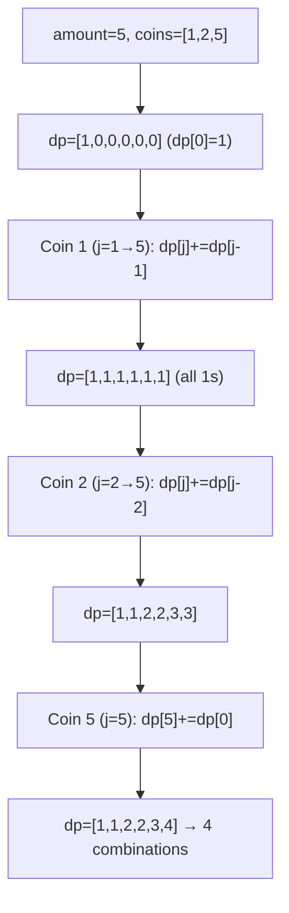
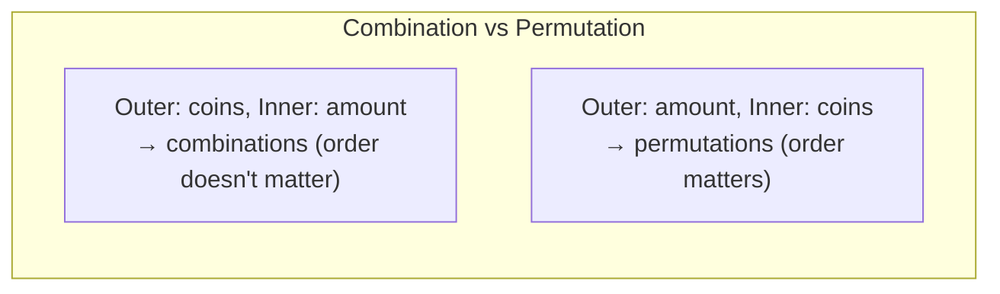
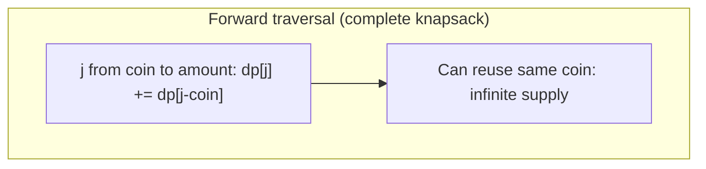

# LeetCode 518. Coin Change II（零钱兑换II） — **中等**

## 考点
数组, 动态规划

## 题目描述
给你一个整数数组 coins 表示不同面额的硬币，另给一个整数 amount 表示总金额。

请你计算并返回可以凑成总金额的硬币组合数。如果任何硬币组合都无法凑出总金额，返回 0。

假设每一种面额的硬币有无限个。

题目数据保证结果符合 32 位带符号整数。

**示例 1:**
```
输入：amount = 5, coins = [1, 2, 5]
输出：4
解释：有四种方式可以凑成总金额：
5=5
5=2+2+1
5=2+1+1+1
5=1+1+1+1+1
```

**示例 2:**
```
输入：amount = 3, coins = [2]
输出：0
解释：只用面额 2 的硬币不能凑成总金额 3。
```

**示例 3:**
```
输入：amount = 10, coins = [10]
输出：1
```

**约束条件:**
- 1 <= coins.length <= 300
- 1 <= coins[i] <= 5000
- coins 中的所有值互不相同
- 0 <= amount <= 5000

## 图解







## 解题思路

### 核心思路

**完全背包求组合数**。每种硬币无限使用，求凑成 amount 的组合数。与 322 Coin Change（求最少硬币数）不同，这里是求方案总数。

### 算法步骤

1. 定义 `dp[j]`：凑成金额 j 的组合数
2. 初始化 `dp[0] = 1`（凑成 0 元有一种方案：什么都不选）
3. 外层遍历每种硬币 coin：
   - 内层从 coin 到 amount 正序遍历 j（正序 = 可重复使用）：
   - `dp[j] += dp[j - coin]`
4. 返回 `dp[amount]`

### 图解示例

```
amount = 5, coins = [1, 2, 5]

dp 数组演变 (外层硬币, 内层金额):

初始: dp = [1, 0, 0, 0, 0, 0]
             0  1  2  3  4  5

处理 coin=1 (正序 j=1→5):
  dp[1] += dp[0] = 1  → dp = [1, 1, 0, 0, 0, 0]
  dp[2] += dp[1] = 1  → dp = [1, 1, 1, 0, 0, 0]
  dp[3] += dp[2] = 1  → dp = [1, 1, 1, 1, 0, 0]
  dp[4] += dp[3] = 1  → dp = [1, 1, 1, 1, 1, 0]
  dp[5] += dp[4] = 1  → dp = [1, 1, 1, 1, 1, 1]
  只用1元: 每种金额只有1种方案 (全用1元)

处理 coin=2 (正序 j=2→5):
  dp[2] += dp[0] = 1  → dp = [1, 1, 2, 1, 1, 1]
  dp[3] += dp[1] = 1  → dp = [1, 1, 2, 2, 1, 1]
  dp[4] += dp[2] = 2  → dp = [1, 1, 2, 2, 3, 1]
  dp[5] += dp[3] = 2  → dp = [1, 1, 2, 2, 3, 3]
  加入2元: dp[2]=2→{1+1, 2}, dp[4]=3→{1+1+1+1, 2+1+1, 2+2}

处理 coin=5 (正序 j=5→5):
  dp[5] += dp[0] = 1  → dp = [1, 1, 2, 2, 3, 4]

结果: dp[5] = 4
```

```
4 种组合方案:
  1+1+1+1+1
  2+1+1+1
  2+2+1
  5

注意: 2+2+1 和 1+2+2 在这里视为同一种（组合）
如果要区分顺序（排列），需要在循环中交换内外层
```

### 逐步追踪（对比组合 vs 排列）

**组合（外层硬币，内层金额）**：

| 阶段 | coin | j 范围 | dp[0] | dp[1] | dp[2] | dp[3] | dp[4] | dp[5] |
|------|------|--------|-------|-------|-------|-------|-------|-------|
| init | - | - | 1 | 0 | 0 | 0 | 0 | 0 |
| coin=1 | 1 | 1→5 | 1 | 1 | 1 | 1 | 1 | 1 |
| coin=2 | 2 | 2→5 | 1 | 1 | 2 | 2 | 3 | 3 |
| coin=5 | 5 | 5→5 | 1 | 1 | 2 | 2 | 3 | 4 |

**排列（外层金额，内层硬币）**——结果不同：

| j | dp[j] 含义 | 
|---|-----------|
| 0 | 1 |
| 1 | 1 (只有{1}) |
| 2 | 2 ({1,1}, {2}) |
| 3 | 3 ({1,1,1}, {1,2}, {2,1}) ← 1+2和2+1算两种！ |
| ... | ... |

### 边界情况

- `amount = 0`：返回 1（不选任何硬币）
- `coins 为空`：返回 0（amount>0 时无法凑出）
- 硬币面额都大于 amount：返回 0
- 结果可能超出 32 位 int：题目保证结果在 32 位范围内

### 复杂度分析

- **时间复杂度**：O(n × amount)，n 为硬币种类数
- **空间复杂度**：O(amount)

### 方法对比

| 方法 | 时间复杂度 | 空间复杂度 | 说明 |
|------|-----------|-----------|------|
| 完全背包 DP（组合） | O(n·amount) | O(amount) | 标准解法 |
| 完全背包 DP（排列） | O(amount·n) | O(amount) | 循环顺序不同 |
| DFS + 记忆化 | O(n·amount) | O(n·amount) | 递归解法 |
| 二维 DP | O(n·amount) | O(n·amount) | dp[i][j] 使用前 i 种硬币 |
