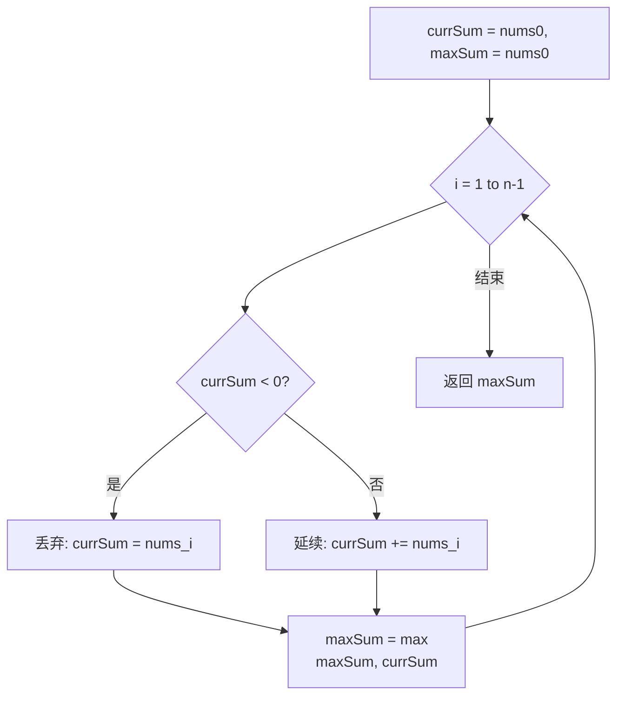

# LeetCode 53. Maximum Subarray（最大子数组和） — **中等**

## 考点
Array, Divide and Conquer, Dynamic Programming

## 题目描述
给你一个整数数组 `nums`，请你找出一个具有最大和的连续子数组（子数组最少包含一个元素），返回其最大和。

**子数组** 是数组中的一个连续部分。

### 示例 1
```
输入：nums = [-2,1,-3,4,-1,2,1,-5,4]
输出：6
解释：连续子数组 [4,-1,2,1] 的和最大，为 6 。
```

### 示例 2
```
输入：nums = [1]
输出：1
```

### 示例 3
```
输入：nums = [5,4,-1,7,8]
输出：23
解释：连续子数组 [5,4,-1,7,8] 的和最大，为 23 。
```

### 约束
- `1 <= nums.length <= 10^5`
- `-10^4 <= nums[i] <= 10^4`

## 图解



## 解题思路

### 核心思路
**Kadane 算法的本质：** 在每个位置 i 做决策——是该把当前元素追加到前面的子数组后面（累加），还是另起炉灶从当前元素开始一个新的子数组。

**关键洞察：** 如果前面的累积和是负数，加上当前元素只会让结果更小，此时应该果断抛弃前面的子数组，从当前元素重新开始。

### 算法步骤（Kadane 算法，O(1) 空间）

1. 初始化 `currentSum = nums[0]`（以当前元素结尾的最大子数组和）
2. 初始化 `maxSum = nums[0]`（全局最大子数组和）
3. 从 i = 1 遍历到 nums.length - 1：
   - `currentSum = max(nums[i], currentSum + nums[i])`
   - 这里的决策：currentSum < 0 则丢弃，否则保留
   - `maxSum = max(maxSum, currentSum)`
4. 返回 maxSum

### 图解示例

**例子：nums = [-2, 1, -3, 4, -1, 2, 1, -5, 4]**

```
索引:   0   1   2   3   4   5   6   7   8
nums:  -2   1  -3   4  -1   2   1  -5   4

决策过程（箭头表示接续 or 重新开始）:

i=0: [-2]              currentSum=-2, maxSum=-2
       ↓
i=1:    [1]            1 > -2+1=-1, 重新开始, currentSum=1,  maxSum=1
         ↓ 继续接
i=2:    [1, -3]        1-3=-2, currentSum=-2, maxSum=1
         X 丢弃 (和为负)
i=3:          [4]      重新开始, currentSum=4,  maxSum=4
               ↓
i=4:          [4,-1]   4-1=3, currentSum=3,  maxSum=4
               ↓
i=5:          [4,-1,2] 3+2=5, currentSum=5,  maxSum=5
               ↓
i=6:          [4,-1,2,1] 5+1=6, currentSum=6, maxSum=6 ★
               ↓
i=7:          [4,-1,2,1,-5] 6-5=1, currentSum=1, maxSum=6
               ↓
i=8:          [4,-1,2,1,-5,4] 1+4=5, currentSum=5, maxSum=6

最大子数组: [4, -1, 2, 1]，和为 6
```

### 逐步追踪

| 索引 i | nums[i] | 决策 | currentSum | maxSum |
|--------|---------|------|------------|--------|
| 0 | -2 | 初始化 | -2 | -2 |
| 1 | 1 | -2+1=-1 < 1 → 重新开始 | 1 | 1 |
| 2 | -3 | 1+(-3)=-2 > -3 → 接续 | -2 | 1 |
| 3 | 4 | -2+4=2 < 4 → 重新开始 | 4 | 4 |
| 4 | -1 | 4+(-1)=3 > -1 → 接续 | 3 | 4 |
| 5 | 2 | 3+2=5 > 2 → 接续 | 5 | 5 |
| 6 | 1 | 5+1=6 > 1 → 接续 | 6 | 6 |
| 7 | -5 | 6+(-5)=1 > -5 → 接续 | 1 | 6 |
| 8 | 4 | 1+4=5 > 4 → 接续 | 5 | 6 |

### 边界情况

| 情况 | 输入 | 处理 | 结果 |
|------|------|------|------|
| 单元素 | [5] | 直接返回 nums[0] | 5 |
| 全负数 | [-3, -1, -2] | Kadane 仍有效，选最大负数 | -1 |
| 全正数 | [1, 2, 3, 4] | 全部接续，sum 递增 | 10 |
| 正负交替 | [-1, 2, -1, 3] | 每次负数时考察是否丢弃 | 4 |

### 方法对比

**方法一：Kadane 算法（推荐）**
```
时间复杂度: O(n), 空间复杂度: O(1)
一次遍历，在每个位置做 O(1) 的决策
```

**方法二：分治法**
```
maxSubArray(l, r):
  if l == r: return nums[l]
  mid = (l + r) / 2
  左半最大 = maxSubArray(l, mid)
  右半最大 = maxSubArray(mid+1, r)
  跨中点最大 = 从mid向左扫描最大前缀 + 从mid+1向右扫描最大前缀
  return max(左半, 右半, 跨中点)

时间复杂度: O(n log n), 空间复杂度: O(log n)（递归栈）
```

**方法三：动态规划（DP 数组版本）**
```
dp[i] = max(nums[i], dp[i-1] + nums[i])  // dp[i] 以 i 结尾的最大子数组和
答案 = max(dp[0..n-1])
时间复杂度: O(n), 空间复杂度: O(n)
```

### 复杂度分析

- **Kadane 算法：** 时间复杂度 O(n)，一次遍历；空间复杂度 O(1)，只需两个变量
- 这是最优解法，因为至少需要遍历每个元素一次
