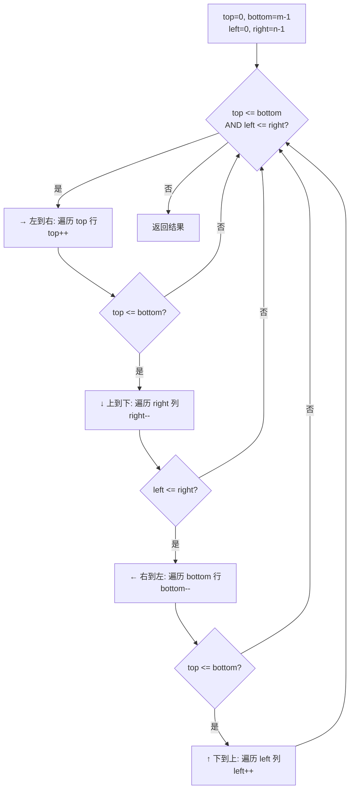

# LeetCode 54. Spiral Matrix（螺旋矩阵） — **中等**

## 考点
Array, Matrix, Simulation

## 题目描述
给你一个 `m` 行 `n` 列的矩阵 `matrix`，请按照 **顺时针螺旋顺序**，返回矩阵中的所有元素。

### 示例 1
```
输入：matrix = [[1,2,3],[4,5,6],[7,8,9]]
输出：[1,2,3,6,9,8,7,4,5]
```

### 示例 2
```
输入：matrix = [[1,2,3,4],[5,6,7,8],[9,10,11,12]]
输出：[1,2,3,4,8,12,11,10,9,5,6,7]
```

### 约束
- `m == matrix.length`
- `n == matrix[i].length`
- `1 <= m, n <= 10`
- `-100 <= matrix[i][j] <= 100`

## 图解



## 解题思路

### 核心思路
就像剥洋葱一样，一层一层地从外向内遍历矩阵。维护四个边界指针，每走完一条边就收缩对应边界，直到边界交叉。

**关键洞察：** 顺时针螺旋的顺序是固定的：右 → 下 → 左 → 上，循环往复。不需要复杂的转向逻辑，只需按顺序执行四个方向的扫描，每次扫描后更新边界即可。

### 算法步骤

1. 初始化边界：`top = 0`, `bottom = m - 1`, `left = 0`, `right = n - 1`
2. 循环，当 `top <= bottom` 且 `left <= right` 时：
   - a. **左→右：** 遍历 `matrix[top][left]` 到 `matrix[top][right]`，top++（上边界下移）
   - b. **上→下：** 检查 `top <= bottom`，遍历 `matrix[top][right]` 到 `matrix[bottom][right]`，right--（右边界左移）
   - c. **右→左：** 检查 `left <= right`，遍历 `matrix[bottom][right]` 到 `matrix[bottom][left]`，bottom--（下边界上移）
   - d. **下→上：** 检查 `top <= bottom`，遍历 `matrix[bottom][left]` 到 `matrix[top][left]`，left++（左边界右移）
3. 返回结果列表

### 图解示例

**例子：matrix = [[1,2,3],[4,5,6],[7,8,9]]**

```
初始状态:
    top=0, bottom=2, left=0, right=2

     left→  right
  top ↓  1   2   3  ← 第1轮(1): 1→2→3, top=1
        ┌───┬───┬───┐
        │ 1 │ 2 │ 3 │
        ├───┼───┼───┤
        │ 4 │ 5 │ 6 │
        ├───┼───┼───┤
        │ 7 │ 8 │ 9 │
        └───┴───┴───┘
  bot →  7   8   9

第1轮(2): 上→下: 6→9, right=1  ─┐
                                  │
    ┌───┬───┬───┐                 │
    │15 │ 2 │ 3 │                 │
    ├───┼───┼●──┤  ← 3           │→→→
    │14 │ 5 │•6 │                 │
    ├───┼───┼●──┤  ← 9          ─┘
    │ 7 │ 8 │ 9 │
    └───┴───┴───┘

第1轮(3): 右→左: 8→7, bottom=1, 第1轮(4): 下→上: 4, left=1

第二层 (1,1)~1,1:
    ┌───┬───┬───┐
    │ 1 │ 2 │ 3 │
    ├───┼───┼───┤
    │ 4 │(5)│ 6 │   只剩中心元素 5
    ├───┼───┼───┤
    │ 7 │ 8 │ 9 │
    └───┴───┴───┘

最终输出: [1,2,3,6,9,8,7,4,5]
```

**例子：非方阵 matrix = [[1,2,3,4],[5,6,7,8],[9,10,11,12]]**

```
第1层: top=0, bottom=2, left=0, right=3

(1) 左→右: [1,2,3,4]  top=1
(2) 上→下: [8,12]      right=2
(3) 右→左: [11,10,9]   bottom=1
(4) 下→上: [5]          left=1

第2层: top=1, bottom=1, left=1, right=2

(1) 左→右: [6,7]       top=2  (top > bottom, 后续都不执行)

输出: [1,2,3,4,8,12,11,10,9,5,6,7]
```

### 逐步追踪

**输入：matrix = [[1,2,3],[4,5,6],[7,8,9]]**

| 步骤 | 方向 | 遍历元素 | top | bottom | left | right | 累计输出 |
|------|------|----------|-----|--------|------|-------|----------|
| 0 | - | - | 0 | 2 | 0 | 2 | [] |
| 1a | → | 1,2,3 | **1** | 2 | 0 | 2 | [1,2,3] |
| 1b | ↓ | 6,9 | 1 | 2 | 0 | **1** | [1,2,3,6,9] |
| 1c | ← | 8,7 | 1 | **1** | 0 | 1 | [1,2,3,6,9,8,7] |
| 1d | ↑ | 4 | 1 | 1 | **1** | 1 | [1,2,3,6,9,8,7,4] |
| 2a | → | 5 | **2** | 1 | 1 | 1 | [1,2,3,6,9,8,7,4,5] |

### 边界情况

| 情况 | 输入 | 处理要点 | 结果 |
|------|------|----------|------|
| 单行 | [[1,2,3]] | 只执行左→右，后续四个方向都被边界检查跳过 | [1,2,3] |
| 单列 | [[1],[2],[3]] | 左→右走一个元素，上→下走剩余 | [1,2,3] |
| 单元素 | [[5]] | 只走左→右 | [5] |
| 只有两行 | [[1,2],[3,4]] | 完整走一圈刚好覆盖 | [1,2,4,3] |

### 复杂度分析

- **时间复杂度：** O(m × n)，每个元素被访问恰好一次
- **空间复杂度：** O(1)，只使用常数个边界变量（不计存储输出的数组）
- 这是理论最优解法，因为必须访问每个元素至少一次
