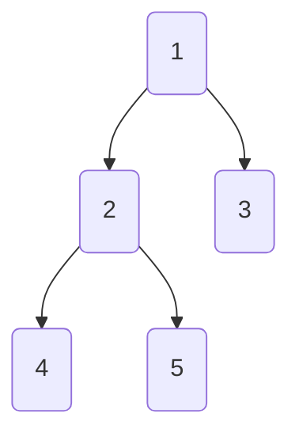
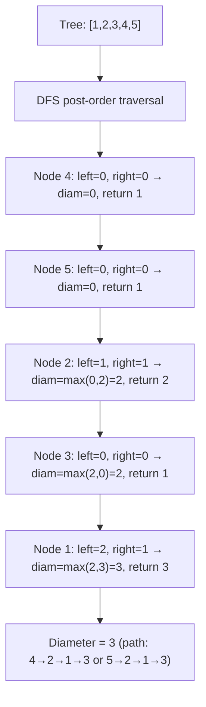
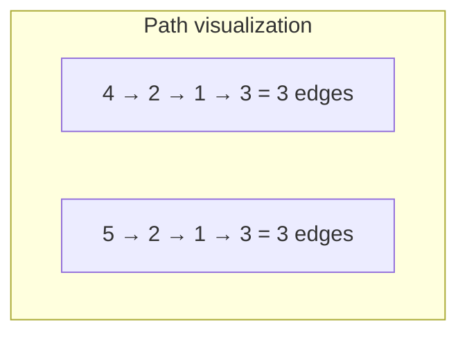

# LeetCode 543. Diameter of Binary Tree（二叉树的直径） — **简单**

## 考点
树, DFS, 二叉树

## 题目描述
给你一棵二叉树的根节点，返回该树的直径。

二叉树的直径是指树中任意两个节点之间最长路径的长度。这条路径可能经过也可能不经过根节点 root。

两节点之间路径的长度由它们之间边数表示。

**示例 1:**
```
输入：root = [1,2,3,4,5]
输出：3
解释：直径是路径 [4,2,1,3] 或者 [5,2,1,3]，长度为 3。
```

**示例 2:**
```
输入：root = [1,2]
输出：1
```

**约束条件:**
- 树中节点数目在范围 [1, 10^4] 内
- -100 <= Node.val <= 100

## 图解







## 解题思路

### 核心思路

二叉树的**直径**是任意两节点间最长路径的边数。关键洞察：这条路径一定经过某个节点的左右子树最深叶子，路径长度 = 左子树深度 + 右子树深度。

### 算法步骤

1. 维护全局变量 `maxDiameter = 0`
2. 定义递归函数 `depth(node)`：
   - 若 `node == null`，返回 0
   - `left = depth(node.left)`
   - `right = depth(node.right)`
   - `maxDiameter = max(maxDiameter, left + right)`
   - 返回 `max(left, right) + 1`
3. 调用 `depth(root)` 后返回 `maxDiameter`

### 图解示例

```
树结构:
          1
         / \
        2   3
       / \
      4   5

depth 计算过程 (后序遍历):

节点 4: left=0, right=0
  maxDiameter = max(0, 0+0) = 0
  返回 max(0,0)+1 = 1

节点 5: left=0, right=0
  maxDiameter = max(0, 0+0) = 0
  返回 max(0,0)+1 = 1

节点 2: left=1, right=1
  maxDiameter = max(0, 1+1) = 2  ← 更新!
  返回 max(1,1)+1 = 2

节点 3: left=0, right=0
  maxDiameter = max(2, 0+0) = 2
  返回 max(0,0)+1 = 1

节点 1: left=2, right=1
  maxDiameter = max(2, 2+1) = 3  ← 更新!
  返回 max(2,1)+1 = 3

结果: maxDiameter = 3
对应路径: [4,2,1,3] 或 [5,2,1,3]（边数=3）
```

```
路径可视化:
          1
         / \
        2   3
       / \
      4   5
      
  路径 [4,2,1,3]:
      4 → 2 → 1 → 3
        边  边  边   = 3 条边
  
  路径 [5,2,1,3]:
      5 → 2 → 1 → 3
        边  边  边   = 3 条边
```

### 逐步追踪

以 `root = [1,2,3,4,5]` 为例：

| 节点 | left深度 | right深度 | left+right | maxDiameter | 返回深度 |
|------|---------|----------|------------|-------------|---------|
| 4 (null子) | 0 | 0 | 0 | 0 | 1 |
| 5 (null子) | 0 | 0 | 0 | 0 | 1 |
| 2 | 1(4) | 1(5) | 2 | 2 | 2 |
| 3 (null子) | 0 | 0 | 0 | 2 | 1 |
| 1 | 2(2) | 1(3) | 3 | 3 | 3 |

### 边界情况

- 单节点树：left=0, right=0, 直径=0（只有自己，没边）
- 空树：node==null 开头即返回，直径=0
- 链状树（只向左/右伸展）：每层 left+right 等于另一侧深度(0)，直径=树高-1
- 星形树（根节点下很多子节点）：直径=最高的两个子树深度之和

### 复杂度分析

- **时间复杂度**：O(n)，每个节点访问一次
- **空间复杂度**：O(h)，h 为树高，最坏 O(n)（链状），平均 O(log n)

### 方法对比

| 方法 | 时间复杂度 | 空间复杂度 | 说明 |
|------|-----------|-----------|------|
| DFS 后序遍历 | O(n) | O(h) | 最优解 |
| BFS 层次遍历 | O(n) | O(n) | 可求某些节点间距离，但非最优 |
| 两遍 BFS 求最远 | O(n) | O(n) | 通用树的直径算法，但二叉树 DFS 更简洁 |
