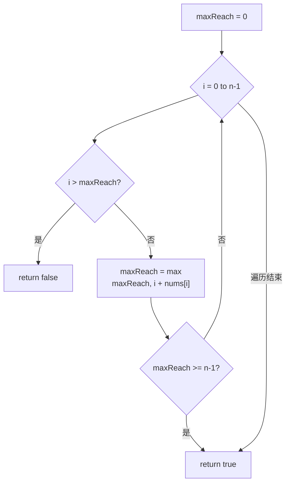

# LeetCode 55. Jump Game（跳跃游戏） — **中等**

## 考点
Greedy, Array, Dynamic Programming

## 题目描述
给你一个非负整数数组 `nums`，你最初位于数组的第一个下标。数组中的每个元素代表你在该位置可以跳跃的最大长度。

判断你是否能够到达最后一个下标，如果可以，返回 `true`；否则，返回 `false`。

### 示例 1
```
输入：nums = [2,3,1,1,4]
输出：true
解释：可以先跳 1 步，从下标 0 到达下标 1，然后再从下标 1 跳 3 步到达最后一个下标。
```

### 示例 2
```
输入：nums = [3,2,1,0,4]
输出：false
解释：无论怎样，总会到达下标为 3 的位置。但该下标的最大跳跃长度是 0，所以永远不可能到达最后一个下标。
```

### 约束
- `1 <= nums.length <= 10^4`
- `0 <= nums[i] <= 10^5`

## 图解



## 解题思路

### 核心思路
**贪心策略：** 在跳跃游戏中，关键不是跳多少步，而是"能跳多远"。每一步我们计算从当前位置能到达的最远下标 `i + nums[i]`，并维护一个全局最远可达距离。只要当前位置在可达范围内，就可以继续前进。

**关键洞察：** 如果你能到达位置 i，那么你一定能到达 [0, i] 之间的每一个位置（因为跳跃步数可调，你不需要恰好跳最大步数）。所以不需要关心路径，只需要关心"边界能延伸多"。

### 算法步骤

1. 初始化 `maxReach = 0`（当前能到达的最远位置）
2. 遍历数组 i = 0 到 n - 1：
   - 如果 i > maxReach：当前位置不可达，游戏失败，返回 false
   - 更新 maxReach = max(maxReach, i + nums[i])
   - 如果 maxReach >= n - 1：已经可以到达终点，提前返回 true
3. 遍历结束（所有位置都可达），返回 true

### 图解示例

**例子 1：nums = [2, 3, 1, 1, 4]（可达）**

```
索引:       0   1   2   3   4
nums:       2   3   1   1   4
           │           │
           │           └── 目标位置
           ▼
i=0: [2]→→→→→→→→→→→→ 最远到 idx 2
     ████████░░░░░░░░
     maxReach = 0 + 2 = 2

i=1:     [3]→→→→→→→→→→→→→→→→→ 最远到 idx 4 (= target!)
     ████████████████████
     maxReach = max(2, 1+3) = 4 >= 4 ✓ 返回 true

路径可视化:
    [2]───1步──→ [3]──3步──→ [4] 
    下标: 0   →   1   →   4
```

**例子 2：nums = [3, 2, 1, 0, 4]（不可达）**

```
索引:       0   1   2   3   4
nums:       3   2   1   0   4
           │               │
           │               └── 目标位置
           ▼
i=0: [3]→→→→→→→→→→→→→→→→→→→→ 最远到 idx 3
     ████████████████████░░
     maxReach = 0 + 3 = 3

i=1:     [2]→→→→→→→→→ 最远到 idx 3 (没变化)
     maxReach = max(3, 1+2) = 3

i=2:         [1]→→→ 最远到 idx 3 (没变化)
     maxReach = max(3, 2+1) = 3

i=3:             [0]→ 最远到 idx 3 (停滞!)
     maxReach = max(3, 3+0) = 3

i=4: 4 > maxReach(3) → 不可达! 返回 false ✗

被困在索引 3，因为 nums[3]=0，无法跳出。
```

### 逐步追踪

**输入：nums = [2, 3, 1, 1, 4]**

| 索引 i | nums[i] | i+nums[i] | 当前 maxReach | i > maxReach? | 更新后 maxReach |
|--------|---------|-----------|---------------|---------------|-----------------|
| 0 | 2 | 2 | 0 | 否 | 2 |
| 1 | 3 | 4 | 2 | 否 | 4 (≥4, 返回true) |

**输入：nums = [3, 2, 1, 0, 4]**

| 索引 i | nums[i] | i+nums[i] | 当前 maxReach | i > maxReach? | 更新后 maxReach |
|--------|---------|-----------|---------------|---------------|-----------------|
| 0 | 3 | 3 | 0 | 否 | 3 |
| 1 | 2 | 3 | 3 | 否 | 3 |
| 2 | 1 | 3 | 3 | 否 | 3 |
| 3 | 0 | 3 | 3 | 否 | 3 |
| 4 | - | - | 3 | **是(4>3)** | 返回 false |

### 边界情况

| 情况 | 输入 | 处理 | 结果 |
|------|------|------|------|
| 单元素 | [0] | maxReach=0 ≥ 0 直接返回 true | true |
| 第一步就是0 | [0, 2, 3] | i=0 时 maxReach=0，i=1 时 1>0 不可达 | false |
| 刚好到达 | [1, 1, 1, 1] | 一路紧贴边界 | true |
| 大跳跃 | [10, 0, 0, 0, 0] | 第一步就能直接到终点 | true |
| 长数组全1 | [1, 1, 1, ...] | 每个位置都是 1>maxReach 就失败了 | 取决于长度 |

### 方法对比

**方法一：贪心（推荐，O(n)）**
```
维护最远可达距离，一次遍历判断每个位置是否在射程内
```

**方法二：动态规划（O(n^2) 或 O(n²)）**
```
dp[i] = 能否到达位置 i
dp[i] = OR(dp[j] AND j+nums[j] >= i) for all j < i
效率远不如贪心
```

**方法三：从后往前贪心**
```
lastPos = n - 1
从 n-2 到 0 遍历：如果 i+nums[i] >= lastPos，则 lastPos = i
最后检查 lastPos == 0
```

### 复杂度分析

- **时间复杂度：** O(n)，最多遍历数组一次
- **空间复杂度：** O(1)，只使用常数变量
