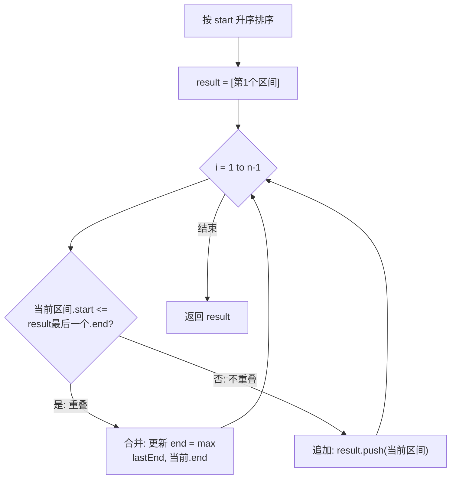

# LeetCode 56. Merge Intervals（合并区间） — **中等**

## 考点
Array, Sorting

## 题目描述
以数组 `intervals` 表示若干个区间的集合，其中单个区间为 `intervals[i] = [start_i, end_i]`。请你合并所有重叠的区间，并返回 **一个不重叠的区间数组**，该数组需恰好覆盖输入中的所有区间。

### 示例 1
```
输入：intervals = [[1,3],[2,6],[8,10],[15,18]]
输出：[[1,6],[8,10],[15,18]]
解释：区间 [1,3] 和 [2,6] 重叠，将它们合并为 [1,6]。
```

### 示例 2
```
输入：intervals = [[1,4],[4,5]]
输出：[[1,5]]
解释：区间 [1,4] 和 [4,5] 可被视为重叠区间。
```

### 约束
- `1 <= intervals.length <= 10^4`
- `intervals[i].length == 2`
- `0 <= start_i <= end_i <= 10^4`

## 图解



## 解题思路

### 核心思路
**排序是关键：** 如果不排序，区间之间重叠关系混乱。一旦按起始位置升序排序后，我们只需要逐个检查相邻区间：当前区间的起始位置 ≤ 上一合并区间的结束位置时，说明重叠；否则不重叠。

**关键洞察：** 排序后的区间有如下性质：如果当前区间与上一个区间不重叠，那么它与之前所有区间也都不重叠（因为起始位置是递增的）。

### 算法步骤

1. 如果输入数组为空，返回 []
2. 按每个区间的 `start` 升序排序 intervals
3. 创建结果列表 result，放入第一个区间 intervals[0]
4. 从 i = 1 开始遍历 intervals：
   - 取 result 的最后一个区间记为 cur（lastStart, lastEnd）
   - 取当前区间 intervals[i] 记为 (start, end)
   - 如果 start ≤ lastEnd（重叠）：
     - 更新 cur[1] = max(lastEnd, end)（合并右边界）
   - 否则（不重叠）：
     - 将 (start, end) 加入 result
5. 返回 result

### 图解示例

**例子 1：intervals = [[1,3],[2,6],[8,10],[15,18]]**

```
排序后（已按 start 有序）:

原始区间:  [1,3] [2,6] [8,10] [15,18]

可视化:
0   1   2   3   4   5   6   7   8   9  10  11  12  13  14  15  16  17  18
    ├───[1,3]───┤
        ├─────────[2,6]─────────┤
                                ├────[8,10]────┤
                                                  ├────────[15,18]────────┤

处理过程:

Step 1: result = [[1,3]]
        当前区间 [2,6] → start(2) ≤ lastEnd(3) → 重叠!
        合并: max(3, 6) = 6 → result = [[1,6]]

Step 2: result = [[1,6]]
        当前区间 [8,10] → start(8) > lastEnd(6) → 不重叠!
        追加 → result = [[1,6], [8,10]]

Step 3: result = [[1,6], [8,10]]
        当前区间 [15,18] → start(15) > lastEnd(10) → 不重叠!
        追加 → result = [[1,6], [8,10], [15,18]]

最终合并结果:
    ├─────────────[1,6]─────────────┤
                                    ├────[8,10]────┤
                                                      ├────────[15,18]────────┤
```

**例子 2：完全包含情况 intervals = [[1,4],[2,3]]**

```
    ├────────[1,4]────────┤
        ├──[2,3]──┤
        
start(2) ≤ lastEnd(4) → 重叠!
max(4, 3) = 4 → result = [[1,4]]  (内部区间被吞并)
```

### 逐步追踪

**输入：[[1,3],[8,10],[2,6],[15,18]]（未排序）**

| 步骤 | 操作 | 当前区间 | result最后区间 | 比较 | result |
|------|------|----------|----------------|------|--------|
| 0 | 排序 | - | - | - | [[1,3],[2,6],[8,10],[15,18]] |
| 1 | 初始化 | - | - | - | [[1,3]] |
| 2 | 处理 [2,6] | [2,6] | [1,3] | 2 ≤ 3 ✓重叠 | [[1,6]] |
| 3 | 处理 [8,10] | [8,10] | [1,6] | 8 > 6 ✗不重叠 | [[1,6],[8,10]] |
| 4 | 处理 [15,18] | [15,18] | [8,10] | 15 > 10 ✗不重叠 | [[1,6],[8,10],[15,18]] |

### 边界情况

| 情况 | 输入 | 处理要点 | 结果 |
|------|------|----------|------|
| 空输入 | [] | 直接返回 [] | [] |
| 单个区间 | [[1,4]] | 直接返回原区间 | [[1,4]] |
| 全部重叠 | [[1,4],[3,5],[4,7]] | 连续合并为一个 | [[1,7]] |
| 完全分离 | [[1,2],[5,6]] | 每个独立保留 | [[1,2],[5,6]] |
| 完全包含 | [[1,10],[3,5]] | 左边界不扩展，右边界取大 | [[1,10]] |
| 边界相接 | [[1,4],[4,5]] | start(4) ≤ lastEnd(4) 判定重叠 | [[1,5]] |

### 方法对比

**方法一：排序+线性合并（推荐）**
```
排序: O(n log n)
合并: O(n)
总计: O(n log n) 时间, O(n) 空间（输出）
最直观且高效
```

**方法二：扫描线（适合变体问题）**
```
将所有点(start=+1, end=-1)排序
扫描累计值，累计=0时记录区间
复杂度相同但实现更复杂
```

### 复杂度分析

- **时间复杂度：** O(n log n)，主要开销在排序；合并过程是 O(n)
- **空间复杂度：** O(n)，存储排序后的结果数组
- 排序是必要的，无法找到 O(n) 的解法（除非输入已有序）
