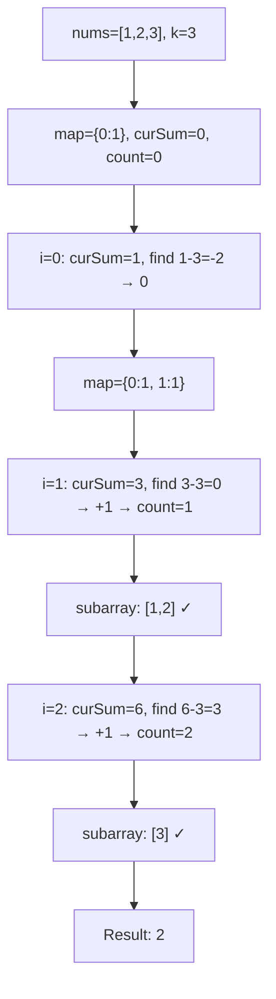
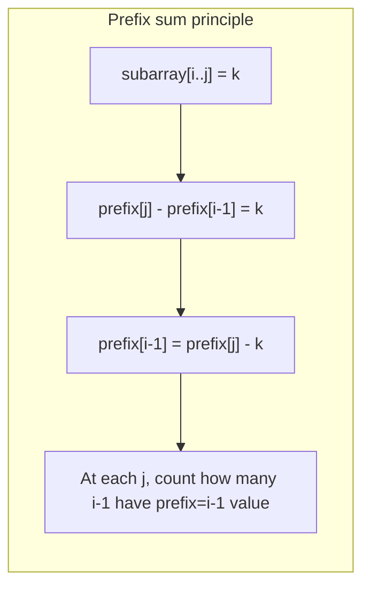
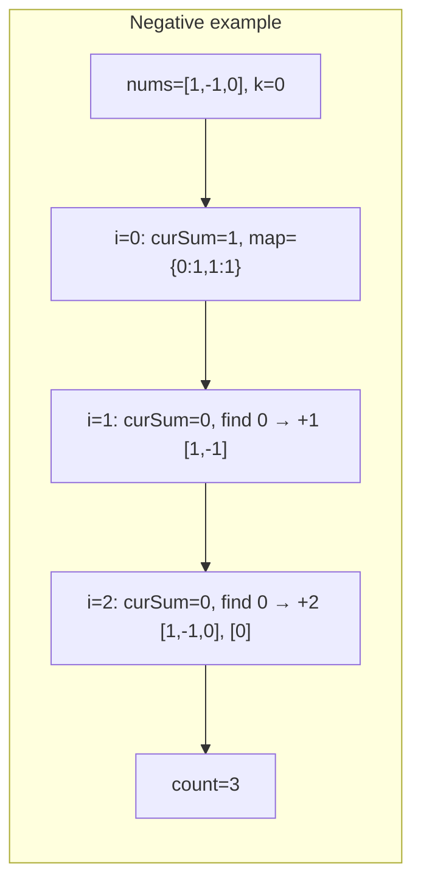

# LeetCode 560. Subarray Sum Equals K（和为K的子数组） — **中等**

## 考点
数组, 哈希表, 前缀和

## 题目描述
给你一个整数数组 nums 和一个整数 k，请你统计并返回该数组中和为 k 的子数组的个数。

子数组是数组中元素的连续非空序列。

**示例 1:**
```
输入：nums = [1,1,1], k = 2
输出：2
```

**示例 2:**
```
输入：nums = [1,2,3], k = 3
输出：2
```

**约束条件:**
- 1 <= nums.length <= 2 * 10^4
- -1000 <= nums[i] <= 1000
- -10^7 <= k <= 10^7

## 图解







## 解题思路

### 核心思路

**前缀和 + 哈希表**。子数组 `nums[i..j]` 的和 = `prefixSum[j] - prefixSum[i-1]`。要找和为 k 的子数组个数，即对每个位置 j，统计前面有多少个 i 满足 `prefixSum[i-1] = prefixSum[j] - k`。

### 算法步骤

1. 初始化哈希表 `map = {0: 1}`（前缀和 0 出现 1 次，处理从开头开始的子数组）
2. `count = 0, curSum = 0`
3. 遍历数组每个元素 num：
   - `curSum += num`
   - 在 map 中查找 `curSum - k`，若存在则 `count += map[curSum - k]`
   - `map[curSum]++`
4. 返回 count

### 图解示例

```
nums = [1, 2, 3], k = 3

遍历过程:

 i=0, num=1:
   curSum = 1
   查找 curSum-k = 1-3 = -2 → map中不存在
   map = {0:1, 1:1}

 i=1, num=2:
   curSum = 3
   查找 curSum-k = 3-3 = 0 → map[0]=1 → count += 1  (子数组 [1,2])
   map = {0:1, 1:1, 3:1}

 i=2, num=3:
   curSum = 6
   查找 curSum-k = 6-3 = 3 → map[3]=1 → count += 1  (子数组 [3])
   map = {0:1, 1:1, 3:1, 6:1}

结果 count = 2 (子数组 [1,2] 和 [3])
```

```
前缀和原理可视化:

   nums:    [1,  2,  3]
   prefix:  0 → 1 → 3 → 6
            ↑   ↑   ↑   ↑
           pre0 pre1 pre2 pre3

   pre2 - pre0 = 3 - 0 = 3 → 子数组 [1,2]
   pre3 - pre2 = 6 - 3 = 3 → 子数组 [3]
```

```
nums = [1, -1, 0], k = 0

 i=0: curSum=1, 找 1-0=1 → 不存在, map={0:1, 1:1}
 i=1: curSum=0, 找 0-0=0 → map[0]=1 → count=1 (子数组 [1,-1])
       map={0:2, 1:1}
 i=2: curSum=0, 找 0-0=0 → map[0]=2 → count=1+2=3 (新增 [-1,0]?不, 还有 [0])
       实际子数组: [1,-1], [1,-1,0], [0]

结果 count = 3
```

### 逐步追踪

以 `nums = [3, 4, 7, 2, -3, 1, 4, 2], k = 7` 为例：

| i | num | curSum | curSum-k | map中次数 | count增量 | map |
|---|-----|--------|----------|----------|----------|-----|
| - | - | 0 | - | - | 0 | {0:1} |
| 0 | 3 | 3 | -4 | 0 | 0 | {0:1, 3:1} |
| 1 | 4 | 7 | 0 | 1 | +1 | {0:1, 3:1, 7:1} |
| 2 | 7 | 14 | 7 | 1 | +1 | {0:1, 3:1, 7:1, 14:1} |
| 3 | 2 | 16 | 9 | 0 | 0 | {0:1, 3:1, 7:1, 14:1, 16:1} |
| 4 | -3 | 13 | 6 | 0 | 0 | {...13:1} |
| 5 | 1 | 14 | 7 | 1 | +1 | {14:2} |
| 6 | 4 | 18 | 11 | 0 | 0 | {18:1} |
| 7 | 2 | 20 | 13 | 1 | +1 | {20:1} |

结果 count = 4
子数组: [3,4], [7], [7,2,-3,1], [2,-3,1,4,2]?... 检查最后一个是 2+(-3)+1+4+2=6 ≠ 7

实际检查: 
- i=1: [3,4]=7 ✓
- i=2: [7]=7 ✓
- i=5: curSum=14, curSum-k=7 → 之前有前缀和7(在i=1), 所以子数组是从i=2到i=5: [7,2,-3,1]=7 ✓
- i=7: curSum=20, curSum-k=13 → 之前有前缀和13(在i=4), 所以子数组是从i=5到i=7: [1,4,2]=7 ✓

### 边界情况

- 单个元素：检查是否等于 k
- k = 0：找前缀和相等的子数组（子数组和为 0）
- nums 中可能有负数：前缀和不是单调的，仍正确
- 所有元素为正：前缀和递增

### 复杂度分析

- **时间复杂度**：O(n)，一次遍历
- **空间复杂度**：O(n)，哈希表存储最多 n 个不同前缀和

### 方法对比

| 方法 | 时间复杂度 | 空间复杂度 | 说明 |
|------|-----------|-----------|------|
| 前缀和+哈希表 | O(n) | O(n) | 最优解 |
| 前缀和+双重循环 | O(n²) | O(n) | 暴力枚举所有子数组 |
| 滑动窗口 | 不适用 | - | 有负数时滑动窗口不适用 |
