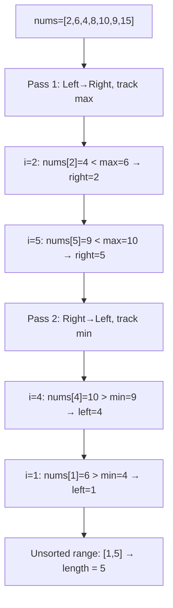
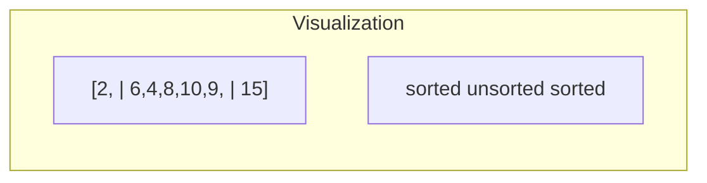
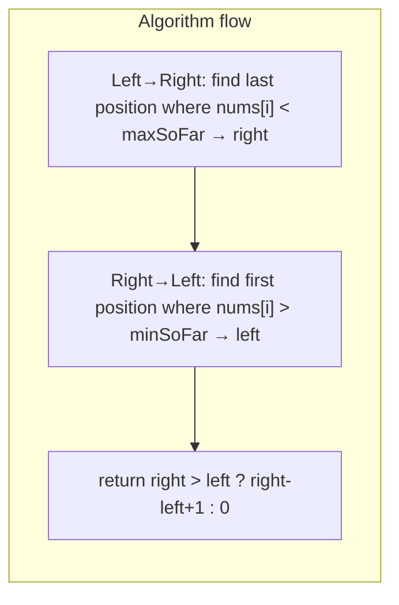

# LeetCode 581. Shortest Unsorted Continuous Subarray（最短无序连续子数组） — **中等**

## 考点
栈, 贪心, 数组, 双指针, 排序, 单调栈

## 题目描述
给你一个整数数组 nums，你需要找出一个连续子数组，如果对这个子数组进行升序排序，那么整个数组都会变为升序排序。

请你找出符合题意的最短子数组，并输出它的长度。

**示例 1:**
```
输入：nums = [2,6,4,8,10,9,15]
输出：5
解释：你只需要对 [6, 4, 8, 10, 9] 进行升序排序，那么整个表都会变为升序排序。
```

**示例 2:**
```
输入：nums = [1,2,3,4]
输出：0
```

**示例 3:**
```
输入：nums = [1]
输出：0
```

**约束条件:**
- 1 <= nums.length <= 10^4
- -10^5 <= nums[i] <= 10^5

## 图解







## 解题思路

### 核心思路

找出使得数组完全有序所需排序的**最短连续子数组**的长度。思路：找到第一个和最后一个「违反有序性」的位置。从左到右扫描找右边界（出现小于左侧最大值的位置），从右到左扫描找左边界（出现大于右侧最小值的位置）。

### 算法步骤

1. 从左到右遍历，维护当前最大值 `max`：
   - 若 `nums[i] < max`，记录 `right = i`（无序右边界）
   - 否则更新 `max = nums[i]`
2. 从右到左遍历，维护当前最小值 `min`：
   - 若 `nums[i] > min`，记录 `left = i`（无序左边界）
   - 否则更新 `min = nums[i]`
3. 返回 `right > left ? right - left + 1 : 0`

### 图解示例

```
nums = [2, 6, 4, 8, 10, 9, 15]

第一遍：从左到右（找右边界 right）

 i=0: num=2,  max=2,  nums[0]>=2  → 无记录
 i=1: num=6,  max=6,  nums[1]>=6  → 无记录
 i=2: num=4,  max=6,  nums[2]<6   → right=2 ← 第一个无序！
 i=3: num=8,  max=8,  nums[3]>=8  → 无记录
 i=4: num=10, max=10, nums[4]>=10 → 无记录
 i=5: num=9,  max=10, nums[5]<10  → right=5 ← 最后一个无序！
 i=6: num=15, max=15, nums[6]>=15 → 无记录

右边界 right = 5


第二遍：从右到左（找左边界 left）

 i=6: num=15, min=15, nums[6]<=15 → 无记录
 i=5: num=9,  min=9,  nums[5]<=9  → 无记录
 i=4: num=10, min=9,  nums[4]>9   → left=4 ← 第一个从右看无序！
 i=3: num=8,  min=8,  nums[3]<=8  → 无记录
 i=2: num=4,  min=4,  nums[2]<=4  → 无记录
 i=1: num=6,  min=4,  nums[1]>4   → left=1 ← 这才是真正的左边界！
 i=0: num=2,  min=2,  nums[0]<=2  → 无记录

左边界 left = 1


无序区间: [1, 5] = [6, 4, 8, 10, 9]
长度 = 5 - 1 + 1 = 5
排序后: [4, 6, 8, 9, 10]

原数组: [2, 6, 4, 8, 10, 9, 15]
                        排序后
                        ↓
最终:   [2, 4, 6, 8, 9, 10, 15] ✓ 整体有序
```

```
视觉化:
          ┌── 无序区间 ──┐
  [2, | 6, 4, 8, 10, 9, | 15]
   ↑    ↑              ↑     ↑
  有序 left=1      right=5  有序
  
  左边有序部分: 最大值 2 < 无序区间最小值 4 ✓
  右边有序部分: 最小值 15 > 无序区间最大值 10 ✓
```

### 逐步追踪

| 步骤 | i | num | max/min | 条件 | left/right |
|------|---|-----|---------|------|-----------|
| 左→右 | 0 | 2 | max=2 | 2<2? N | - |
| 左→右 | 1 | 6 | max=6 | 6<6? N | - |
| 左→右 | 2 | 4 | max=6 | 4<6? Y | right=2 |
| 左→右 | 3 | 8 | max=8 | 8<8? N | - |
| 左→右 | 4 | 10 | max=10 | 10<10? N | - |
| 左→右 | 5 | 9 | max=10 | 9<10? Y | right=5 |
| 左→右 | 6 | 15 | max=15 | 15<15? N | - |
| 右→左 | 6 | 15 | min=15 | 15>15? N | - |
| 右→左 | 5 | 9 | min=9 | 9>9? N | - |
| 右→左 | 4 | 10 | min=9 | 10>9? Y | left=4 |
| 右→左 | 3 | 8 | min=8 | 8>8? N | - |
| 右→左 | 2 | 4 | min=4 | 4>4? N | - |
| 右→左 | 1 | 6 | min=4 | 6>4? Y | left=1 |
| 右→左 | 0 | 2 | min=2 | 2>2? N | - |

### 边界情况

- 数组已有序（如 [1,2,3,4]）：right 和 left 保持初始值，right≤left，返回 0
- 完全逆序（如 [4,3,2,1]）：left=0, right=n-1，返回 n
- 单元素：返回 0
- 前半段有序、后半段乱：left 在前半段之后

### 复杂度分析

- **时间复杂度**：O(n)，两次线性扫描
- **空间复杂度**：O(1)

### 方法对比

| 方法 | 时间复杂度 | 空间复杂度 | 说明 |
|------|-----------|-----------|------|
| 双指针扫描 | O(n) | O(1) | 最优解 |
| 排序后对比 | O(nlogn) | O(n) | 复制排序后找首尾不同位置 |
| 单调栈 | O(n) | O(n) | 用栈找左右边界 |
