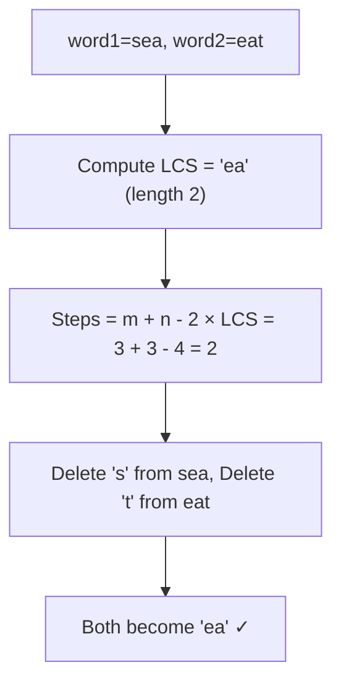
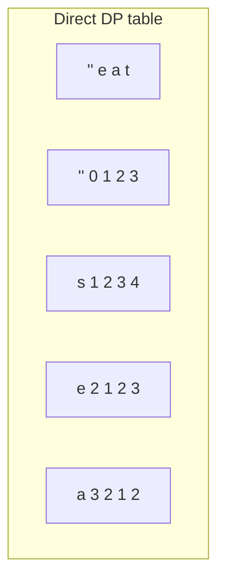
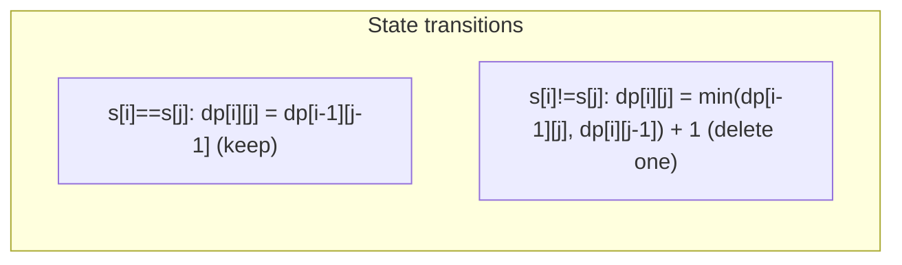

# LeetCode 583. Delete Operation for Two Strings（两个字符串的删除操作） — **中等**

## 考点
字符串, 动态规划

## 题目描述
给定两个单词 word1 和 word2，返回使得 word1 和 word2 相同所需的最小步数。

每步可以删除任意一个字符串中的一个字符。

**示例 1:**
```
输入: word1 = "sea", word2 = "eat"
输出: 2
解释: 第一步将 "sea" 变为 "ea"，第二步将 "eat" 变为 "ea"。
```

**示例 2:**
```
输入：word1 = "leetcode", word2 = "etco"
输出：4
```

**约束条件:**
- 1 <= word1.length, word2.length <= 500
- word1 和 word2 只包含小写英文字母

## 图解







## 解题思路

### 核心思路

使两个字符串相等只能通过**删除**操作。最优策略是保留最长公共子序列（LCS），删除其余字符。因此：
`最小删除步数 = len(word1) + len(word2) - 2 × LCS(word1, word2)`

也可以直接用 DP 定义最小删除数（不经过 LCS 转换）。

### 算法步骤

**方法一：LCS 转化法**

1. 计算 word1 和 word2 的 LCS 长度
2. 返回 `m + n - 2 × LCS`

**方法二：直接 DP（删除操作）**

1. 定义 `dp[i][j]`：使 `word1[0..i-1]` 和 `word2[0..j-1]` 相同的最小步数
2. 初始化：`dp[i][0] = i`（删掉 word1 全部），`dp[0][j] = j`（删掉 word2 全部）
3. 状态转移：
   - `word1[i-1] == word2[j-1]`：`dp[i][j] = dp[i-1][j-1]`
   - `word1[i-1] != word2[j-1]`：`dp[i][j] = min(dp[i-1][j], dp[i][j-1]) + 1`
4. 返回 `dp[m][n]`

### 图解示例

```
word1 = "sea", word2 = "eat"
m=3, n=3

LCS("sea", "eat"):

dp_LCS 表:
       ""  e  a  t
  "" [ 0, 0, 0, 0 ]
  s  [ 0, 0, 0, 0 ]
  e  [ 0, 1, 1, 1 ]
  a  [ 0, 1, 2, 2 ]

LCS = dp[3][3] = 2 → "ea"
删除步数 = 3 + 3 - 2×2 = 2


直接 DP 表:
       ""  e  a  t
  "" [ 0, 1, 2, 3 ]
  s  [ 1, 2, 3, 4 ]
  e  [ 2, 1, 2, 3 ]
  a  [ 3, 2, 1, 2 ]

结果 dp[3][3] = 2

解释:
  dp[2][2]: word1="se", word2="ea"
    s≠e → min(dp[1][2], dp[2][1])+1 = min(3,3)+1 = 4
    不对...重新计算

  更仔细地追踪 dp[2][2]:
  前面: dp[1][1]匹配填充后的值...

     ""   e   a   t
""   0    1   2   3
s    1    
e    2
a    3

行1 "s":
  j=1 "e": s≠e → min(dp[0][1],dp[1][0])+1=min(1,1)+1=2
  j=2 "a": s≠a → min(dp[0][2],dp[1][1])+1=min(2,2)+1=3
  j=3 "t": s≠t → min(dp[0][3],dp[1][2])+1=min(3,3)+1=4

行2 "e":
  j=1 "e": e=e → dp[1][0]=1
  j=2 "a": e≠a → min(dp[1][2],dp[2][1])+1=min(3,1)+1=2
  j=3 "t": e≠t → min(dp[1][3],dp[2][2])+1=min(4,2)+1=3

行3 "a":
  j=1 "e": a≠e → min(dp[2][1],dp[3][0])+1=min(1,3)+1=2
  j=2 "a": a=a → dp[2][1]=1
  j=3 "t": a≠t → min(dp[2][3],dp[3][2])+1=min(3,1)+1=2

最终: dp[3][3]=2 ✓

操作: 删除sea的's' → "ea", 删除eat的't' → "ea"
```

### 逐步追踪（直接 DP）

| i | j | word1[i-1] | word2[j-1] | 相同? | 公式 | dp[i][j] |
|---|---|-----------|-----------|-------|------|----------|
| 0 | 0-3 | - | - | - | base | [0,1,2,3] |
| 1 | 0 | - | - | - | base | 1 |
| 1 | 1 | s | e | N | min(0,1)+1 | 2 |
| 1 | 2 | s | a | N | min(1,2)+1 | 3 |
| 1 | 3 | s | t | N | min(2,3)+1 | 4 |
| 2 | 0 | - | - | - | base | 2 |
| 2 | 1 | e | e | Y | dp[1][0] | 1 |
| 2 | 2 | e | a | N | min(3,1)+1 | 2 |
| 2 | 3 | e | t | N | min(4,2)+1 | 3 |
| 3 | 0 | - | - | - | base | 3 |
| 3 | 1 | a | e | N | min(1,3)+1 | 2 |
| 3 | 2 | a | a | Y | dp[2][1] | 1 |
| 3 | 3 | a | t | N | min(3,1)+1 | 2 |

### 边界情况

- 一个字符串为空：返回另一个字符串的长度（全删）
- 两字符串相同：返回 0（无需删除）
- 无公共字符：返回 m + n

### 复杂度分析

- **时间复杂度**：O(m × n)
- **空间复杂度**：O(m × n)，可优化至 O(min(m,n)) 使用滚动数组

### 方法对比

| 方法 | 时间复杂度 | 空间复杂度 | 说明 |
|------|-----------|-----------|------|
| LCS 转化 | O(mn) | O(mn) | 先求 LCS 再计算，思路清晰 |
| 直接 DP | O(mn) | O(mn) | 一步到位 |
| 滚动数组 DP | O(mn) | O(min(m,n)) | 空间最优 |
| 编辑距离变体 | O(mn) | O(mn) | 只允许删除操作 |
