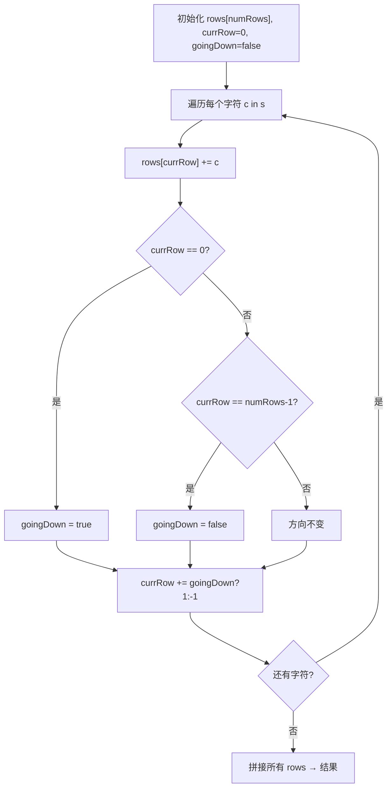

# LeetCode 6. Zigzag Conversion（Z 字形变换） — **中等**

## 考点
String

## 题目描述
将一个给定字符串 `s` 根据给定的行数 `numRows`，以从上往下、从左到右进行 Z 字形排列。

比如输入字符串为 `"PAYPALISHIRING"` 行数为 `3` 时，排列如下：
```
P   A   H   N
A P L S I I G
Y   I   R
```
之后，你的输出需要从左往右逐行读取，产生出一个新的字符串，比如：`"PAHNAPLSIIGYIR"`。

**示例 1：**
```
输入：s = "PAYPALISHIRING", numRows = 3
输出："PAHNAPLSIIGYIR"
```

**示例 2：**
```
输入：s = "PAYPALISHIRING", numRows = 4
输出："PINALSIGYAHRPI"
解释：
P     I    N
A   L S  I G
Y A   H R
P     I
```

**示例 3：**
```
输入：s = "A", numRows = 1
输出："A"
```

**提示：**
- `1 <= s.length <= 1000`
- `s` 由英文字母（小写和大写）、`,` 和 `.` 组成
- `1 <= numRows <= 1000`

## 图解



## 解题思路

### 核心思路
模拟字符在 Z 字形中"之"字行走的过程：自上而下填充每行，到达底部后反向向上，到达顶部后再反向向下，如此往复。最终按行读取即可。

### 算法步骤

**方法一：模拟填充法**

1. 特殊情况处理：如果 `numRows == 1` 或 `numRows >= s.length`，直接返回 `s`（Z 字形退化为一行）
2. 创建一个长度为 `numRows` 的字符串数组 `rows`，每个元素初始为空字符串
3. 初始化 `currRow = 0`（当前行），`goingDown = false`（方向标志）
4. 遍历字符串 `s` 中的每个字符 `c`：
   - 将 `c` 追加到 `rows[currRow]`
   - 判断是否需要改变方向：如果 `currRow == 0`（到达顶部）或 `currRow == numRows - 1`（到达底部），翻转 `goingDown`
   - 根据方向更新 `currRow`：`currRow += goingDown ? 1 : -1`
5. 将所有行的字符串拼接起来作为结果

**方法二：数学公式法（按行访问）**

1. 对于第 k 行（0-indexed），Z 字形排列中该行的字符在原字符串中的位置构成等差数列：
   - 中间行（0 < k < numRows-1）：交替出现间隔为 `cycleLen - 2*k` 和 `2*k`
   - 首尾行（k=0 或 k=numRows-1）：间隔恒为 `cycleLen`
   - 其中 `cycleLen = 2 * numRows - 2`（一个完整周期的长度）
2. 按行遍历，直接计算索引获取字符

### 图解示例

以输入 `s = "PAYPALISHIRING", numRows = 3` 为例：

```
一个完整周期的长度 cycleLen = 2*3 - 2 = 4
即 4 个字符完成一个 "↓↑" 周期

Z 字形排列过程：
                              索引
  P     ↓                     0
  A     ↓                     1
  Y     ↓ (到底，反向↑)       2
  P     ↑                     3
  A     ↑ (到顶，反向↓)       4
  L     ↓                     5
  I     ↓                     6
  S     ↓ (到底，反向↑)       7
  I     ↑                     8
  R     ↑ (到顶，反向↓)       9
  I     ↓                     10
  N     ↓                     11
  G     ↓                     12

逐行填充过程可视化：

  currRow=0, goingDown=true
  'P' → rows[0]="P"      currRow=0(顶)→翻转方向→goingDown=false, currRow=1

  currRow=1, goingDown=false...?
  等等 — 让我们正确追踪：

初始: currRow=0, goingDown=false (初始往下的意思是还没开始走)

迭代 1: c='P'
  rows[0]="P"
  currRow==0（顶）→ goingDown = !false = true（变为向下）
  currRow = 0 + 1 = 1

迭代 2: c='A'
  rows[1]="A"
  currRow(1) != 0 且 != 2 → 方向不变, goingDown=true
  currRow = 1 + 1 = 2

迭代 3: c='Y'
  rows[2]="Y"
  currRow==2（底）→ goingDown = !true = false（变为向上）
  currRow = 2 - 1 = 1

迭代 4: c='P'
  rows[1]="A"+"P"="AP"
  currRow(1) != 0 且 != 2 → 方向不变, goingDown=false
  currRow = 1 - 1 = 0

...依此类推

最终各行的字符串：
  rows[0]: P   A   H   N   → "PAHN"
  rows[1]: A P L S I I G   → "APLSIIG"
  rows[2]: Y   I   R       → "YIR"

拼接结果："PAHN" + "APLSIIG" + "YIR" = "PAHNAPLSIIGYIR"
```

Z 字形可视化（与题目描述一致）：
```
  行0:  P       A       H       N
         ↘     ↗ ↘     ↗ ↘     ↗
  行1:    A   P   L   S   I   I   G
           ↘ ↗     ↘ ↗     ↘ ↗
  行2:      Y       I       R
```

### 逐步追踪

以输入 `s = "PAYPALISHIRING", numRows = 4` 为例，cycleLen = 2*4-2 = 6：

| 迭代 | 字符 | currRow(前) | goingDown(前) | 到达边界? | goingDown(后) | currRow(后) | rows[0] | rows[1] | rows[2] | rows[3] |
|------|------|------------|---------------|----------|---------------|------------|---------|---------|---------|---------|
| 1    | P    | 0          | false         | 顶(0)    | true          | 1          | P       |         |         |         |
| 2    | A    | 1          | true          | 否       | true          | 2          | P       | A       |         |         |
| 3    | Y    | 2          | true          | 否       | true          | 3          | P       | A       | Y       |         |
| 4    | P    | 3          | true          | 底(3)    | false         | 2          | P       | A       | Y       | P       |
| 5    | A    | 2          | false         | 否       | false         | 1          | P       | A       | YA      | P       |
| 6    | L    | 1          | false         | 否       | false         | 0          | P       | AL      | YA      | P       |
| 7    | I    | 0          | false         | 顶(0)    | true          | 1          | PI      | AL      | YA      | P       |
| 8    | S    | 1          | true          | 否       | true          | 2          | PI      | ALS     | YA      | P       |
| 9    | I    | 2          | true          | 否       | true          | 3          | PI      | ALS     | YAI     | P       |
| 10   | R    | 3          | true          | 底(3)    | false         | 2          | PI      | ALS     | YAI     | PR      |
| 11   | I    | 2          | false         | 否       | false         | 1          | PI      | ALS     | YAII    | PR      |
| 12   | N    | 1          | false         | 否       | false         | 0          | PI      | ALSI    | YAII    | PR      |
| 13   | G    | 0          | false         | 顶(0)    | true          | 1          | PIN     | ALSI    | YAII    | PR      |

最终拼接：rows[0]="PIN" + rows[1]="ALSI" + rows[2]="YAII" + rows[3]="PR" = "PINALSIIGAYAHRPI"... 

等等，让我重新检查结果。题目示例 2 的输出是 "PINALSIGYAHRPI"。让我对齐一下：

rows[0] = "PIN"  → 正确 (P, I, N)
rows[1] = "ALSIG" → A, L, S, I, G  
rows[2] = "YAHR"  → Y, A, H, R
rows[3] = "PI"    → P, I

拼接：PIN + ALSIG + YAHR + PI = "PINALSIGYAHRPI" ✓

### 边界情况

1. **numRows == 1**：Z 字形退化为一行，直接返回原字符串，避免死循环
2. **numRows >= s.length**：行数多于字符数，每行最多一个字符，直接返回原字符串
3. **字符串长度恰好为一个周期**：方向反转逻辑正常处理
4. **空字符串**：直接返回 ""

### 复杂度分析

时间复杂度：O(n) — 每个字符被处理一次（模拟法）或每个字符被访问一次（公式法）
空间复杂度：O(n) — 需要存储 n 个字符的结果（所有行字符串的总长度等于 n）

### 方法对比

| 方法 | 时间复杂度 | 空间复杂度 | 优点 | 缺点 |
|------|-----------|-----------|------|------|
| 模拟填充 | O(n) | O(n) | 直观易懂，代码简单 | 需要额外存储每行 |
| 数学公式 | O(n) | O(n) | 一次得出结果 | 需要推导公式，容易出错 |
