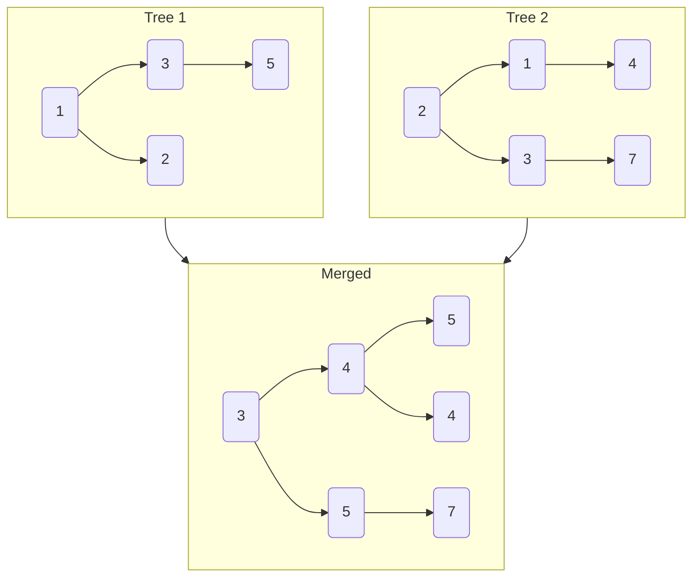
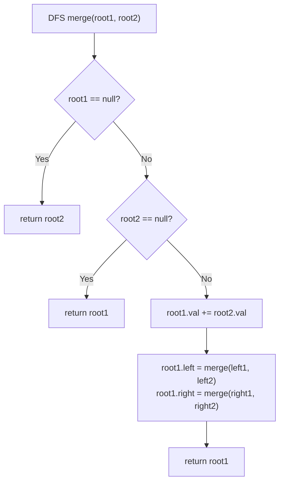

# LeetCode 617. Merge Two Binary Trees（合并二叉树） — **简单**

## 考点
树, DFS, BFS, 二叉树

## 题目描述
给你两棵二叉树 root1 和 root2。

想象一下，当你将其中一棵覆盖到另一棵之上时，两棵树上的一些节点将会重叠（而另一些不会）。你需要将这两棵树合并成一棵新二叉树。合并的规则是：如果两个节点重叠，那么将这两个节点的值相加作为合并后节点的新值；否则，不为 null 的节点将直接作为新二叉树的节点。

返回合并后的二叉树。

注意：合并过程必须从两个树的根节点开始。

**示例 1:**
```
输入：root1 = [1,3,2,5], root2 = [2,1,3,null,4,null,7]
输出：[3,4,5,5,4,null,7]
```

**示例 2:**
```
输入：root1 = [1], root2 = [1,2]
输出：[2,2]
```

**约束条件:**
- 两棵树中的节点数目在范围 [0, 2000] 内
- -10^4 <= Node.val <= 10^4

## 图解





## 解题思路

### 核心思路

DFS 递归合并两棵二叉树的对应位置节点。关键规则：若两节点都存在，值相加；若只有一个存在，保留存在的那个（相当于直接嫁接）。

### 算法步骤

1. 若 `root1 == null`，返回 `root2`
2. 若 `root2 == null`，返回 `root1`
3. **合并当前节点**：`root1.val += root2.val`
4. **递归合并子树**：
   - `root1.left = mergeTrees(root1.left, root2.left)`
   - `root1.right = mergeTrees(root1.right, root2.right)`
5. 返回 `root1`（以 root1 为基础合入 root2）

**原地修改 vs 新建节点**：上述方案在原树上修改。若要求不修改原树，需 `new TreeNode(root1.val + root2.val)` 创建新节点。

### 图解示例

```
树1:          树2:           合并结果:
     1            2                3
    / \          / \              / \
   3   2        1   3      →     4   5
  /             \   \           / \   \
 5               4   7         5   4   7


DFS合并过程:

Step 1: root1=1, root2=2 → 都不为null
        1.val += 2.val → 1.val = 3

Step 2: root1.left(3), root2.left(1)
        3.val += 1.val = 4

Step 3: root1.left.left(5), root2.left.left(null)
        root2=null → 直接返回 5 (不用动)

Step 4: root1.left.right(null), root2.left.right(4)
        root1=null → 返回 root2=4 → root1.left.right = 4

Step 5: root1.right(2), root2.right(3)
        2.val += 3.val = 5

Step 6: root1.right.left(null), root2.right.left(null)
        都为null → 返回null

Step 7: root1.right.right(null), root2.right.right(7)
        root1=null → 返回 7 → root1.right.right = 7
```

```
结构变化示意:
        树1                    树2
        1                      2
       / \                    / \
      3   2                  1   3
     /          +           \     \
    5                       4     7
    =                   =
        3 (合并后)
       / \
      4   5
     / \   \
    5   4   7
```

### 逐步追踪

| 步骤 | root1节点 | root2节点 | 操作 | 结果 |
|------|----------|----------|------|------|
| 1 | 1 | 2 | 1+2=3 | 3 |
| 2 | 3 | 1 | 3+1=4 | 4 (作为3的左子) |
| 3 | 5 | null | root2=null, 返回5 | 5 (作为4的左子) |
| 4 | null | 4 | root1=null, 返回4 | 4 (作为4的右子) |
| 5 | 2 | 3 | 2+3=5 | 5 (作为3的右子) |
| 6 | null | null | 双null | null (5的左子) |
| 7 | null | 7 | root1=null, 返回7 | 7 (作为5的右子) |

### 边界情况

- 两棵树都为空：返回 null
- 其中一棵为空：返回非空树（直接嫁接）
- 只有根节点：合并根节点的值即可
- 两树结构不对称：代码自然处理（null 时直接返回对方子树）

### 复杂度分析

- **时间复杂度**：O(min(n1, n2))，其中 n1、n2 是两棵树的节点数。实际会遍历两棵树重叠部分的节点。
- **空间复杂度**：O(min(h1, h2))，递归栈深度为较矮树的高度。

### 方法对比

| 方法 | 时间复杂度 | 空间复杂度 | 说明 |
|------|-----------|-----------|------|
| DFS 递归 | O(m) | O(min(h1,h2)) | 代码最简洁 |
| BFS 迭代 | O(m) | O(m) | 使用队列层序遍历合并 |
| 新建节点 | O(m) | O(m) | 不修改原树 |
