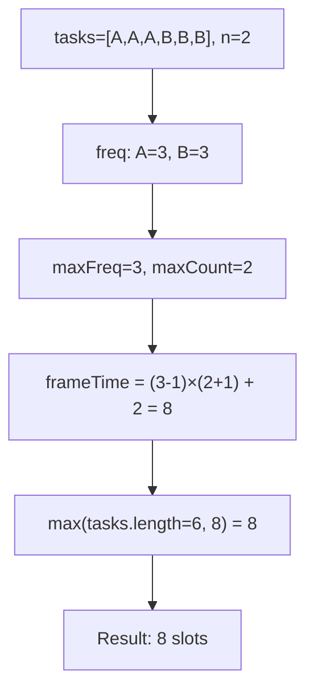
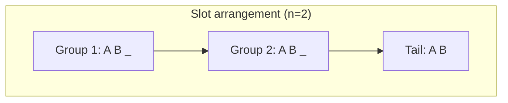
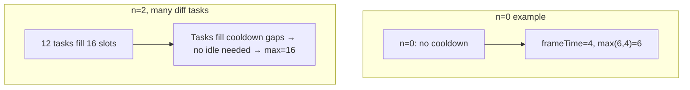

# LeetCode 621. Task Scheduler（任务调度器） — **中等**

## 考点
贪心, 数组, 哈希表, 计数, 排序, 堆

## 题目描述
给你一个用字符数组 tasks 表示的 CPU 需要执行的任务列表，用字母 A 到 Z 表示，以及一个冷却时间 n。每个周期或时间片允许完成一项任务。任务可以按任意顺序完成，但有一个限制：两个相同种类的任务之间必须有长度为 n 的冷却时间。

在任何一个时间片，CPU 可以完成一个任务，也可以处于待命状态。

返回完成所有任务所需的最短时间。

**示例 1:**
```
输入：tasks = ["A","A","A","B","B","B"], n = 2
输出：8
解释：A -> B -> (待命) -> A -> B -> (待命) -> A -> B
在本示例中，两个相同类型任务之间必须间隔长度为 n = 2 的冷却时间，而执行一个任务只需要一个单位时间，所以中间出现了（待命）状态。
```

**示例 2:**
```
输入：tasks = ["A","A","A","B","B","B"], n = 0
输出：6
解释：在这种情况下，任何大小为 6 的排列都可以满足要求，因为 n = 0。
["A","A","A","B","B","B"]、["A","B","A","B","A","B"]、["B","B","B","A","A","A"]... 诸如此类。
```

**示例 3:**
```
输入：tasks = ["A","A","A","A","A","A","B","C","D","E","F","G"], n = 2
输出：16
解释：一种可能的解决方案是：
A -> B -> C -> A -> D -> E -> A -> F -> G -> A -> (待命) -> (待命) -> A -> (待命) -> (待命) -> A
```

**约束条件:**
- 1 <= task.length <= 10^4
- tasks[i] 是大写英文字母
- 0 <= n <= 100

## 图解







## 解题思路

### 核心思路

**贪心 + 排列公式**。最高频任务决定了最少需要的轮次。设最高频任务的频率为 `maxFreq`，有 `maxCount` 个任务具有该频率。将这些最高频任务作为「框架」排列，中间填充其他任务或待命状态。

### 算法步骤

1. 统计每个任务的频率，存入数组 `freq[26]`
2. 找出最高频率 `maxFreq = max(freq)`
3. 统计有多少任务具有最高频率：`maxCount = count(freq == maxFreq)`
4. 计算框架所需时间：`frameTime = (maxFreq - 1) × (n + 1) + maxCount`
5. 返回 `max(task.length, frameTime)`

### 图解示例

```
tasks = ["A","A","A","B","B","B"], n = 2

频率: A:3, B:3
maxFreq = 3, maxCount = 2 (A和B都出现3次)

框架排列 (以A为最高频任务):
  A _ _ A _ _ A
  ↑     ↑     ↑
  第1组  第2组  结尾

每组: (n+1) = 3 个位置
组数: (maxFreq-1) = 2 组
框架 = 2 × 3 + 2(最后A和B) = 8

实际填充:
  A B _ A B _ A B
  └─┬─┘ └─┬─┘ └┬┘
   组1    组2   尾

8 个时间片中:
  位置: [A,B,_], [A,B,_], [A,B]
  任务: 6个, 待命: 2个

tasks.length = 6, frameTime = 8
max(6, 8) = 8 ✓
```

```
tasks = ["A","A","A","B","B","B"], n = 0

maxFreq=3, maxCount=2
frameTime = (3-1)×(0+1)+2 = 2+2 = 4
max(6, 4) = 6 ✓ (n=0 时直接等于任务总数)

实际: A B A B A B (6个时间片)
```

```
tasks = ["A","A","A","A","A","A","B","C","D","E","F","G"], n = 2

频率表: A:6, B:1, C:1, D:1, E:1, F:1, G:1
maxFreq=6, maxCount=1 (只有A)

frameTime = (6-1)×3 + 1 = 15 + 1 = 16
tasks.length = 12
max(12, 16) = 16 ✓

框架: A _ _ A _ _ A _ _ A _ _ A _ _ A
      └─组1─┘└─组2─┘└─组3─┘└─组4─┘└─组5─┘

5组 × 3位置 = 15, + 最后的A = 16
12个任务填不满16个位置, 需要4个待命
```

### 逐步追踪

以 `tasks = ["A","A","A","B","B","C"], n = 2` 为例：

| 阶段 | 操作 | 值 |
|------|------|-----|
| 统计 | freq[A]=3, freq[B]=2, freq[C]=1 | |
| 找最高频 | maxFreq = 3 | |
| 统计最高频任务数 | A出现了3次=C出现?不等于=B出现?不等于 → maxCount=1 | |
| 框架时间 | (3-1)×(2+1)+1 = 2×3+1 = 7 | |
| 比较 | max(6, 7) = 7 | |

排列验证: A B C A B _ A → 7 个时间片，中间 1 个待命 ✓

### 边界情况

- `n = 0`：无需冷却，答案 = tasks.length
- 所有任务频率相同且种类>n+1：tasks.length 更大，无需待命
- 只有一种任务：`frameTime = (maxFreq-1)×(n+1)+1`，答案 = max(tasks.length, frameTime)
- 任务种类很多，能填满所有冷却槽：答案 = tasks.length

### 复杂度分析

- **时间复杂度**：O(N + 26) = O(N)，N 为任务数量
- **空间复杂度**：O(1)，固定 26 个字母的数组

### 方法对比

| 方法 | 时间复杂度 | 空间复杂度 | 说明 |
|------|-----------|-----------|------|
| 公式法 | O(N) | O(1) | 最优解 |
| 贪心模拟（优先队列） | O(N log 26) | O(1) | 每次取最高频任务执行 |
| 数学排列 | O(N) | O(1) | 与公式法等价，更直观 |
