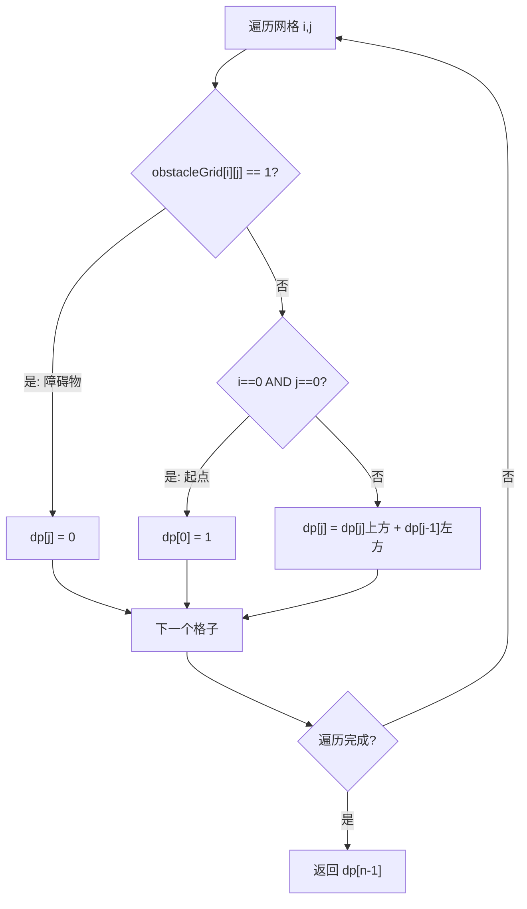

# LeetCode 63. Unique Paths II（不同路径 II） — **中等**

## 考点
Array, Dynamic Programming, Matrix

## 题目描述
一个机器人位于一个 `m x n` 网格的左上角。机器人每次只能向下或者向右移动一步。机器人试图达到网格的右下角。

现在考虑网格中有障碍物。那么从左上角到右下角将会有多少条不同的路径？

网格中的障碍物和空位置分别用 `1` 和 `0` 来表示。

### 示例 1
```
输入：obstacleGrid = [[0,0,0],[0,1,0],[0,0,0]]
输出：2
解释：3x3 网格的正中间有一个障碍物。
从左上角到右下角一共有 2 条不同的路径：
1. 向右 -> 向右 -> 向下 -> 向下
2. 向下 -> 向下 -> 向右 -> 向右
```

### 示例 2
```
输入：obstacleGrid = [[0,1],[0,0]]
输出：1
```

### 约束
- `m == obstacleGrid.length`
- `n == obstacleGrid[i].length`
- `1 <= m, n <= 100`
- `obstacleGrid[i][j]` 为 `0` 或 `1`

## 图解



## 解题思路

### 核心思路
在 LeetCode 62 的基础上增加了障碍物。核心逻辑不变：每个可达格子 = 上方可达路径数 + 左方可达路径数。但如果格子本身是障碍物，直接设 0（不可达）。

**关键洞察：** 障碍物不仅使自身不可达，还会阻断其右侧（对第一行）或下侧（对第一列）的路径。因此第一行和第一列的初始化需要特殊处理——一旦遇到障碍物，后面的格子全部不可达。

### 算法步骤

1. 获取 m, n，如果起点或终点是障碍物 → 直接返回 0
2. 初始化 dp 数组（一维），大小 n
3. 初始化 dp[0] = 1（起点可达）
4. 对 i = 0 到 m-1：
   - 对 j = 0 到 n-1：
     - 如果 i == 0 且 j == 0：跳过（已初始化）
     - 如果 obstacleGrid[i][j] == 1：dp[j] = 0（障碍物，不可达）
     - 否则：dp[j] = (i > 0 ? dp[j] : 0) + (j > 0 ? dp[j-1] : 0)
     - dp[j] 中，等号右边的 dp[j] 代表上一行同列的值，dp[j-1] 代表本行左侧的值
5. 返回 dp[n-1]

### 图解示例

**例子：obstacleGrid = [[0,0,0],[0,1,0],[0,0,0]]**

```
网格可视化 (1=障碍物, 0=空):
    ┌───┬───┬───┐
    │ S │ 0 │ 0 │  S = 起点
    ├───┼───┼───┤
    │ 0 │ ■ │ 0 │  ■ = 障碍物 (1,1)
    ├───┼───┼───┤
    │ 0 │ 0 │ F │  F = 终点
    └───┴───┴───┘

DP 填充过程 (二维视角):

初始:            第1行: 1 1 1      第1列: 1
                ┌───┬───┬───┐      (全部可达，无障碍)
                │ 1 │ 1 │ 1 │
                ├───┼───┼───┤
                │ 1 │ ? │ ? │
                ├───┼───┼───┤
                │ 1 │ ? │ ? │
                └───┴───┴───┘

dp[1][1] = 障碍 → 0
dp[1][2] = dp[0][2] + dp[1][1] = 1 + 0 = 1
dp[2][1] = dp[1][1] + dp[2][0] = 0 + 1 = 1
dp[2][2] = dp[1][2] + dp[2][1] = 1 + 1 = 2

最终 DP 表:
    ┌───┬───┬───┐
    │ 1 │ 1 │ 1 │
    ├───┼───┼───┤
    │ 1 │ 0 │ 1 │
    ├───┼───┼───┤
    │ 1 │ 1 │ 2 │ ← 答案
    └───┴───┴───┘

两条有效路径:
  路径1: → → ↓ ↓  (绕开障碍物右侧)
  路径2: ↓ ↓ → →  (绕开障碍物下方)
```

**一维 DP 滚动过程：**

```
初始 dp: [1, 0, 0]

第0行 (i=0):
  j=0: dp[0]=1 (起点)
  j=1: 无障, dp[1] = dp[1](上,0) + dp[0](左,1) = 0+1 = 1
  j=2: 无障, dp[2] = dp[2](上,0) + dp[1](左,1) = 0+1 = 1
  → dp = [1, 1, 1]

第1行 (i=1):
  j=0: 无障, dp[0] = dp[0](上,1) + 0 = 1
  j=1: 有障! dp[1] = 0
  j=2: 无障, dp[2] = dp[2](上,1) + dp[1](左,0) = 1+0 = 1
  → dp = [1, 0, 1]

第2行 (i=2):
  j=0: 无障, dp[0] = dp[0](上,1) + 0 = 1
  j=1: 无障, dp[1] = dp[1](上,0) + dp[0](左,1) = 0+1 = 1
  j=2: 无障, dp[2] = dp[2](上,1) + dp[1](左,1) = 1+1 = 2
  → dp = [1, 1, 2]

答案: dp[2] = 2
```

### 逐步追踪

**输入：obstacleGrid = [[0,1],[0,0]]**

| 步骤 | dp 数组 | 说明 |
|------|---------|------|
| 初始 | [1, 0] | dp[0]=1 |
| i=0, j=0 | [1, 0] | 起点，跳过 |
| i=0, j=1 | [1, 0] | obstacleGrid[0][1]=1 → 障碍物，dp[1]=0 |
| i=1, j=0 | [1, 0] | dp[0] = dp[0](上) = 1 |
| i=1, j=1 | [1, 1] | dp[1] = dp[1](上,0) + dp[0](左,1) = 0+1 = 1 |

### 边界情况

| 情况 | 输入 | 处理 | 结果 |
|------|------|------|------|
| 起点是障碍物 | [[1,0],[0,0]] | m=1, n=2, 直接返回 0 | 0 |
| 终点是障碍物 | [[0,0],[0,1]] | 正常DP，dp[m-1][n-1] = 0 | 0 |
| 第一行有障碍物 | [[0,1,0]] | 障碍物及其右侧全为 0 | 0 |
| 第一列有障碍物 | [[0],[1],[0]] | 障碍物及其下侧全为 0 | 0 |
| 无障碍物 | 3×3 全0 | 等价于 LeetCode 62 | C(4,2)=6 |

### 复杂度分析

- **时间复杂度：** O(m × n)，遍历整个网格一次
- **空间复杂度（一维 DP）：** O(n)，只维护一行大小的数组
- **空间复杂度（原地修改）：** O(1)，直接修改 obstacleGrid 为 DP 数组（如果允许修改输入）
