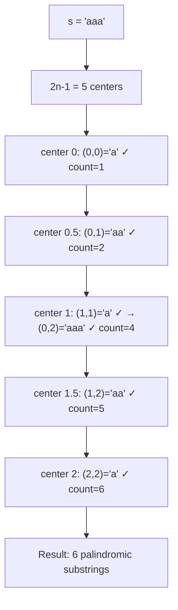
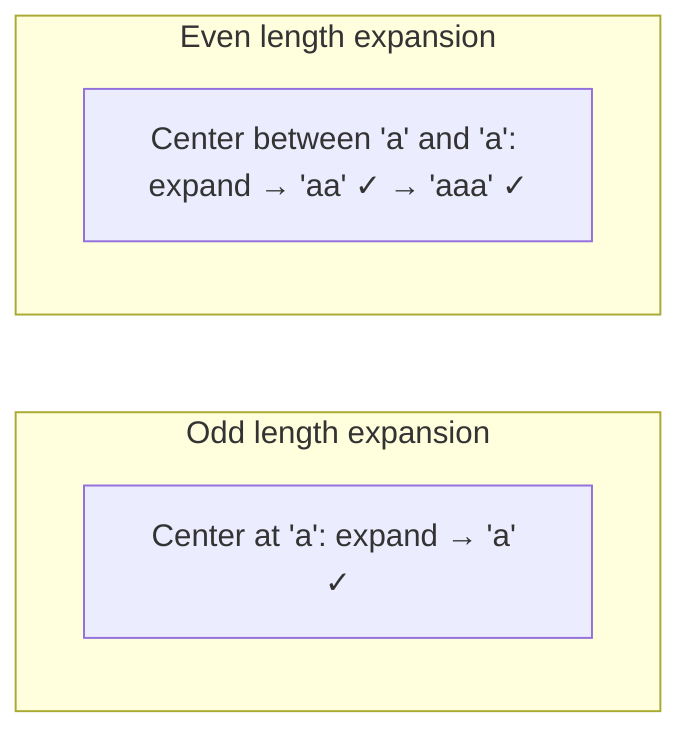
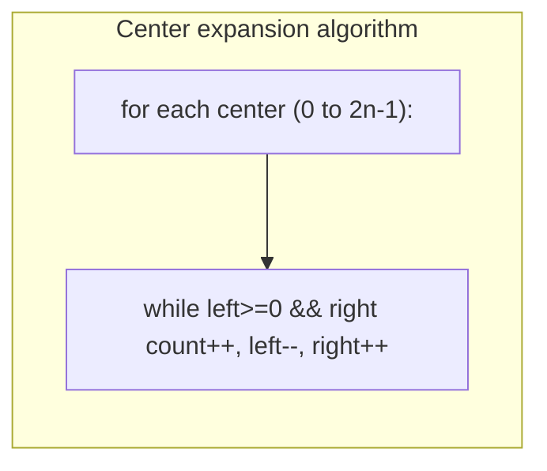

# LeetCode 647. Palindromic Substrings（回文子串） — **中等**

## 考点
双指针, 字符串, 动态规划

## 题目描述
给你一个字符串 s，请你统计并返回这个字符串中回文子串的数目。

回文字符串是正着读和倒过来读一样的字符串。

子字符串是字符串中的由连续字符组成的一个序列。

**示例 1:**
```
输入：s = "abc"
输出：3
解释：三个回文子串: "a", "b", "c"
```

**示例 2:**
```
输入：s = "aaa"
输出：6
解释：6个回文子串: "a", "a", "a", "aa", "aa", "aaa"
```

**约束条件:**
- 1 <= s.length <= 1000
- s 由小写英文字母组成

## 图解







## 解题思路

### 核心思路

**中心扩展法**：回文串以其中心为轴对称。每个回文串都有一个中心（奇数长度：单字符中心；偶数长度：双字符中心）。枚举所有可能的中心（共 2n-1 个），向两边扩展统计回文数量。

### 算法步骤

1. 初始化 `count = 0`
2. 遍历 i 从 0 到 n-1（n 个单字符中心）：
   - **奇数长度**：以 i 为中心扩展 `expand(i, i)`
   - **偶数长度**：以 i 和 i+1 之间为中心扩展 `expand(i, i+1)`
3. expand(left, right)：
   - 当 `left >= 0 && right < n && s[left] == s[right]` 时：
     - `count++`（找到一个回文）
     - `left--, right++`（向外扩展）
4. 返回 count

### 图解示例

```
s = "aaa", n = 3

所有可能的中心及扩展:

中心 i=0 (单字符):
  expand(0,0): s[0]='a'==s[0] → count=1 [回文: "a"]
  expand(-1,1): left越界 → 停止

中心 i=0~1 (双字符):
  expand(0,1): s[0]='a'==s[1]='a' → count=2 [回文: "aa"]
  expand(-1,2): left越界 → 停止

中心 i=1 (单字符):
  expand(1,1): s[1]='a'→ count=3 [回文: "a" (中间的a)]
  expand(0,2): s[0]='a'==s[2]='a' → count=4 [回文: "aaa"]
  expand(-1,3): left越界 → 停止

中心 i=1~2 (双字符):
  expand(1,2): s[1]='a'==s[2]='a' → count=5 [回文: "aa"]
  expand(0,3): right越界 → 停止

中心 i=2 (单字符):
  expand(2,2): s[2]='a'→ count=6 [回文: "a"]
  expand(1,3): right越界 → 停止

结果: 6
回文子串: "a"(3个), "aa"(2个), "aaa"(1个) = 6 ✓
```

```
中心扩展可视化:

  s = "a b c"
       ↑ ↑ ↑
       | | |
      (0,0): "a"
      (1,1): "b"
      (2,2): "c"
      (0,1): "ab" ≠ 回文
      (1,2): "bc" ≠ 回文

  结果: 3

  s = "a b b a"
       ↑ ↑ ↑ ↑
       | | | |
      (0,0): "a"
      (1,1): "b"
      (2,2): "b"
      (3,3): "a"
      (0,1): "ab" ≠
      (1,2): "bb" ✓ → 继续: (0,3): "abba" ✓
      (2,3): "ba" ≠

  结果: 6 (a,b,b,a,bb,abba)
```

### 逐步追踪

以 `s = "racecar"` 为例：

| i | 中心类型 | 扩展过程 | 找到的回文 | count增量 |
|---|---------|---------|-----------|----------|
| 0 | 单字符(0,0) | "r" | "r" | 1 |
| 0 | 双字符(0,1) | "ra" → s[0]≠s[1] | - | 0 |
| 1 | 单字符(1,1) | "a" | "a" | 1 |
| 1 | 双字符(1,2) | "ac" → 不等 | - | 0 |
| 2 | 单字符(2,2) | "c" | "c" | 1 |
| 2 | 双字符(2,3) | "ce" → 不等 | - | 0 |
| 3 | 单字符(3,3) | "e" → (2,4)"cec" → (1,5)"aceca" → (0,6)"racecar" | "e","cec","aceca","racecar" | 4 |
| 3 | 双字符(3,4) | "ec" → 不等 | - | 0 |
| 4 | 单字符(4,4) | "c" | "c" | 1 |
| 4 | 双字符(4,5) | "ca" → 不等 | - | 0 |
| 5 | 单字符(5,5) | "a" | "a" | 1 |
| 5 | 双字符(5,6) | "ar" → 不等 | - | 0 |
| 6 | 单字符(6,6) | "r" | "r" | 1 |

总 count = 10

### 边界情况

- 空字符串：返回 0
- 单个字符：返回 1
- 全部相同字符（如 "aaaa"）：返回 n(n+1)/2 = 10（n=4）
- 无重复字符（如 "abc"）：返回 n = 3（每个字符各自是回文）

### 复杂度分析

- **时间复杂度**：O(n²)，每个中心最多扩展 n/2 次
- **空间复杂度**：O(1)

### 方法对比

| 方法 | 时间复杂度 | 空间复杂度 | 说明 |
|------|-----------|-----------|------|
| 中心扩展 | O(n²) | O(1) | 最优，原地扩展 |
| 区间 DP | O(n²) | O(n²) | dp[i][j] 判断 s[i..j] 是否回文 |
| Manacher 算法 | O(n) | O(n) | 线性时间，但实现复杂 |
| 暴力枚举 | O(n³) | O(1) | 枚举所有子串+判断回文 |
