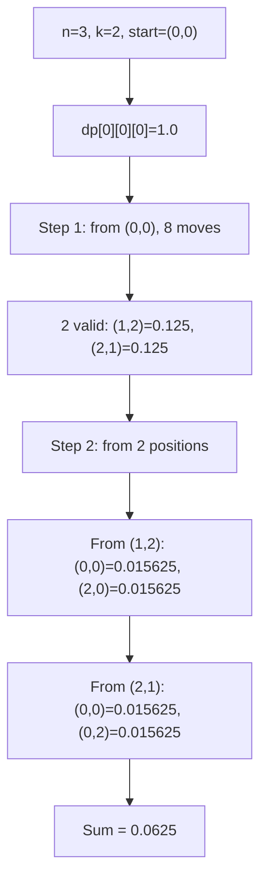
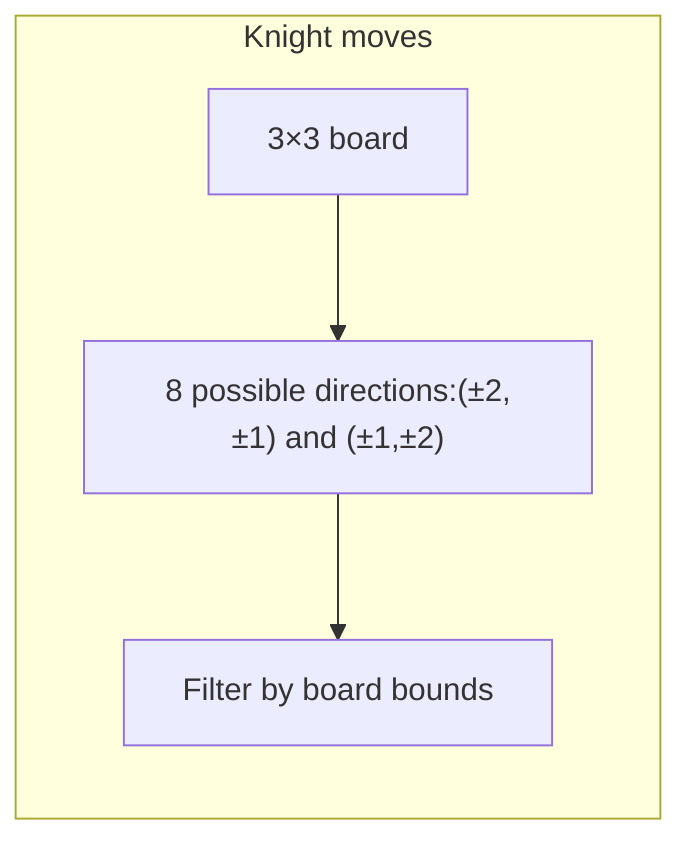
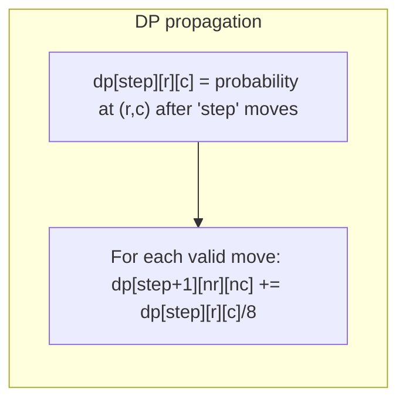

# LeetCode 688. Knight Probability in Chessboard（骑士在棋盘上的概率） — **中等**

## 考点
动态规划

## 题目描述
在一个 n x n 的国际象棋棋盘上，一个骑士从单元格 (row, column) 开始，并尝试进行 k 次移动。行和列是从 0 开始的，所以左上角单元格是 (0, 0)，右下角单元格是 (n - 1, n - 1)。

象棋骑士有 8 种可能的走法，如下图所示。每次移动在基本方向上是两个单元格，然后在正交方向上是一个单元格。

每次骑士要移动时，它都会随机从 8 种可能的移动中选择一种（即使棋子会离开棋盘），然后移动到那里。

骑士继续移动，直到它走了 k 步或离开了棋盘。

返回骑士在棋盘停止移动后仍留在棋盘上的概率。

**示例 1:**
```
输入: n = 3, k = 2, row = 0, column = 0
输出: 0.0625
解释: 有两步（到 (1,2)，(2,1)）可以让骑士留在棋盘上。在每一个位置上，也有两种移动可以让骑士留在棋盘上。骑士留在棋盘上的总概率是 0.0625。
```

**示例 2:**
```
输入: n = 1, k = 0, row = 0, column = 0
输出: 1.0
```

**约束条件:**
- 1 <= n <= 25
- 0 <= k <= 100
- 0 <= row, column <= n - 1

## 图解







## 解题思路

### 核心思路

**概率型动态规划**。骑士每步随机选择 8 个方向之一。`dp[step][r][c]` 表示走 step 步后位于 (r,c) 的概率。每步将当前位置的概率平分到 8 个合法下一位置。

### 算法步骤

1. 定义 `dp[step][r][c]`：走 step 步后在 (r,c) 的概率
2. 初始化 `dp[0][startRow][startCol] = 1.0`
3. 8 个移动方向：`[(±2,±1), (±1,±2)]` 共 8 组
4. 对于 step 从 0 到 k-1：
   - 遍历所有 (r,c)，若 `dp[step][r][c] > 0`：
   - 对 8 个方向 (dr,dc)，若 `(r+dr, c+dc)` 在棋盘内：
     - `dp[step+1][r+dr][c+dc] += dp[step][r][c] / 8.0`
5. 最终概率 = `Σ dp[k][r][c]`（k 步后仍在棋盘上的所有位置概率和）

**空间优化**：使用两个二维数组交替，将三维降为二维。

### 图解示例

```
n = 3, k = 2, start = (0,0)

棋盘坐标:
  (0,0) (0,1) (0,2)
  (1,0) (1,1) (1,2)
  (2,0) (2,1) (2,2)

骑士的 8 个走法:
  (-2,-1), (-2,+1), (-1,-2), (-1,+2),
  (+1,-2), (+1,+2), (+2,-1), (+2,+1)

Step 0: dp[0][0][0] = 1.0
  其余位置 = 0

Step 1: 从 (0,0) 走 8 个方向
  (-2,-1) → 越界
  (-2,+1) → 越界
  (-1,-2) → 越界
  (-1,+2) → 越界
  (+1,-2) → 越界
  (+1,+2) → (1,2) ✓ → dp[1][1][2] += 1/8 = 0.125
  (+2,-1) → (2,-1) 越界
  (+2,+1) → (2,1) ✓ → dp[1][2][1] += 1/8 = 0.125

Step 1 结果: (1,2)=0.125, (2,1)=0.125

Step 2: 从两个位置分别出发

从 (1,2) 出发(概率0.125):
  检查 8 个方向:
  (0,1) ✓, (2,1) ✓, (0,0) ✓, (2,0) ✓ 各得 0.125/8 = 0.015625
  其余越界

从 (2,1) 出发(概率0.125):
  检查 8 个方向:
  (0,0) ✓, (1,3)越界, (0,2) ✓, (1,3)越界, (3,0)越界, (3,2)越界, (4,0)越界, (4,2)越界
  有效: (0,0)=0.015625, (0,2)=0.015625

Step 2 汇总:
  (0,0): 0.015625 + 0.015625 = 0.03125
  (0,1): 0.015625
  (0,2): 0.015625
  (2,0): 0.015625
  (2,1): 0.015625

总概率 = 0.03125+0.015625+0.015625+0.015625+0.015625 = 0.09375

不对... 应该是 0.0625?

让我重新计算:
从(1,2): 走法→(0,0)+0.015625, (2,0)+0.015625, (-1,1)越界, (3,1)越界, (0,4)越界, (2,4)越界, (-1,3)越界, (3,3)越界
等等, 我搞错了方向...

正确的 8 个方向:
  (r-2,c-1), (r-2,c+1), (r-1,c-2), (r-1,c+2),
  (r+1,c-2), (r+1,c+2), (r+2,c-1), (r+2,c+1)

从(1,2):
  (-1,1)越界, (-1,3)越界, (0,0)有效, (0,4)越界, (2,0)有效, (2,4)越界, (3,1)有效, (3,3)越界
  有效: (0,0),(2,0),(3,1)
  各得 0.125/8 = 0.015625

从(2,1):
  (0,0)有效, (0,2)有效, (1,-1)越界, (1,3)越界, (3,-1)越界, (3,3)越界, (4,0)越界, (4,2)越界
  有效: (0,0),(0,2)
  各得 0.125/8 = 0.015625

总计:
  (0,0): 0.015625 + 0.015625 = 0.03125
  (2,0): 0.015625
  (0,2): 0.015625

总和 = 0.03125 + 0.015625 + 0.015625 = 0.0625 ✓
```

### 逐步追踪

| Step | r,c | 概率(dp) | 8个方向中有效 | 每个贡献 |
|------|-----|---------|-------------|---------|
| 0 | (0,0) | 1.0 | - | dp[0] |
| 0→1 | (0,0) | 1.0 | (1,2),(2,1) | 各 0.125 |
| 1→2 | (1,2) | 0.125 | (0,0),(2,0) | 各 0.015625 |
| 1→2 | (2,1) | 0.125 | (0,0),(0,2) | 各 0.015625 |
| 汇总 | - | - | - | 0.0625 |

### 边界情况

- `k = 0`：骑士不动，概率 = 1.0
- `n = 1`：只有一格，所有移动都越界，但 k=0 时仍为 1
- 起始位置靠近边缘：有效移动更少

### 复杂度分析

- **时间复杂度**：O(k × n² × 8) = O(k × n²)
- **空间复杂度**：O(n²)（使用滚动数组优化后）

### 方法对比

| 方法 | 时间复杂度 | 空间复杂度 | 说明 |
|------|-----------|-----------|------|
| 三维 DP | O(kn²) | O(kn²) | 直观但空间大 |
| 滚动数组 DP | O(kn²) | O(n²) | 空间优化 |
| DFS 记忆化 | O(kn²) | O(kn²) | 自顶向下 |
