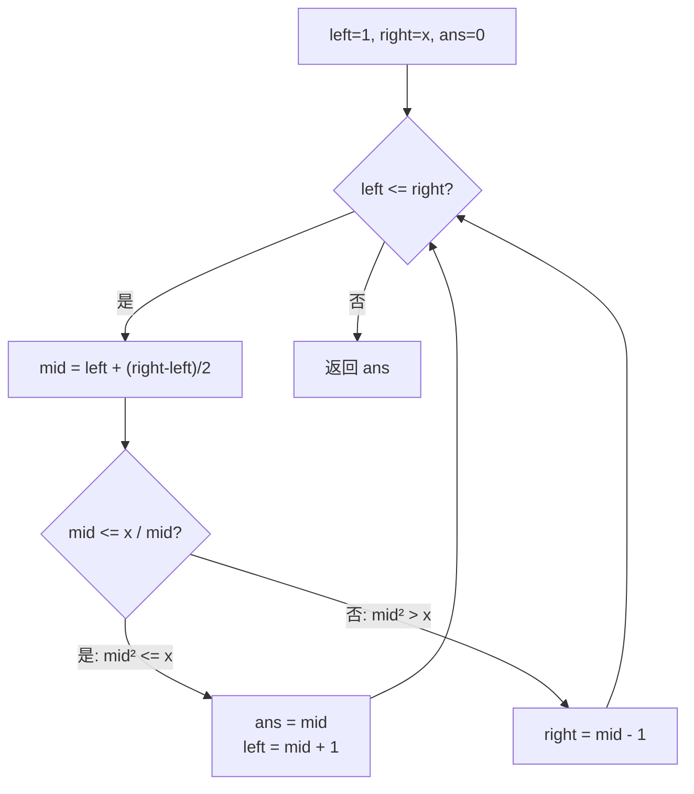

# LeetCode 69. Sqrt(x)（x 的平方根） — **简单**

## 考点
Math, Binary Search

## 题目描述
给你一个非负整数 `x`，计算并返回 `x` 的 **算术平方根**。

由于返回类型是整数，结果只保留 **整数部分**，小数部分将被舍去。

**注意：** 不允许使用任何内置指数函数和算符，例如 `pow(x, 0.5)` 或者 `x ** 0.5`。

### 示例 1
```
输入：x = 4
输出：2
```

### 示例 2
```
输入：x = 8
输出：2
解释：8 的算术平方根是 2.82842...，由于返回类型是整数，小数部分将被舍去。
```

### 约束
- `0 <= x <= 2^31 - 1`

## 图解



## 解题思路

### 核心思路
在 [0, x] 范围内二分搜索最大的整数 ans 使得 ans² ≤ x。这道题本质上是"找右侧边界的二分查找"。

**关键洞察：** 避免 mid × mid 溢出！用除法替代乘法：mid ≤ x / mid 等价于 mid² ≤ x。搜索上界可优化为 x/2 + 1（因为 sqrt(x) ≤ x/2 + 1 对于 x ≥ 1）。

### 算法步骤

1. 处理边界：x = 0 → 返回 0；x = 1 → 返回 1
2. 初始化 left = 1, right = x（或 right = x / 2 + 1 优化）
3. 初始化 ans = 0
4. 当 left ≤ right 时：
   - mid = left + (right - left) / 2（防溢出）
   - 若 mid ≤ x / mid（即 mid² ≤ x）：ans = mid, left = mid + 1
   - 否则：right = mid - 1
5. 返回 ans

### 图解示例

**例子：x = 8**

```
搜索范围: [1, 8]

第1轮: left=1, right=8
  mid = (1+8)/2 = 4
  4² = 16 > 8  →  right = 3
  ├──────────[1────3]──────────┤

第2轮: left=1, right=3
  mid = (1+3)/2 = 2
  2² = 4 ≤ 8  →  ans=2, left = 3
         ├──────[3]─────────────┤

第3轮: left=3, right=3
  mid = 3
  3² = 9 > 8  →  right = 2
  循环结束 (left > right)

返回 ans = 2
验证: 2²=4 ≤ 8,  3²=9 > 8 ✓
```

**二分搜索决策树：**

```
                    [1, 8]
                  mid=4, 16>8
                      │
                    [1, 3]
        mid=2, 4≤8 ✓(ans=2)
          left=3            right=3
              │
            [3, 3]
         mid=3, 9>8
       right=2 ← left=3 > right → 结束, ans=2
```

### 逐步追踪

**输入：x = 8**

| 轮次 | left | right | mid | mid² | 比较 | ans | 操作 |
|------|------|-------|-----|------|------|-----|------|
| 1 | 1 | 8 | 4 | 16 | 16 > 8 | 0 | right = 3 |
| 2 | 1 | 3 | 2 | 4 | 4 ≤ 8 | 2 | left = 3 |
| 3 | 3 | 3 | 3 | 9 | 9 > 8 | 2 | right = 2 |
| 结束 | 3 | 2 | - | - | left > right | **2** | 返回 2 |

**输入：x = 16**

| 轮次 | left | right | mid | mid² | 比较 | ans | 操作 |
|------|------|-------|-----|------|------|-----|------|
| 1 | 1 | 16 | 8 | 64 | 64 > 16 | 0 | right = 7 |
| 2 | 1 | 7 | 4 | 16 | 16 ≤ 16 | 4 | left = 5 |
| 3 | 5 | 7 | 6 | 36 | 36 > 16 | 4 | right = 5 |
| 4 | 5 | 5 | 5 | 25 | 25 > 16 | 4 | right = 4 |
| 结束 | 5 | 4 | - | - | - | **4** | 返回 4 |

### 边界情况

| 情况 | 输入 | 处理 | 结果 |
|------|------|------|------|
| x = 0 | 0 | 直接返回 | 0 |
| x = 1 | 1 | 直接返回 或 二分结束 | 1 |
| 完全平方 | 16 | 二分找到 mid=4 | 4 |
| 非完全平方 | 8 | 二分返回下取整 | 2 |
| 大数 | 2147395599 | 使用除法防溢出 | 46339 |
| INT_MAX | 2^31-1 | 上界优化为 x/2+1 防止溢出 | 46340 |

### 方法对比

**方法一：二分查找（推荐，O(log x)）**
```
在 [0, x] 范围二分搜索
每次比较用除法避免溢出: mid <= x / mid
```

**方法二：牛顿迭代法（更快收敛）**
```
牛顿法求 √x = r 满足 r² = x
迭代公式: r = (r + x/r) / 2
从 r = x 开始，快速收敛
时间复杂度近似 O(log log x)，但实现稍复杂
```

**牛顿法示例（x=8）：**
```
r₀ = 8
r₁ = (8 + 8/8) / 2 = 4.5
r₂ = (4.5 + 8/4.5) / 2 ≈ 3.139
r₃ = (3.139 + 8/3.139) / 2 ≈ 2.844
r₄ = (2.844 + 8/2.844) / 2 ≈ 2.829 → 整数部分 2
```

### 复杂度分析

- **二分查找：** 时间 O(log x)，每次迭代搜索空间减半；空间 O(1)
- **牛顿法：** 时间近似 O(log log x)，收敛更快；空间 O(1)
- 比较次数：二分约 log₂(x) ≈ 31 次（x ≤ 2³¹），牛顿法通常 10-20 次
