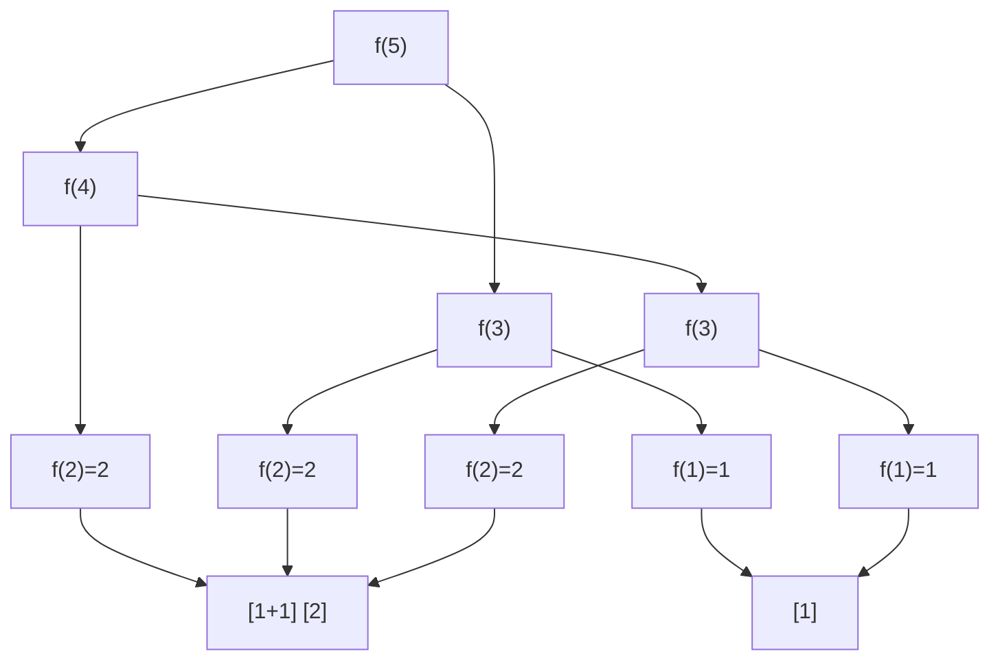

# LeetCode 70. Climbing Stairs（爬楼梯） — **简单**

## 考点
Math, Dynamic Programming, Memoization

## 题目描述
假设你正在爬楼梯。需要 `n` 阶你才能到达楼顶。

每次你可以爬 `1` 或 `2` 个台阶。你有多少种不同的方法可以爬到楼顶呢？

### 示例 1
```
输入：n = 2
输出：2
解释：有两种方法可以爬到楼顶。
1. 1 阶 + 1 阶
2. 2 阶
```

### 示例 2
```
输入：n = 3
输出：3
解释：有三种方法可以爬到楼顶。
1. 1 阶 + 1 阶 + 1 阶
2. 1 阶 + 2 阶
3. 2 阶 + 1 阶
```

### 约束
- `1 <= n <= 45`

## 图解



## 解题思路

### 核心思路
到达第 n 级台阶的最后一步只有两种可能：从 n-1 跨 1 步上来，或从 n-2 跨 2 步上来。因此 f(n) = f(n-1) + f(n-2)，这就是斐波那契数列。

**关键洞察：** 这是一个典型的"计数型 DP"，状态转移仅依赖前两个状态，可以做到 O(1) 空间。

### 算法步骤

1. 如果 n ≤ 2：返回 n（基础情况）
2. 初始化 prev2 = 1（f(1)），prev1 = 2（f(2)）
3. 对 i = 3 到 n：
   - curr = prev1 + prev2
   - prev2 = prev1
   - prev1 = curr
4. 返回 prev1

### 图解示例

**例子：n = 5 的决策树**

```
                        f(5)
                       /    \
                  f(4)      f(3)
                 /    \    /    \
            f(3)    f(2) f(2) f(1)
           /    \    |     |    |
       f(2)   f(1)  跳到2  跳到2  跳到1
        |       |
       跳到2    跳到1

f(2) = 2: [1+1], [2]
f(1) = 1: [1]

f(3) = f(2) + f(1) = 2 + 1 = 3
  [1+1+1], [1+2], [2+1]

f(4) = f(3) + f(2) = 3 + 2 = 5
  [1+1+1+1], [1+1+2], [1+2+1], [2+1+1], [2+2]

f(5) = f(4) + f(3) = 5 + 3 = 8
```

**台阶爬法对应（n=5, 共8种）：**

```
方式1:  1→1→1→1→1
方式2:  1→1→1→2
方式3:  1→1→2→1
方式4:  1→2→1→1
方式5:  2→1→1→1
方式6:  1→2→2
方式7:  2→1→2
方式8:  2→2→1
```

### 逐步追踪

**输入：n = 5**

| i | prev2 (f(i-2)) | prev1 (f(i-1)) | curr = prev2+prev1 | 含义 |
|---|-----------------|-----------------|-------------------|------|
| - | 1 (f(1)) | 2 (f(2)) | - | 初始 |
| 3 | 1 | 2 | **3** | f(3)=f(1)+f(2)=1+2=3 |
| 4 | 2 | 3 | **5** | f(4)=f(2)+f(3)=2+3=5 |
| 5 | 3 | 5 | **8** | f(5)=f(3)+f(4)=3+5=8 |

斐波那契数列增长：
```
n:  1  2  3  4  5  6   7   8   9  10
f:  1  2  3  5  8  13  21  34  55  89
```

### 边界情况

| 情况 | n | 处理 | 结果 |
|------|---|------|------|
| 最小台阶 | 1 | 直接返回 1 | 1 |
| 两台阶 | 2 | 直接返回 2 | 2 |
| 三台阶 | 3 | 循环一次 | 3 |
| 大台阶(n=45) | 45 | DP 循环 42 次 | 1836311903 |

### 方法对比

**方法一：迭代 DP（推荐）**
```
prev2 → prev1 → curr
时间: O(n), 空间: O(1)
```

**方法二：递归 + 记忆化**
```
f(n) = f(n-1) + f(n-2), 用 memo 去重
时间: O(n), 空间: O(n)（递归栈 + memo）
```

**方法三：矩阵快速幂（理论上最优）**
```
|f(n)  | = |1 1|^(n-1) × |f(1)|
|f(n-1)|   |1 0|         |f(0)|

用快速幂计算矩阵的 n-1 次方
时间: O(log n), 空间: O(1)
n=45 时 DP 已足够，n 更大（如 10^7）时需用此方法
```

**方法四：通项公式**
```
f(n) = (φ^(n+1) - ψ^(n+1)) / √5
其中 φ=(1+√5)/2, ψ=(1-√5)/2
浮点数精度问题，不推荐直接使用
```

### 复杂度分析

- **迭代 DP：** 时间 O(n)，空间 O(1)
- n ≤ 45 时 O(n) 绰绰有余
- 这道题是所有 DP 入门必做题，和斐波那契数列完全等价
