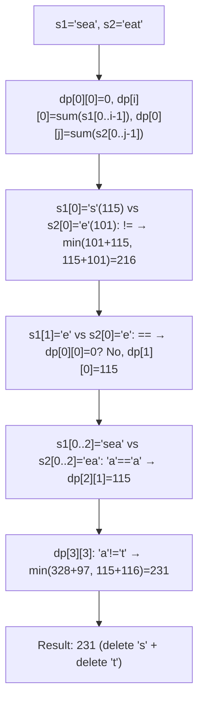
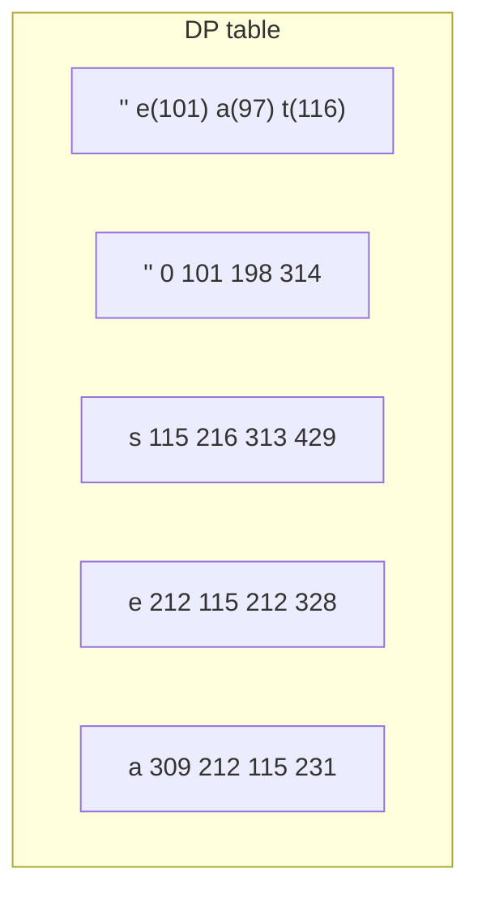
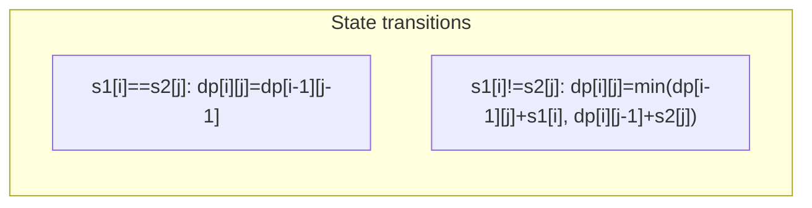

# LeetCode 712. Minimum ASCII Delete Sum for Two Strings（两个字符串的最小ASCII删除和） — **中等**

## 考点
字符串, 动态规划

## 题目描述
给定两个字符串 s1 和 s2，返回使两个字符串相等所需删除字符的 ASCII 值的最小和。

**示例 1:**
```
输入: s1 = "sea", s2 = "eat"
输出: 231
解释: 在 "sea" 中删除 "s" 并将 "s" 的值(115)加入总和。
在 "eat" 中删除 "t" 并将 116 加入总和。
结束时，两个字符串相等，115 + 116 = 231 就是符合条件的最小和。
```

**示例 2:**
```
输入：s1 = "delete", s2 = "leet"
输出：403
解释：在 "delete" 中删除 "dee" 字符串变成 "let"，将 100[d]+101[e]+101[e] 加入总和。在 "leet" 中删除 "e" 将 101[e] 加入总和。
结束时，两个字符串都等于 "let"，结果即为 100+101+101+101 = 403。
如果改为将两个字符串转换为 "lee" 或 "eet"，我们会得到 433 或 417 的结果，比 403 大。
```

**约束条件:**
- 1 <= s1.length, s2.length <= 1000
- s1 和 s2 由小写英文字母组成

## 图解







## 解题思路

### 核心思路

**带权重的编辑距离（只允许删除）**。使两字符串相等需要删除一些字符，求删除字符的 ASCII 值之和最小。`dp[i][j]` 表示使 `s1[0..i-1]` 和 `s2[0..j-1]` 相等的最小 ASCII 删除和。

### 算法步骤

1. 定义 `dp[i][j]`：使 `s1[0..i-1]` 和 `s2[0..j-1]` 相等的最小删除 ASCII 和
2. 初始化：
   - `dp[0][0] = 0`
   - `dp[i][0] = dp[i-1][0] + s1[i-1]`（删掉 s1 所有字符）
   - `dp[0][j] = dp[0][j-1] + s2[j-1]`（删掉 s2 所有字符）
3. 状态转移（i,j 从 1 开始）：
   - `s1[i-1] == s2[j-1]`：这两字符可以保留，`dp[i][j] = dp[i-1][j-1]`
   - `s1[i-1] != s2[j-1]`：必须删除一个字符：
     `dp[i][j] = min(dp[i-1][j] + s1[i-1], dp[i][j-1] + s2[j-1])`
4. 返回 `dp[m][n]`

### 图解示例

```
s1 = "sea", s2 = "eat"
字符及ASCII: s=115, e=101, a=97, t=116

dp 表 (i行: s1前缀, j列: s2前缀):

       ""     e      a      t
  "" [  0,   101,   198,   314 ]
      [删除  删除e  删除ea  删除eat]
  s  [ 115,   ? ,    ? ,    ?  ]
  e  [ 212,   ? ,    ? ,    ?  ]
  a  [ 309,   ? ,    ? ,    ?  ]

填表过程:

dp[1][1]: s1="s", s2="e" → s≠e
  min(dp[0][1]+115=101+115=216, dp[1][0]+101=115+101=216) = 216

dp[1][2]: s1="s", s2="ea" → s≠a
  min(dp[0][2]+115=198+115=313, dp[1][1]+97=216+97=313) = 313

dp[1][3]: s1="s", s2="eat" → s≠t
  min(dp[0][3]+115=314+115=429, dp[1][2]+116=313+116=429) = 429

dp[2][1]: s1="se", s2="e" → e=e
  dp[1][0] = 115

dp[2][2]: s1="se", s2="ea" → e≠a
  min(dp[1][2]+101=313+101=414, dp[2][1]+97=115+97=212) = 212

dp[2][3]: s1="se", s2="eat" → e≠t
  min(dp[1][3]+101=429+101=530, dp[2][2]+116=212+116=328) = 328

dp[3][1]: s1="sea", s2="e" → a≠e
  min(dp[2][1]+97=115+97=212, dp[3][0]+101=309+101=410) = 212

dp[3][2]: s1="sea", s2="ea" → a=a
  dp[2][1] = 115

dp[3][3]: s1="sea", s2="eat" → a≠t
  min(dp[2][3]+97=328+97=425, dp[3][2]+116=115+116=231) = 231

最终 dp 表:
       ""    e     a     t
  "" [  0,  101,  198,  314 ]
  s  [115,  216,  313,  429 ]
  e  [212,  115,  212,  328 ]
  a  [309,  212,  115,  231 ]

结果: dp[3][3] = 231
操作: 删除 s(115) + 删除 t(116) = 231 ✓
```

```
删除路径可视化:

  s1 = "s e a"
         ↓
        删除 s(115) → "ea"
  
  s2 = "e a t"
             ↓
        删除 t(116) → "ea"

  最终相等: "ea", 总代价 = 115 + 116 = 231
```

### 逐步追踪

| i | j | s1[i-1] | s2[j-1] | 相同? | dp[i-1][j]+s1 | dp[i][j-1]+s2 | dp[i][j] |
|---|---|---------|---------|-------|--------------|--------------|----------|
| 1 | 1 | s(115) | e(101) | N | 101+115=216 | 115+101=216 | 216 |
| 1 | 2 | s(115) | a(97) | N | 198+115=313 | 216+97=313 | 313 |
| 1 | 3 | s(115) | t(116) | N | 314+115=429 | 313+116=429 | 429 |
| 2 | 1 | e(101) | e(101) | Y | - | - | 115 |
| 2 | 2 | e(101) | a(97) | N | 313+101=414 | 115+97=212 | 212 |
| 2 | 3 | e(101) | t(116) | N | 429+101=530 | 212+116=328 | 328 |
| 3 | 1 | a(97) | e(101) | N | 115+97=212 | 309+101=410 | 212 |
| 3 | 2 | a(97) | a(97) | Y | - | - | 115 |
| 3 | 3 | a(97) | t(116) | N | 328+97=425 | 115+116=231 | 231 |

### 边界情况

- 一个字符串为空：返回另一个字符串所有字符 ASCII 值之和
- 两字符串相同：返回 0
- 两字符串完全不同：返回两个字符串所有字符 ASCII 值之和

### 复杂度分析

- **时间复杂度**：O(m × n)
- **空间复杂度**：O(m × n)，可优化至 O(min(m,n))

### 方法对比

| 方法 | 时间复杂度 | 空间复杂度 | 说明 |
|------|-----------|-----------|------|
| 直接 DP（带权重） | O(mn) | O(mn) | 标准解法 |
| LCS 转化 + 总ASCII - 2×最大公共ASCII | O(mn) | O(mn) | 转化为求最大ASCII和公共子序列 |
| 滚动数组 DP | O(mn) | O(min(m,n)) | 空间优化 |
