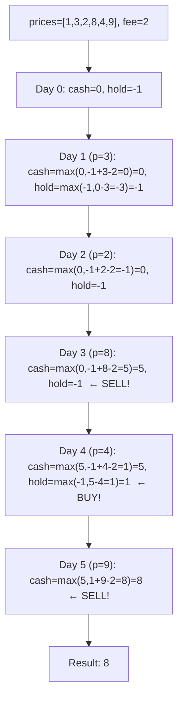
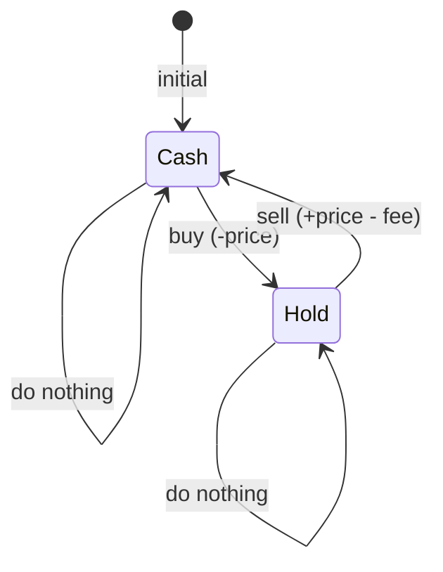
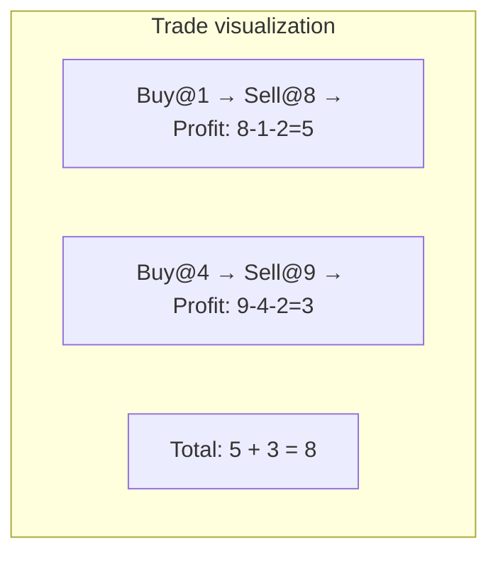

# LeetCode 714. Best Time to Buy and Sell Stock with Transaction Fee（买卖股票的最佳时机含手续费） — **中等**

## 考点
贪心, 数组, 动态规划

## 题目描述
给定一个整数数组 prices，其中 prices[i] 表示第 i 天的股票价格；整数 fee 代表了交易股票的手续费用。

你可以无限次地完成交易，但是你每笔交易都需要付手续费。如果你已经购买了一个股票，在卖出它之前你就不能再继续购买股票了。

返回获得利润的最大值。

注意：这里的一笔交易指买入持有并卖出股票的整个过程，每笔交易你只需要为支付一次手续费。

**示例 1:**
```
输入：prices = [1, 3, 2, 8, 4, 9], fee = 2
输出：8
解释：能够达到的最大利润：
在此处买入 prices[0] = 1
在此处卖出 prices[3] = 8
在此处买入 prices[4] = 4
在此处卖出 prices[5] = 9
总利润: ((8 - 1) - 2) + ((9 - 4) - 2) = 8
```

**示例 2:**
```
输入：prices = [1,3,7,5,10,3], fee = 3
输出：6
```

**约束条件:**
- 1 <= prices.length <= 5 * 10^4
- 1 <= prices[i] < 5 * 10^4
- 0 <= fee < 5 * 10^4

## 图解







## 解题思路

### 核心思路

**状态机 DP**。每天结束时只有两种状态：持有股票（`hold`）和不持有股票（`cash`）。卖出时需扣除手续费。每天根据前一天的状态和当天价格做决策。

### 算法步骤

1. 初始化：
   - `cash = 0`（第一天结束时不持有股票，收益为 0）
   - `hold = -prices[0]`（第一天结束时持有股票，花费 prices[0]）
2. 从第 1 天起遍历 prices：
   - `cash = max(cash, hold + prices[i] - fee)`（卖出：之前持有的收益 + 当天价格 - 手续费）
   - `hold = max(hold, cash - prices[i])`（买入：当前现金 - 当天价格）
3. 返回 `cash`（最后一天不持有股票的状态）

### 图解示例

```
prices = [1, 3, 2, 8, 4, 9], fee = 2

状态转移:

Day 0 (p=1): cash=0, hold=-1
  操作: 买入(花费1), 或什么都不做(现金0)

Day 1 (p=3):
  cash = max(0, -1+3-2=0) = 0     → 不卖(卖出利润为0, 没必要)
  hold = max(-1, 0-3=-3) = -1     → 不买(买入后亏损更多)

Day 2 (p=2):
  cash = max(0, -1+2-2=-1) = 0    → 不卖(亏钱)
  hold = max(-1, 0-2=-2) = -1

Day 3 (p=8):
  cash = max(0, -1+8-2=5) = 5     → 卖出! 利润5
  hold = max(-1, 5-8=-3) = -1

Day 4 (p=4):
  cash = max(5, -1+4-2=1) = 5     → 不卖(不如之前)
  hold = max(-1, 5-4=1) = 1       → 买入! hold=1表示以净收益1的状态持有股票

Day 5 (p=9):
  cash = max(5, 1+9-2=8) = 8      → 卖出! 利润8
  hold = max(1, 8-9=-1) = 1

结果: cash = 8
```

```
交易路径:
  Day0 买入@1  →  Day3 卖出@8  →  利润: 8-1-2 = 5
  Day4 买入@4  →  Day5 卖出@9  →  利润: 9-4-2 = 3
  总利润: 5 + 3 = 8
```

### 逐步追踪

| Day | price | 卖操作(cash候选) | 买操作(hold候选) | cash | hold |
|-----|-------|----------------|-----------------|------|------|
| 0 | 1 | - | - | 0 | -1 |
| 1 | 3 | -1+3-2=0 | 0-3=-3 | 0 | -1 |
| 2 | 2 | -1+2-2=-1 | 0-2=-2 | 0 | -1 |
| 3 | 8 | -1+8-2=5 | 5-8=-3 | 5 | -1 |
| 4 | 4 | -1+4-2=1 | 5-4=1 | 5 | 1 |
| 5 | 9 | 1+9-2=8 | 8-9=-1 | 8 | 1 |

注意：Day 4 的 hold 更新时，使用的 `cash` 是**更新前**的值。某些实现可能用临时变量保存旧值，确保 buy 和 sell 在同一天不能同时发生。

正确更新顺序：
```
temp_cash = max(cash, hold + price - fee)
temp_hold = max(hold, cash - price)     ← 用旧的 cash
cash = temp_cash
hold = temp_hold
```

### 边界情况

- 只有一天：返回 0（无法完成一次交易获利，买+卖+手续费的净收益 <= 0）
- fee = 0：退化为无限次交易无手续费（LeetCode 122）
- prices 单调递减：返回 0（无论如何买入都会亏）
- prices 单调递增：一次买入持有到最后卖出最优

### 复杂度分析

- **时间复杂度**：O(n)，一次遍历
- **空间复杂度**：O(1)，只使用两个变量

### 方法对比

| 方法 | 时间复杂度 | 空间复杂度 | 说明 |
|------|-----------|-----------|------|
| 状态机 DP | O(n) | O(1) | 最优解 |
| 贪心 | O(n) | O(1) | 状态机本质也是贪心 |
| 二维 DP 数组 | O(n) | O(n) | dp[i][0]=不持有, dp[i][1]=持有 |