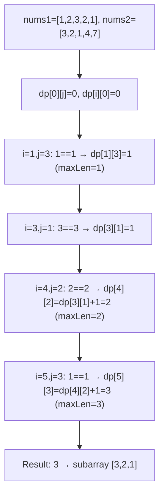
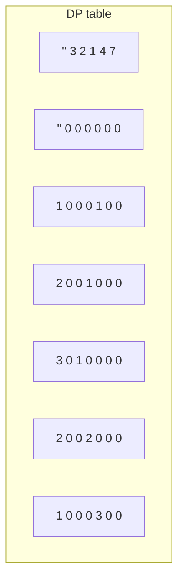
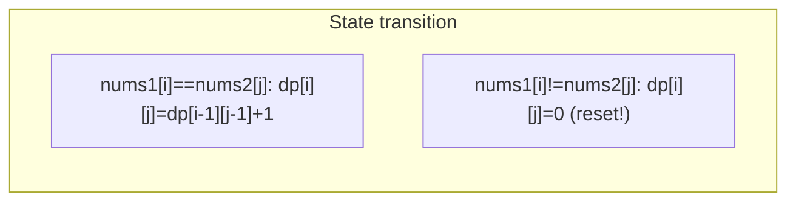
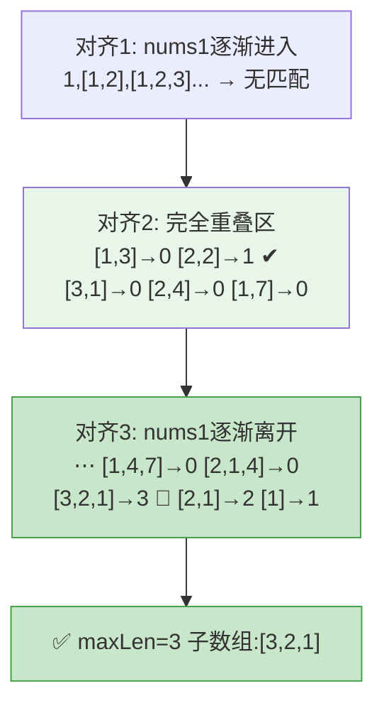

# LeetCode 718. Maximum Length of Repeated Subarray（最长重复子数组） — **中等**

## 考点
数组, 二分搜索, 动态规划, 滑动窗口, 滚动哈希

## 题目描述
给两个整数数组 nums1 和 nums2，返回两个数组中公共的、长度最长的子数组的长度。

**示例 1:**
```
输入：nums1 = [1,2,3,2,1], nums2 = [3,2,1,4,7]
输出：3
解释：长度最长的公共子数组是 [3,2,1]。
```

**示例 2:**
```
输入：nums1 = [0,0,0,0,0], nums2 = [0,0,0,0,0]
输出：5
```

**约束条件:**
- 1 <= nums1.length, nums2.length <= 1000
- 0 <= nums1[i], nums2[i] <= 100

## 图解







### 滑动窗口对齐法图解

将 nums1=[1,2,3,2,1] 在 nums2=[3,2,1,4,7] 上滑动对齐，统计最长连续匹配：



> ⚠️ 实现使用 DP 解法 O(m×n)，滑动窗口对齐法 O((m+n)×min(m,n)) 为替代思路。

## 解题思路

### 核心思路

**最长公共子数组**要求子数组连续，是 DP 经典问题。`dp[i][j]` 表示以 `nums1[i-1]` 和 `nums2[j-1]` **结尾**的最长公共子数组长度。当两元素相同时，在前一位置基础上 +1；不同时归零。

### 算法步骤

1. 定义 `dp[i][j]`：以 `nums1[i-1]` 和 `nums2[j-1]` 结尾的最长公共子数组长度
2. 初始化 `dp[0][j] = 0, dp[i][0] = 0`
3. 遍历 i 从 1 到 m, j 从 1 到 n：
   - 若 `nums1[i-1] == nums2[j-1]`：`dp[i][j] = dp[i-1][j-1] + 1`
   - 否则：`dp[i][j] = 0`
4. 遍历过程中记录 `maxLen = max(maxLen, dp[i][j])`
5. 返回 maxLen

**空间优化**：由于 `dp[i][j]` 只依赖于 `dp[i-1][j-1]`（左上角），可以降为一维数组，但需倒序遍历 j。

### 图解示例

```
nums1 = [1, 2, 3, 2, 1]
nums2 = [3, 2, 1, 4, 7]

dp 表:

        ""  3  2  1  4  7
  ""  [ 0, 0, 0, 0, 0, 0 ]
  1   [ 0, 0, 0, 1, 0, 0 ]   ← nums1[0]=1, nums2[2]=1, 匹配!
  2   [ 0, 0, 1, 0, 0, 0 ]   ← nums1[1]=2, nums2[1]=2, 匹配!
  3   [ 0, 1, 0, 0, 0, 0 ]   ← nums1[2]=3, nums2[0]=3, 匹配!
  2   [ 0, 0, 2, 0, 0, 0 ]   ← nums1[3]=2, nums2[1]=2, dp[2][0]+1=0+1=1?不
                              ← 不对... dp[3-1][1-1]+1 = dp[2][0]+1 = 0+1 = 1
  1   [ 0, 0, 0, 3, 0, 0 ]   ← nums1[4]=1, nums2[2]=1, dp[3][1]+1 = dp[3][1]+1

让我重新填表:

       ""  3  2  1  4  7
  "" [ 0, 0, 0, 0, 0, 0 ]
  1  [ 0, 0, 0, 1, 0, 0 ]    i=1, j=3: nums1[0]=1, nums2[2]=1 → dp[0][2]+1=1
  2  [ 0, 0, 1, 0, 0, 0 ]    i=2, j=2: nums1[1]=2, nums2[1]=2 → dp[1][1]+1=1
  3  [ 0, 1, 0, 0, 0, 0 ]    i=3, j=1: nums1[2]=3, nums2[0]=3 → dp[2][0]+1=1
  2  [ 0, 0, 2, 0, 0, 0 ]    i=4, j=2: nums1[3]=2, nums2[1]=2 → dp[3][1]+1=1+1=2
  1  [ 0, 0, 0, 3, 0, 0 ]    i=5, j=3: nums1[4]=1, nums2[2]=1 → dp[4][2]+1=2+1=3

maxLen = 3
公共子数组: [3, 2, 1] = nums1[2..4] = nums2[0..2]
```

```
连续匹配链:

nums1:  1  2  3  2  1
              ↘ ↘ ↘
nums2:  3  2  1  4  7

匹配链: (nums1[2]=3,nums2[0]=3) → (nums1[3]=2,nums2[1]=2) → (nums1[4]=1,nums2[2]=1)
长度: 3
```

### 逐步追踪

| i | j | nums1[i-1] | nums2[j-1] | 是否相同 | dp[i][j] | maxLen |
|---|---|-----------|-----------|---------|----------|--------|
| 1 | 1 | 1 | 3 | N | 0 | 0 |
| 1 | 2 | 1 | 2 | N | 0 | 0 |
| 1 | 3 | 1 | 1 | Y | dp[0][2]+1=1 | 1 |
| 1 | 4-5 | ... | ... | N | 0 | 1 |
| 2 | 1 | 2 | 3 | N | 0 | 1 |
| 2 | 2 | 2 | 2 | Y | dp[1][1]+1=1 | 1 |
| 2 | 3 | 2 | 1 | N | 0 | 1 |
| 2 | 4-5 | ... | ... | N | 0 | 1 |
| 3 | 1 | 3 | 3 | Y | dp[2][0]+1=1 | 1 |
| 3 | 2 | 3 | 2 | N | 0 | 1 |
| 3 | 3-5 | ... | ... | ... | 0 | 1 |
| 4 | 1 | 2 | 3 | N | 0 | 1 |
| 4 | 2 | 2 | 2 | Y | dp[3][1]+1=2 | 2 |
| 4 | 3-5 | ... | ... | N | 0 | 2 |
| 5 | 1 | 1 | 3 | N | 0 | 2 |
| 5 | 2 | 1 | 2 | N | 0 | 2 |
| 5 | 3 | 1 | 1 | Y | dp[4][2]+1=3 | 3 |
| 5 | 4-5 | ... | ... | N | 0 | 3 |

### 边界情况

- 两数组无公共元素：返回 0
- 一个数组为空：返回 0
- 两数组完全相同：返回数组长度
- 值域只有 [0, 100]：可以考虑使用哈希或其他方法

### 复杂度分析

- **时间复杂度**：O(m × n)
- **空间复杂度**：O(m × n)，可优化至 O(min(m,n))

### 方法对比

| 方法 | 时间复杂度 | 空间复杂度 | 说明 |
|------|-----------|-----------|------|
| DP | O(mn) | O(mn) | 标准解法 |
| 一维滚动 DP | O(mn) | O(min(m,n)) | 空间优化，倒序更新 |
| 滑动窗口对齐 | O((m+n)×min(m,n)) | O(1) | 枚举对齐位置扫描 |
| 二分 + 滚动哈希 | O((m+n)logn) | O(n) | 对长度二分，用哈希验证 |
