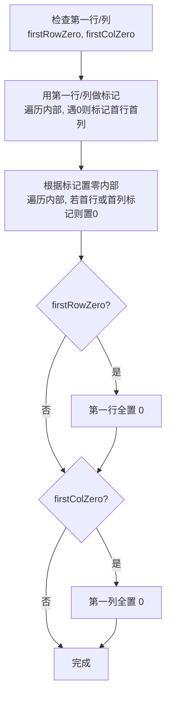

# LeetCode 73. Set Matrix Zeroes（矩阵置零） — **中等**

## 考点
Array, Hash Table, Matrix

## 题目描述
给定一个 `m x n` 的矩阵，如果一个元素为 `0`，则将其所在行和列的所有元素都设为 `0`。请使用 **原地** 算法。

### 示例 1
```
输入：matrix = [[1,1,1],[1,0,1],[1,1,1]]
输出：[[1,0,1],[0,0,0],[1,0,1]]
```

### 示例 2
```
输入：matrix = [[0,1,2,0],[3,4,5,2],[1,3,1,5]]
输出：[[0,0,0,0],[0,4,5,0],[0,3,1,0]]
```

### 约束
- `m == matrix.length`
- `n == matrix[0].length`
- `1 <= m, n <= 200`
- `-2^31 <= matrix[i][j] <= 2^31 - 1`

**进阶：** 使用 O(m + n) 空间复杂度是简单方案。能否使用 O(1) 空间复杂度？

## 图解



## 解题思路

### 核心思路
O(m+n) 空间方案简单：用两个额外数组标记哪些行和列含 0。但进阶要求 O(1) 空间，技巧是**复用第一行和第一列作为标记数组**。

**关键洞察：** 第一行和第一列本身是否含 0 需要用两个额外布尔变量记录，因为它们被复用为标记存储区，如果先修改它们就会丢失信息。

### 算法步骤

1. 检查第一行是否含 0：遍历 j，若 matrix[0][j] == 0，firstRowZero = true
2. 检查第一列是否含 0：遍历 i，若 matrix[i][0] == 0，firstColZero = true
3. **标记阶段：** 遍历 i=1..m-1, j=1..n-1：
   - 若 matrix[i][j] == 0：设置 matrix[i][0] = 0 和 matrix[0][j] = 0
4. **置零内部：** 遍历 i=1..m-1, j=1..n-1：
   - 若 matrix[i][0] == 0 或 matrix[0][j] == 0：matrix[i][j] = 0
5. **处理第一行：** 若 firstRowZero，将第一行全置 0
6. **处理第一列：** 若 firstColZero，将第一列全置 0

### 图解示例

**例子：matrix = [[0,1,2,0],[3,4,5,2],[1,3,1,5]]**

```
原始矩阵:
    ┌───┬───┬───┬───┐
    │ 0 │ 1 │ 2 │ 0 │  ← 第0行含0
    ├───┼───┼───┼───┤
    │ 3 │ 4 │ 5 │ 2 │
    ├───┼───┼───┼───┤
    │ 1 │ 3 │ 1 │ 5 │
    └───┴───┴───┴───┘
    ↑               ↑
  第0列也有0

Step 1 & 2: 检查第一行/列
  firstRowZero = true (matrix[0][0]=0, matrix[0][3]=0)
  firstColZero = true (matrix[0][0]=0)

Step 3: 标记 (扫描内部区域)
  i=1,j=0..3: 没有0，不标记
  i=2,j=0..3: 没有0，不标记
  标记后的矩阵:
    ┌───┬───┬───┬───┐
    │ 0 │ 1 │ 2 │ 0 │
    ├───┼───┼───┼───┤
    │ 3 │ 4 │ 5 │ 2 │
    ├───┼───┼───┼───┤
    │ 1 │ 3 │ 1 │ 5 │
    └───┴───┴───┴───┘

Step 4: 根据标记置零内部
  检查 matrix[i][0] 和 matrix[0][j]:
  - 第1行: matrix[1][0]=3≠0, 但 matrix[0][0]=0 → matrix[1][0]=0
            matrix[1][3]=2, matrix[0][3]=0 → matrix[1][3]=0
  - 第2行: matrix[2][0]=1≠0, 但 matrix[0][0]=0 → matrix[2][0]=0
            matrix[2][3]=5, matrix[0][3]=0 → matrix[2][3]=0

  置零后:
    ┌───┬───┬───┬───┐
    │ 0 │ 1 │ 2 │ 0 │  ← 第一行/列还没处理
    ├───┼───┼───┼───┤
    │ 0 │ 4 │ 5 │ 0 │
    ├───┼───┼───┼───┤
    │ 0 │ 3 │ 1 │ 0 │
    └───┴───┴───┴───┘

Step 5 & 6: 处理第一行和第一列
  firstRowZero=true → 第一行全0
  firstColZero=true → 第一列全0

最终结果:
    ┌───┬───┬───┬───┐
    │ 0 │ 0 │ 0 │ 0 │
    ├───┼───┼───┼───┤
    │ 0 │ 4 │ 5 │ 0 │
    ├───┼───┼───┼───┤
    │ 0 │ 3 │ 1 │ 0 │
    └───┴───┴───┴───┘
```

### 逐步追踪

**输入：matrix = [[1,1,1],[1,0,1],[1,1,1]]**

| 阶段 | 操作 | firstRowZero | firstColZero | 关键变化 |
|------|------|:---:|:---:|------|
| 初始 | - | - | - | [[1,1,1],[1,0,1],[1,1,1]] |
| Step1 | 检查第0行 | false | - | 无变化 |
| Step2 | 检查第0列 | false | false | 无变化 |
| Step3 | 标记 (i=1,j=1): matrix[1][1]=0 | false | false | matrix[1][0]=0, matrix[0][1]=0 |
| Step4 | 根据标记置零内部 | - | - | matrix[1][1]=0(已是), 置零相交行列中的元素 |
| Step5 | 处理第一行 | false | - | 不变 |
| Step6 | 处理第一列 | - | false | 不变 |

结果矩阵：
```
标记后:        置零内部后:      最终:
[1,0,1]       [1,0,1]        [1,0,1]
[0,0,1]  →    [0,0,0]   →    [0,0,0]
[1,1,1]       [1,0,1]        [1,0,1]
```

### 边界情况

| 情况 | 输入 | 处理要点 | 结果 |
|------|------|----------|------|
| 第一行含0 | [[0,1,2]] | firstRowZero=true, 第一行全0 | [[0,0,0]] |
| 第一列含0 | [[1],[0],[3]] | firstColZero=true, 第一列全0 | [[0],[0],[0]] |
| 起点是0 | [[0,1],[1,2]] | 两个flag都为true | [[0,0],[0,0]] |
| 无0 | [[1,2],[3,4]] | 无变化 | [[1,2],[3,4]] |
| 1×1网格 | [[0]] | 两个flag都为true | [[0]] |

### 复杂度分析

- **时间复杂度：** O(m × n)，遍历矩阵常数次（标记1次 + 置零1次 + 首行/列检查）
- **空间复杂度：** O(1)，只使用两个布尔变量
- 这是 O(1) 空间的经典技巧，核心是复用输入数组的空间做标记
