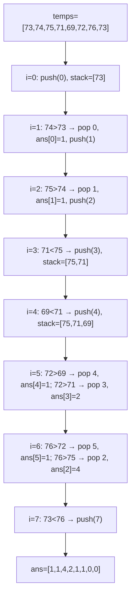
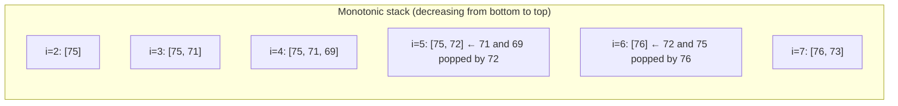

# LeetCode 739. Daily Temperatures（每日温度） — **中等**

## 考点
栈, 数组, 单调栈

## 题目描述
给定一个整数数组 temperatures，表示每天的温度，返回一个数组 answer，其中 answer[i] 表示对于第 i 天，下一个更高温度出现在几天后。如果气温在这之后都不会升高，请在该位置用 0 来代替。

**示例 1:**
```
输入: temperatures = [73,74,75,71,69,72,76,73]
输出: [1,1,4,2,1,1,0,0]
```

**示例 2:**
```
输入: temperatures = [30,40,50,60]
输出: [1,1,1,0]
```

**示例 3:**
```
输入: temperatures = [30,60,90]
输出: [1,1,0]
```

**约束条件:**
- 1 <= temperatures.length <= 10^5
- 30 <= temperatures[i] <= 100

## 图解





## 解题思路

### 核心思路

**单调递减栈**解决「下一个更大元素」问题。维护一个存储索引的栈，保证栈内索引对应的温度是递减的。当遇到比栈顶更大的温度时，弹出栈顶并记录差值（天数间隔）。

### 算法步骤

1. 初始化 `answer[n]` 全为 0，以及空栈 `stack`
2. 遍历 i 从 0 到 n-1：
   - 当栈非空 且 `temperatures[i] > temperatures[stack.peek()]`：
     - `prev = stack.pop()`（找到 prev 的下一个更高温度）
     - `answer[prev] = i - prev`
   - `stack.push(i)`
3. 返回 answer（栈中剩余索引保持 0，表示没有更高温度）

### 图解示例

```
temperatures = [73, 74, 75, 71, 69, 72, 76, 73]

过程追踪:

 i=0, temp=73:
   栈空 → push(0)
   栈: [0]

 i=1, temp=74:
   栈顶=0, temp[0]=73
   74 > 73 → pop(0), answer[0] = 1-0 = 1
   push(1)
   栈: [1]

 i=2, temp=75:
   栈顶=1, temp[1]=74
   75 > 74 → pop(1), answer[1] = 2-1 = 1
   push(2)
   栈: [2]

 i=3, temp=71:
   栈顶=2, temp[2]=75
   71 < 75 → push(3)
   栈: [2, 3]

 i=4, temp=69:
   栈顶=3, temp[3]=71
   69 < 71 → push(4)
   栈: [2, 3, 4]

 i=5, temp=72:
   栈顶=4, temp[4]=69
   72 > 69 → pop(4), answer[4] = 5-4 = 1
   栈: [2, 3]
   栈顶=3, temp[3]=71
   72 > 71 → pop(3), answer[3] = 5-3 = 2
   栈: [2]
   栈顶=2, temp[2]=75
   72 < 75 → push(5)
   栈: [2, 5]

 i=6, temp=76:
   栈顶=5, temp[5]=72
   76 > 72 → pop(5), answer[5] = 6-5 = 1
   栈: [2]
   栈顶=2, temp[2]=75
   76 > 75 → pop(2), answer[2] = 6-2 = 4
   栈空 → push(6)
   栈: [6]

 i=7, temp=73:
   栈顶=6, temp[6]=76
   73 < 76 → push(7)
   栈: [6, 7]

遍历结束，栈中 [6, 7] 的 answer 保持 0

结果: answer = [1, 1, 4, 2, 1, 1, 0, 0]
```

```
单调栈可视化:

  温度  i=0  i=1  i=2  i=3  i=4  i=5  i=6  i=7
   76                         ↑栈顶(75→2)
   75              ↑栈顶(74→1)  ← pop → 76>75
   74     ↑栈顶(73→0)
   73  ↑push0 ←pop
   72                         ↑push5
   71                   ↑push3
   69                       ↑push4

栈内温度始终递减（从底到顶）:
  栈底 → 栈顶
  [75]           i=2 时
  [75, 71]       i=3 时
  [75, 71, 69]   i=4 时
  [75, 72]       i=5 时 (弹出71和69)
  [76]           i=6 时
  [76, 73]       i=7 时
```

### 逐步追踪

| i | temp[i] | 栈内容(值,索引) | 弹出操作 | answer更新 |
|---|---------|---------------|---------|-----------|
| 0 | 73 | [(73,0)] | - | - |
| 1 | 74 | [(74,1)] | pop(73,0) | answer[0]=1 |
| 2 | 75 | [(75,2)] | pop(74,1) | answer[1]=1 |
| 3 | 71 | [(75,2),(71,3)] | - | - |
| 4 | 69 | [(75,2),(71,3),(69,4)] | - | - |
| 5 | 72 | [(75,2),(72,5)] | pop(69,4),pop(71,3) | answer[4]=1,answer[3]=2 |
| 6 | 76 | [(76,6)] | pop(72,5),pop(75,2) | answer[5]=1,answer[2]=4 |
| 7 | 73 | [(76,6),(73,7)] | - | - |

answer[6]=0, answer[7]=0 (栈中剩余)
最终: [1,1,4,2,1,1,0,0]

### 边界情况

- 只有一个温度：返回 [0]
- 温度严格递增：每步都弹出，answer[i] = 1（除了最后一个为 0）
- 温度严格递减：全部入栈不退，所有 answer 为 0
- 温度相同：不弹出（题目要求「更高」温度，相等不算）

### 复杂度分析

- **时间复杂度**：O(n)，每个元素最多入栈出栈各一次
- **空间复杂度**：O(n)，最坏情况下栈存所有元素（递减序列）

### 方法对比

| 方法 | 时间复杂度 | 空间复杂度 | 说明 |
|------|-----------|-----------|------|
| 单调栈 | O(n) | O(n) | 最优解 |
| 暴力双重循环 | O(n²) | O(1) | 对每个 i 向后找到第一个更大的 |
| 从右到左 DP | O(n) | O(1) | 利用 answer 跳过部分检查（跳表法） |
