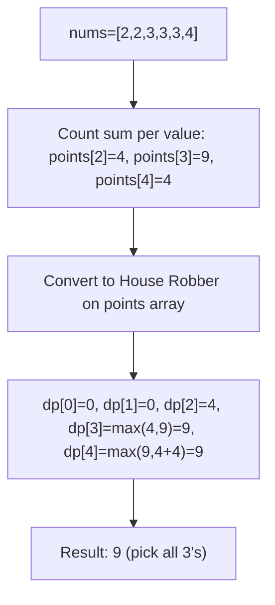
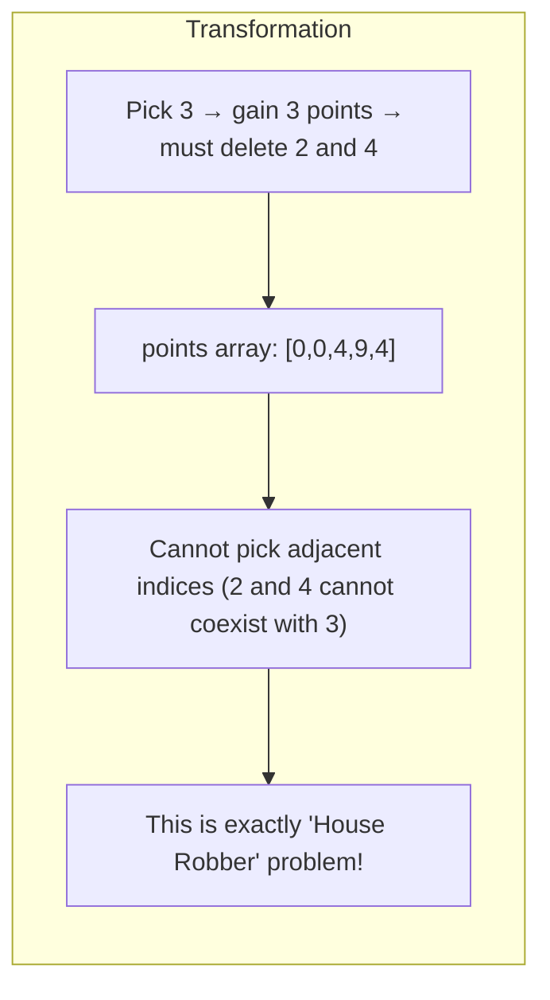
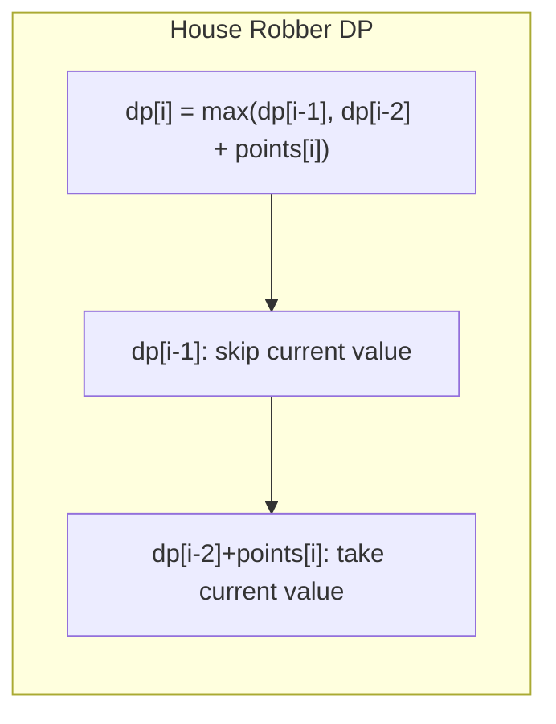

# LeetCode 740. Delete and Earn（删除并获得点数） — **中等**

## 考点
数组, 哈希表, 动态规划

## 题目描述
给你一个整数数组 nums，你可以对它进行一些操作。

每次操作中，选择任意一个 nums[i]，删除它并获得 nums[i] 的点数。之后，你必须删除所有等于 nums[i] - 1 和 nums[i] + 1 的元素。

开始你拥有 0 个点数。返回你能通过这些操作获得的最大点数。

**示例 1:**
```
输入：nums = [3,4,2]
输出：6
解释：
删除 4 获得 4 个点数，因此 3 也被删除。
之后，删除 2 获得 2 个点数。总共获得 6 个点数。
```

**示例 2:**
```
输入：nums = [2,2,3,3,3,4]
输出：9
解释：
删除 3 获得 3 个点数，接着要删除两个 2 和 4。
之后，再次删除 3 获得 3 个点数，再次删除 3 获得 3 个点数。
总共获得 9 个点数。
```

**约束条件:**
- 1 <= nums.length <= 2 * 10^4
- 1 <= nums[i] <= 10^4

## 图解







## 解题思路

### 核心思路

选择 `nums[i]` 就必须删除 `nums[i]-1` 和 `nums[i]+1`，意味着不能同时选择相邻数值。这等价于**打家劫舍**问题的变体。预处理：将相同数值的点数累加，变成「点数数组」，然后对相邻位置做打家劫舍 DP。

### 算法步骤

1. 统计 `maxVal = max(nums)`，创建 `points[maxVal+1]` 数组
2. 遍历 nums，`points[num] += num`（相同数值累加点数）
3. 对 points 数组做打家劫舍 DP：
   - `prev2 = points[0]`（dp[i-2]）
   - `prev1 = max(points[0], points[1])`（dp[i-1]）
   - 对于 i 从 2 到 maxVal：
     - `curr = max(prev1, prev2 + points[i])`
     - `prev2 = prev1, prev1 = curr`
4. 返回 prev1

### 图解示例

```
nums = [2, 2, 3, 3, 3, 4]

预处理:
  数值:   0  1  2  3  4
  points: [0, 0, 4, 9, 4]
            (2出现2次=4, 3出现3次=9, 4出现1次=4)

打家劫舍 DP:
  不能同时选择相邻的数值(如选了3就不能选2和4)

  dp[0] = 0      (数值0不存在)
  dp[1] = 0      (数值1不存在)
  dp[2] = 4      (选数值2) 或 前面: max(dp[1], dp[0]+4) = max(0,4) = 4
  dp[3] = max(dp[2], dp[1]+9) = max(4, 0+9) = 9      (选数值3更好)
  dp[4] = max(dp[3], dp[2]+4) = max(9, 4+4) = 9      (保持选3)

结果: 9
对应操作: 选择所有3 (3×3=9), 2和4被删除
```

```
问题转化可视化:

  原问题: nums = [2,2,3,3,3,4]
    选择 3 → 获得3分 → 删除所有2和4
    可以再选择另一个3 → 获得3分 → 2和4已被删除
    再选一个3 → 获得3分

  等价于: 统计各数值收益, 不能选相邻的
    value: 0  1  2  3  4
    score: 0  0  4  9  4
    
    选或不选:
    ┌────┬────┬────┬────┬────┐
    │ 0  │ 1  │ 2  │ 3  │ 4  │
    │ ·  │ ·  │ ✓  │ ·  │ ·  │   收益=4
    │ ·  │ ·  │ ·  │ ✓  │ ·  │   收益=9  ← 最优
    │ ·  │ ·  │ ✓  │ ·  │ ✓  │   不行! 3在2和4之间
    └────┴────┴────┴────┴────┘
```

### 逐步追踪

| i | points[i] | prev2(i-2) | prev1(i-1) | prev2+points[i] | curr = max(prev1, prev2+points) | 含义 |
|---|----------|------------|------------|-----------------|-------------------------------|------|
| 0 | 0 | - | - | - | 0 | 不选0 |
| 1 | 0 | 0 | 0 | 0+0=0 | max(0,0)=0 | 不选1 |
| 2 | 4 | 0 | 0 | 0+4=4 | max(0,4)=4 | 选2 |
| 3 | 9 | 0 | 4 | 0+9=9 | max(4,9)=9 | 选3(不选2) |
| 4 | 4 | 4 | 9 | 4+4=8 | max(9,8)=9 | 保持选3 |

### 边界情况

- 所有元素相同：返回 sum(nums)
- 只有一个元素：返回该元素的值
- nums[i] 可能为 1：points[0] 不会被利用，但要确保 points[1] 能正确计算
- maxVal 可能达 10^4：points 数组大小 OK

### 复杂度分析

- **时间复杂度**：O(N + maxVal)，N 是 nums 长度，maxVal <= 10^4
- **空间复杂度**：O(maxVal)

### 方法对比

| 方法 | 时间复杂度 | 空间复杂度 | 说明 |
|------|-----------|-----------|------|
| 打家劫舍转化 | O(N+maxVal) | O(maxVal) | 标准解法 |
| 排序+DP | O(NlogN) | O(N) | 按数值排序后 DP |
| DFS + 记忆化 | O(N+maxVal) | O(maxVal) | 递归解法 |
