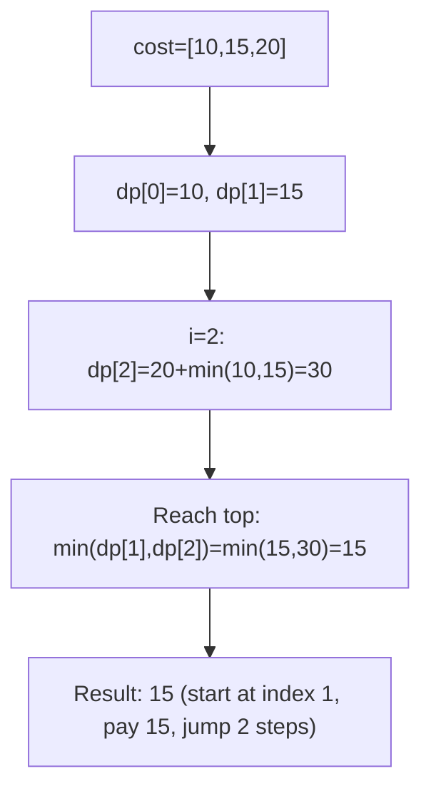
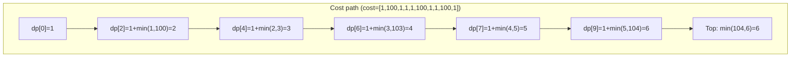
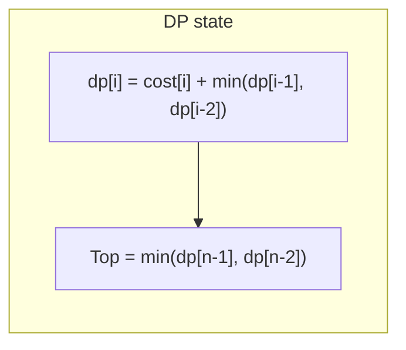

# LeetCode 746. Min Cost Climbing Stairs（使用最小花费爬楼梯） — **简单**

## 考点
数组, 动态规划

## 题目描述
给你一个整数数组 cost，其中 cost[i] 是从楼梯第 i 个台阶向上爬需要支付的费用。一旦你支付此费用，即可选择向上爬一个或者两个台阶。

你可以选择从下标为 0 或下标为 1 的台阶开始爬楼梯。

请你计算并返回达到楼梯顶部的最低花费。

**示例 1:**
```
输入：cost = [10,15,20]
输出：15
解释：你将从下标为 1 的台阶开始。
- 支付 15，向上爬两个台阶，到达楼梯顶部。
总花费为 15。
```

**示例 2:**
```
输入：cost = [1,100,1,1,1,100,1,1,100,1]
输出：6
解释：你将从下标为 0 的台阶开始。
- 支付 1，向上爬两个台阶，到达下标为 2 的台阶。
- 支付 1，向上爬两个台阶，到达下标为 4 的台阶。
- 支付 1，向上爬两个台阶，到达下标为 6 的台阶。
- 支付 1，向上爬一个台阶，到达下标为 7 的台阶。
- 支付 1，向上爬两个台阶，到达下标为 9 的台阶。
- 支付 1，向上爬一个台阶，到达楼梯顶部。
总花费为 6。
```

**约束条件:**
- 2 <= cost.length <= 1000
- 0 <= cost[i] <= 999

## 图解







## 解题思路

### 核心思路

**爬楼梯问题的带权版本**。到达第 i 级台阶需要支付 `cost[i]`，可以从 i-2 跳两步或 i-1 跳一步到达。由于可以从 0 或 1 开始，初始化时 `dp[0]=cost[0], dp[1]=cost[1]`。最终到达「顶部」意味着从最后一级或倒数第二级起跳，不花费额外 cost。

### 算法步骤

1. 若 `n == 2`，返回 `min(cost[0], cost[1])`
2. `prev2 = cost[0]`（到达第 0 级的最小花费）
3. `prev1 = cost[1]`（到达第 1 级的最小花费）
4. 对于 i 从 2 到 n-1：
   - `curr = cost[i] + min(prev1, prev2)`
   - `prev2 = prev1, prev1 = curr`
5. 返回 `min(prev1, prev2)`（从最后一级或倒数第二级起跳到顶部）

### 图解示例

```
cost = [10, 15, 20]

楼梯和花费:
  台阶:  0    1    2    顶部
        [10] [15] [20]
         ↑    ↑
      可从这开始

DP 过程:
  dp[0] = 10    (在台阶0支付10可以到达)
  dp[1] = 15    (在台阶1支付15可以到达, 或从0支付10+一跳=到达1后还要付cost[1]? 
                  不, dp[i]表示到达第i级台阶需要的最小花费, 不包括顶部的跳跃)
  
  实际上: dp[i] = 到达且支付了cost[i]后, 在第i级的最小总花费

  dp[0] = cost[0] = 10
  dp[1] = cost[1] = 15 (也可以从0过去: dp[0]=10, 但dp[1]要付cost[1]=15, 所以 min(cost[1], dp[0]+cost[1])? 
          不对, 从0开始的话, 支付cost[0]=10后可以跳1或2步, 
          跳到1不需要额外付费, 但dp[1]的定义是到达第1级的花费)
  
重新理清:
  从-1(地面)开始, 可以跳到0或1
  dp[i] = 从地面到达第i级的最小花费 (必须支付cost[i])
  
  dp[0] = cost[0] = 10
  dp[1] = cost[1] = 15
  
  但也可以 dp[1] = cost[0] (如果是从0跳2步到第1级? 不对, 0+2=2不是1)
  
  更准确的定义: dp[i] = 到达第i级的最小花费, 其中到达时已支付cost[i]
  
  从地面(-1)到0: cost[0]
  从地面(-1)到1: cost[1]
  从0到2: dp[0]+cost[2]
  从1到2: dp[1]+cost[2]

因此:
  dp[0] = 10
  dp[1] = 15
  dp[2] = cost[2] + min(dp[0], dp[1]) = 20 + 10 = 30

  到达顶部: 可以从第1级跳2步(15+0), 或第2级跳1步(30+0)
  min(15, 30) = 15

所以最小花费 = 15
对应: 从台阶1开始 → 支付15 → 跳2步到顶部
```

```
cost = [1, 100, 1, 1, 1, 100, 1, 1, 100, 1]

dp 表:
  i:   0    1    2    3    4    5    6    7    8    9
cost:  1  100    1    1    1  100    1    1  100    1

  dp[0] = 1
  dp[1] = 100
  dp[2] = 1 + min(dp[0], dp[1]) = 1 + min(1, 100) = 2
  dp[3] = 1 + min(dp[1], dp[2]) = 1 + min(100, 2) = 3
  dp[4] = 1 + min(dp[2], dp[3]) = 1 + min(2, 3) = 3
  dp[5] = 100 + min(dp[3], dp[4]) = 100 + min(3, 3) = 103
  dp[6] = 1 + min(dp[4], dp[5]) = 1 + min(3, 103) = 4
  dp[7] = 1 + min(dp[5], dp[6]) = 1 + min(103, 4) = 5
  dp[8] = 100 + min(dp[6], dp[7]) = 100 + min(4, 5) = 104
  dp[9] = 1 + min(dp[7], dp[8]) = 1 + min(5, 104) = 6

到达顶部: min(dp[8], dp[9]) = min(104, 6) = 6

路径: 0→2→4→6→7→9→顶部
     支付: 1+1+1+1+1+1 = 6 ✓
```

### 逐步追踪

以 `cost = [10, 15, 20]` 为例：

| i | cost[i] | prev2 | prev1 | curr = cost[i]+min(prev1,prev2) | 说明 |
|---|---------|-------|-------|-------------------------------|------|
| 0 | 10 | - | 10 | dp[0]=10 | 从地面到0 |
| 1 | 15 | 10 | 15 | dp[1]=15 | 从地面到1 |
| 2 | 20 | 10 | 15 | 20+min(15,10)=30 | dp[2]=30 |

到达顶部：min(dp[1], dp[2]) = min(15, 30) = 15

### 边界情况

- `n = 2`：可直接 `min(cost[0], cost[1])`
- 所有 cost 相同：相当于爬楼梯，选跳得多的路径
- cost 中有 0：免费台阶，鼓励选择

### 复杂度分析

- **时间复杂度**：O(n)
- **空间复杂度**：O(1)，两个滚动变量

### 方法对比

| 方法 | 时间复杂度 | 空间复杂度 | 说明 |
|------|-----------|-----------|------|
| 滚动变量 DP | O(n) | O(1) | 最优 |
| dp 数组 | O(n) | O(n) | 直观但空间浪费 |
| 递归+记忆化 | O(n) | O(n) | 自顶向下 |
