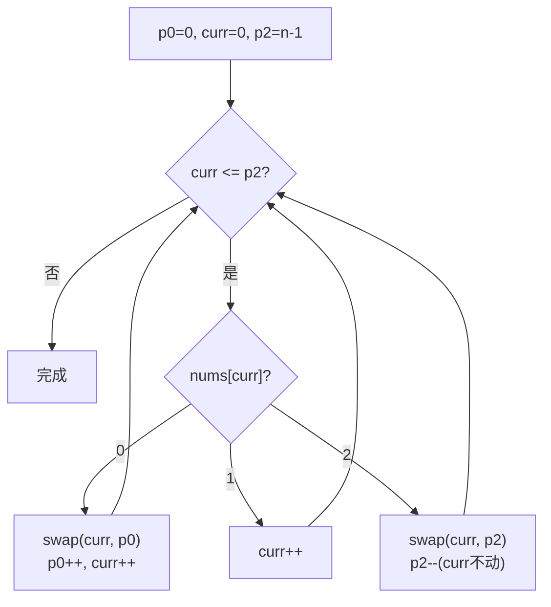

# LeetCode 75. Sort Colors（颜色分类） — **中等**

## 考点
Array, Two Pointers, Sorting

## 题目描述
给定一个包含红色、白色和蓝色、共 `n` 个元素的数组 `nums`，**原地** 对它们进行排序，使得相同颜色的元素相邻，并按照红色、白色、蓝色顺序排列。

我们使用整数 `0`、`1` 和 `2` 分别表示红色、白色和蓝色。

必须在不使用库内置的 sort 函数的情况下解决这个问题。

### 示例 1
```
输入：nums = [2,0,2,1,1,0]
输出：[0,0,1,1,2,2]
```

### 示例 2
```
输入：nums = [2,0,1]
输出：[0,1,2]
```

### 约束
- `n == nums.length`
- `1 <= n <= 300`
- `nums[i]` 为 `0`、`1` 或 `2`

**进阶：** 你能想出一个仅使用常数空间的一趟扫描算法吗？

## 图解



## 解题思路

### 核心思路
**荷兰国旗问题（Dutch National Flag Problem）**，由 Edsger Dijkstra 提出。使用三个指针将数组分为四个区域：

```
[0, p0)     全是 0（已确定）
[p0, curr)  全是 1（已确定）
[curr, p2]  未处理区域
(p2, n-1]   全是 2（已确定）
```

扫描 curr，根据 curr 指向的值决定与 p0 或 p2 交换。

**关键洞察：** 与 p0 交换后 curr 可以前进（换过来的一定是 1，因为 curr 已经扫描过 [p0, curr) 区间）；与 p2 交换后 curr 不前进（换过来的值未知，需要重新检查）。

### 算法步骤

1. 初始化 p0 = 0, curr = 0, p2 = n - 1
2. while curr ≤ p2：
   - 若 nums[curr] == 0：swap(nums[curr], nums[p0])；p0++；curr++
   - 若 nums[curr] == 1：curr++
   - 若 nums[curr] == 2：swap(nums[curr], nums[p2])；p2--（curr 不前进!）
3. 排序完成，返回

### 图解示例

**例子：nums = [2, 0, 2, 1, 1, 0]**

```
初始状态:
 p0=0, curr=0, p2=5
 [ 2   0   2   1   1   0 ]
   ↑                   ↑
  p0,curr             p2

状态演变 (每步的数组状态和指针位置):

  未处理      p0      curr       p2
├────────┤ ├─────┤ ├───────┤ ├────────┤
   (0区)     (1区)   (待处理)   (2区)

Step 1: nums[curr=0]=2
  swap(0,5) → [0, 0, 2, 1, 1, 2]  但等等... swap(0,5):
  [ 0   0   2   1   1   2 ]
    ↑               ↑
   curr           p2(=4)
  (p0=0不变, curr=0不变, p2=4)

  不对，重新来。swap(nums[0], nums[5]):
  nums 变为: [0, 0, 2, 1, 1, 2]
  指针: p0=0, curr=0, p2=4

Step 2: nums[curr=0]=0
  swap(0,0) (自身) → 不变
  [ 0   0   2   1   1   2 ]
        ↑           ↑
    p0=1,curr=1  p2=4

Step 3: nums[curr=1]=0
  swap(1,1) (自身) → 不变
  [ 0   0   2   1   1   2 ]
            ↑       ↑
        p0=2,curr=2  p2=4

Step 4: nums[curr=2]=2
  swap(2,4) → [0, 0, 1, 1, 2, 2]
  [ 0   0   1   1   2   2 ]
            ↑   ↑
        curr=2  p2=3
  (p0=2不变, p2=3)

Step 5: nums[curr=2]=1
  curr++ → curr=3

Step 6: nums[curr=3]=1
  curr++ → curr=4
  
curr=4 > p2=3 → 循环结束!

最终: [0, 0, 1, 1, 2, 2] ✓
```

**区域划分可视化（每一步）：**

```
初始: [ 2, 0, 2, 1, 1, 0 ]
        ├──────────────┤ ├──┤
          未处理(p0=0)   2区
          curr=0         p2=5

Step1后: [ 0, 0, 2, 1, 1, 2 ]
           ├─┤ ├────────┤ ├──┤
           0区  未处理     2区
           p0=0 curr=0    p2=4

Step3后: [ 0, 0, 2, 1, 1, 2 ]
           ├──┤ ├──────┤ ├──┤
           0区   未处理    2区
           p0=2 curr=2   p2=4

Step4后: [ 0, 0, 1, 1, 2, 2 ]
           ├──┤ ├──┤ ├──┤├──┤
           0区   1区  未处  2区
           p0=2 curr=2 p2=3

最终:   [ 0, 0, 1, 1, 2, 2 ]
           ├──┤ ├──┤ ├──────┤
           0区   1区    2区
```

### 逐步追踪

| 步骤 | curr | nums[curr] | 操作 | p0 | p2 | 数组 |
|------|------|------------|------|----|----|------|
| 初始 | 0 | 2 | - | 0 | 5 | [2,0,2,1,1,0] |
| 1 | 0 | 2 | swap(0,5), p2-- | 0 | 4 | [0,0,2,1,1,2] |
| 2 | 0 | 0 | swap(0,0), p0++, curr++ | 1 | 4 | [0,0,2,1,1,2] |
| 3 | 1 | 0 | swap(1,1), p0++, curr++ | 2 | 4 | [0,0,2,1,1,2] |
| 4 | 2 | 2 | swap(2,4), p2-- | 2 | 3 | [0,0,1,1,2,2] |
| 5 | 2 | 1 | curr++ | 2 | 3 | [0,0,1,1,2,2] |
| 6 | 3 | 1 | curr++ | 2 | 3 | [0,0,1,1,2,2] |
| 结束 | 4 > 3 | - | 循环结束 | 2 | 3 | [0,0,1,1,2,2] |

### 边界情况

| 情况 | 输入 | 处理 | 结果 |
|------|------|------|------|
| 全0 | [0,0,0] | curr一直前进 | [0,0,0] |
| 全1 | [1,1,1] | curr一直前进 | [1,1,1] |
| 全2 | [2,2,2] | 不断swap(curr,p2) | [2,2,2] |
| 单元素 | [1] | 直接结束 | [1] |
| 已有序 | [0,0,1,1,2,2] | curr一直前进 | 不变 |

### 方法对比

**方法一：三指针一趟扫描（推荐，O(n)）**
```
一趟遍历，每个元素最多被交换一次
时间: O(n), 空间: O(1)
```

**方法二：计数排序（两趟扫描）**
```
第一趟: 统计 0,1,2 的个数
第二趟: 按个数填充数组
时间: O(n), 空间: O(1), 但需要两趟
```

**方法三：直接排序**
```
Arrays.sort() / sort()
时间: O(n log n), 但未利用只有3种值的特性
```

### 复杂度分析

- **时间复杂度：** O(n)，每个元素最多被操作 2 次（至多一次交换 + 一次扫描）
- **空间复杂度：** O(1)，原地排序，只使用三个指针
- 这是原地一趟扫描的最优解法
