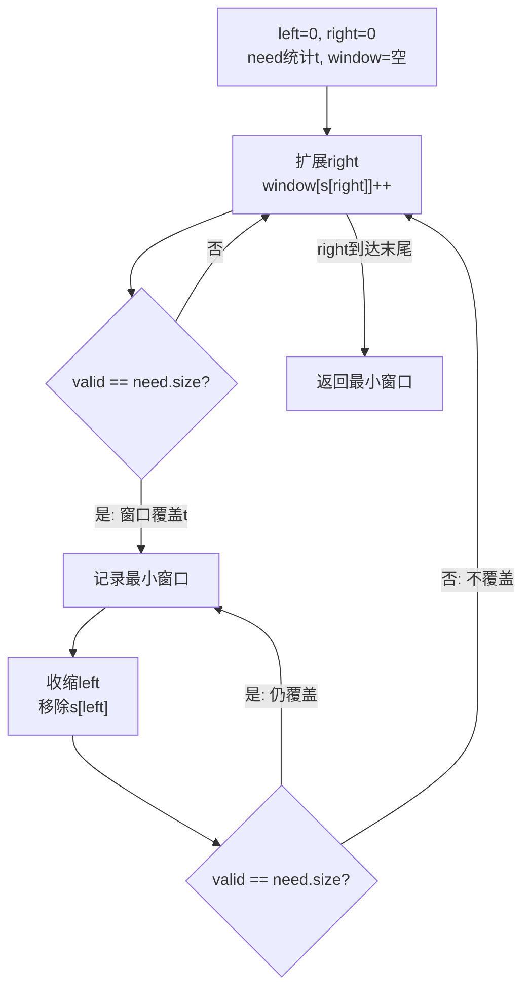
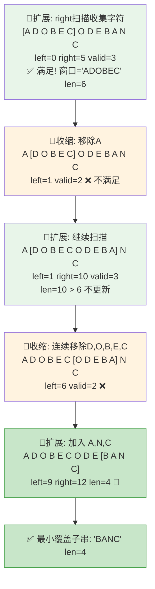

# LeetCode 76. Minimum Window Substring（最小覆盖子串） — **困难**

## 考点
Hash Table, String, Sliding Window

## 题目描述
给你一个字符串 `s`、一个字符串 `t`。返回 `s` 中涵盖 `t` 所有字符的最小子串。如果 `s` 中不存在涵盖 `t` 所有字符的子串，则返回空字符串 `""`。

**注意：**
- 对于 `t` 中重复字符，我们寻找的子字符串中该字符数量必须不少于 `t` 中该字符数量。
- 如果 `s` 中存在这样的子串，我们保证它是唯一的答案。

### 示例 1
```
输入：s = "ADOBECODEBANC", t = "ABC"
输出："BANC"
解释：最小覆盖子串 "BANC" 包含来自字符串 t 的 'A'、'B' 和 'C'。
```

### 示例 2
```
输入：s = "a", t = "a"
输出："a"
```

### 示例 3
```
输入：s = "a", t = "aa"
输出：""
解释：t 中两个字符 'a' 均应包含在 s 的子串中，因此没有符合条件的子字符串，返回空字符串。
```

### 约束
- `1 <= s.length, t.length <= 10^5`
- `s` 和 `t` 由英文字母组成

## 图解



### 滑动窗口指针移动图解

以 s = "ADOBECODEBANC", t = "ABC" 演示窗口扩展/收缩过程：



## 解题思路

### 核心思路
滑动窗口模板题。维护一个变长窗口 [left, right]，窗口向右扩展直到覆盖 t 的所有字符，然后尝试从左边收缩窗口，在保持覆盖的前提下找到最小窗口。

**关键洞察：** 使用 `valid` 计数已满足的字符种类数（而非每次检查所有字符），将判断"窗口是否覆盖 t"从 O(|Σ|) 降为 O(1)。

### 算法步骤

1. 构建 need Map：统计 t 中每个字符的需求量
2. 维护 window Map：窗口内各字符计数
3. 初始化 left=0, right=0, valid=0（已满足的种类数）
4. 初始化 start=0, minLen=∞（记录最小窗口）
5. 扩展右边界（for right in 0..n-1）：
   - c = s[right]，window[c]++
   - 若 c 在 need 中且 window[c] == need[c]：valid++
   - **收缩阶段：** 当 valid == need.size 时：
     - 若 right-left+1 < minLen：更新 minLen 和 start
     - 移除 s[left]：若 c 在 need 中且 window[c] < need[c]：valid--
     - left++
6. 返回 minLen == ∞ ? "" : s[start..start+minLen]

### 图解示例

**例子：s = "ADOBECODEBANC", t = "ABC"**

```
need = {A:1, B:1, C:1}, need.size = 3

窗口扩展和收缩过程:

索引: 0 1 2 3 4 5 6 7 8 9 10 11 12
 s:  A D O B E C O D E B  A  N  C

Step 1-5: 扩展 right, 收集字符
  right=0: 'A' → window={A:1}, valid=1
  right=1: 'D' → (不在need, 忽略)
  right=2: 'O' → (不在need, 忽略)
  right=3: 'B' → window={A:1,B:1}, valid=2
  right=4: 'E' → (不在need, 忽略)
  right=5: 'C' → window={A:1,B:1,C:1}, valid=3 (=need.size!)

  窗口 [0,5]="ADOBEC" 覆盖ABC, 长度=6, 记录!

  开始收缩:
    left=0: 移除 'A' → window={A:0,B:1,C:1}, valid=2 → 不满足了!
    left=1, 窗口 [1,5]="DOBEC"

Step 6-9: 继续扩展
  right=6: 'O' → (忽略)
  right=7: 'D' → (忽略)
  right=8: 'E' → (忽略)
  right=9: 'B' → window={A:0,B:2,C:1}, valid=2 (不满足)

  right=10: 'A' → window={A:1,B:2,C:1}, valid=3!

  窗口 [1,10]="DOBECODEBA" 长度=10 > 6, 不更新

  收缩:
    移除 D,O,B,E,C... 直到 valid 下降
    移除到 left=5: 'C' → valid=2, 不满足

  right=11: 'N' → (忽略)
  right=12: 'C' → window 中 C 回到 1, valid=3

  窗口 [5,12]="CODEBANC" 长度=8, 不更新
  收缩:
    移除到 left=9: 'B' → valid=2
    继续... 最终找到最小窗口

最优窗口: [9,12] = "BANC", 长度=4
```

### 逐步追踪

**输入：s="ADOBECODEBANC", t="ABC"**

| right | char | window | valid? | left | 窗口 | 长度 | 操作 |
|-------|------|--------|--------|------|------|------|------|
| 0 | A | {A:1} | 1/3 | 0 | [0,0] | 1 | 扩展 |
| 1 | D | {A:1,D:1} | 1/3 | 0 | [0,1] | 2 | 扩展 |
| 2 | O | {A:1,D:1,O:1} | 1/3 | 0 | [0,2] | 3 | 扩展 |
| 3 | B | {A:1,B:1,...} | 2/3 | 0 | [0,3] | 4 | 扩展 |
| 4 | E | +E | 2/3 | 0 | [0,4] | 5 | 扩展 |
| 5 | C | **{A:1,B:1,C:1}** | **3/3** | 0 | **[0,5]** | **6** | **记录!** |
| 收缩 | 移A | {A:0,B:1,C:1} | 2/3 | 1 | [1,5] | 5 | valid下降 |
| ... | ... | ... | ... | ... | ... | ... | ... |
| 12 | C | {A:1,B:1,C:1} | 3/3 | 9 | **[9,12]** | **4** | **更新!** |

### 边界情况

| 情况 | 输入 | 处理 | 结果 |
|------|------|------|------|
| s 长度 < t 长度 | s="a", t="aa" | 永远无法满足 | "" |
| 完全匹配 | s="abc", t="abc" | 窗口 = 整个 s | "abc" |
| t 中有重复字符 | s="aa", t="aa" | 需要两个 'a' | "aa" |
| 窗口在末尾 | s="abbbc", t="abc" | 最短在末尾 | "abbbc"中找最优 |
| s 和 t 相同 | s="a", t="a" | 窗口就是整个 s | "a" |

### 方法对比

**方法一：滑动窗口 + 哈希表（推荐）**
```
双指针维护窗口，哈希表记录字符计数
时间: O(n), 空间: O(|Σ|)
```

**方法二：使用数组替代哈希表**
```
因为只有大小写字母，用 int[128] 或 int[58] 替代 HashMap
减少哈希开销，但空间仍是 O(|Σ|)
```

**方法三：暴力枚举**
```
枚举所有子串 O(n²)，每个检查是否覆盖 t O(n)
时间: O(n³), 不可行
```

### 复杂度分析

- **时间复杂度：** O(n)，right 和 left 各移动至多 n 次
- **空间复杂度：** O(|Σ|)，need 和 window 都是字符集大小（字母集：O(1)）
- 滑动窗口是解决子串覆盖问题的标准模板
