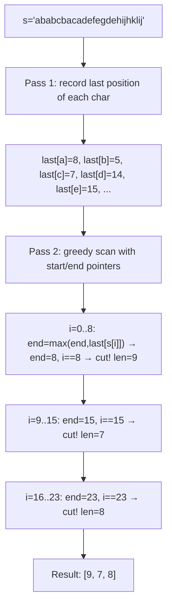
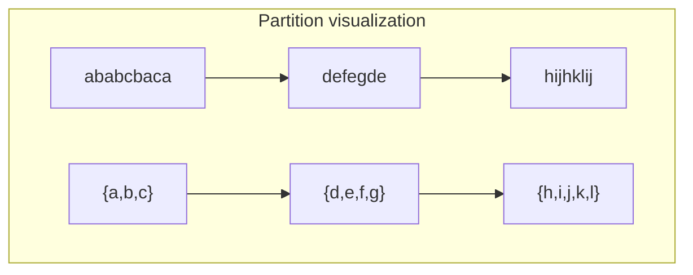
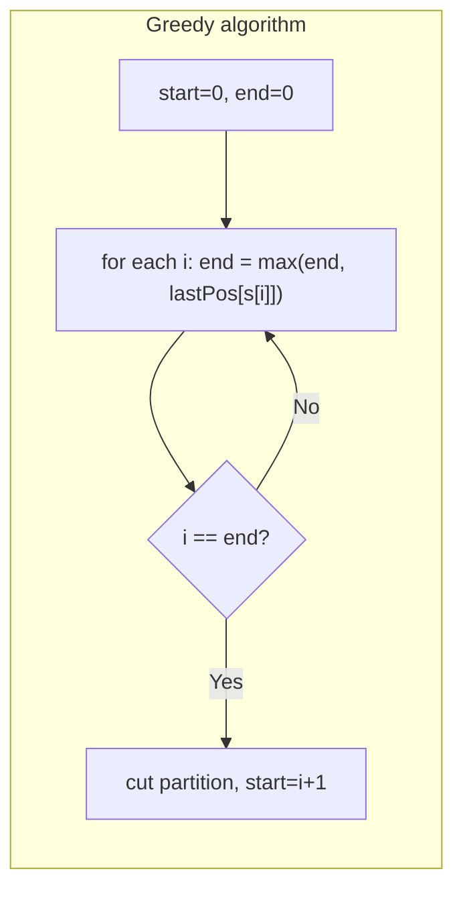

# LeetCode 763. Partition Labels（划分字母区间） — **中等**

## 考点
贪心, 哈希表, 双指针, 字符串

## 题目描述
给你一个字符串 s。我们要把这个字符串划分为尽可能多的片段，同一字母最多出现在一个片段中。

注意，划分结果需要满足：将所有划分结果按顺序连接，得到的字符串仍然是 s。

返回一个表示每个字符串片段的长度的列表。

**示例 1:**
```
输入：s = "ababcbacadefegdehijhklij"
输出：[9,7,8]
解释：
划分结果为 "ababcbaca"、"defegde"、"hijhklij"。
每个字母最多出现在一个片段中。
像 "ababcbacadefegde", "hijhklij" 这样的划分是错误的，因为划分的片段数较少。
```

**示例 2:**
```
输入：s = "eccbbbbdec"
输出：[10]
```

**约束条件:**
- 1 <= s.length <= 500
- s 由小写英文字母组成

## 图解







## 解题思路

### 核心思路

**贪心 + 双指针**。同一字母必须出现在同一片段中，因此片段的结束位置至少是该片段中所有字符的最后出现位置的最大值。

### 算法步骤

1. 遍历 s，记录每个字符最后出现的索引：`lastPos[26]`
2. 初始化 `start = 0, end = 0, result = []`
3. 遍历 i 从 0 到 n-1：
   - `end = max(end, lastPos[s[i]])`（扩展当前片段到最远必须覆盖的位置）
   - 若 `i == end`：当前片段可以切割
     - `result.add(end - start + 1)`
     - `start = i + 1`（下一片段开始位置）
4. 返回 result

### 图解示例

```
s = "ababcbacadefegdehijhklij"

第一遍: 记录每个字符最后出现位置

  a: 8    b: 5    c: 7    d: 14   e: 15
  f: 11   g: 13   h: 19   i: 22   j: 23
  k: 20   l: 21

标记每个位置:
  索引: 0 1 2 3 4 5 6 7 8 9 10 11 12 13 14 15 16 17 18 19 20 21 22 23
  字符: a b a b c b a c a d e  f  e  g  d  e  h  i  j  h  k  l  i  j

第二遍: 确定片段

  片段1:
    i=0: s[0]=a, last[a]=8 → end=8
    i=1: s[1]=b, last[b]=5 → end=8
    i=2: s[2]=a, last[a]=8 → end=8
    i=3: s[3]=b, last[b]=5 → end=8
    i=4: s[4]=c, last[c]=7 → end=8
    i=5: s[5]=b, last[b]=5 → end=8
    i=6: s[6]=a, last[a]=8 → end=8
    i=7: s[7]=c, last[c]=7 → end=8
    i=8: s[8]=a, last[a]=8 → end=8
    i==end(8) → 切割! 长度 = 8-0+1 = 9

  片段2:
    start=9
    i=9:  s[9]=d,  last[d]=14  → end=14
    i=10: s[10]=e, last[e]=15  → end=15
    i=11: s[11]=f, last[f]=11  → end=15
    i=12: s[12]=e, last[e]=15  → end=15
    i=13: s[13]=g, last[g]=13  → end=15
    i=14: s[14]=d, last[d]=14  → end=15
    i=15: s[15]=e, last[e]=15  → end=15
    i==end(15) → 切割! 长度 = 15-9+1 = 7

  片段3:
    start=16
    i=16: s[16]=h, last[h]=19 → end=19
    i=17: s[17]=i, last[i]=22 → end=22
    i=18: s[18]=j, last[j]=23 → end=23
    i=19: s[19]=h, last[h]=19 → end=23
    i=20: s[20]=k, last[k]=20 → end=23
    i=21: s[21]=l, last[l]=21 → end=23
    i=22: s[22]=i, last[i]=22 → end=23
    i=23: s[23]=j, last[j]=23 → end=23
    i==end(23) → 切割! 长度 = 23-16+1 = 8

结果: [9, 7, 8]
```

### 逐步追踪

| i | char | lastPos[char] | end (更新后) | i==end? | 操作 |
|---|------|--------------|-------------|---------|------|
| 0 | a | 8 | 8 | N | - |
| 1 | b | 5 | 8 | N | - |
| 2 | a | 8 | 8 | N | - |
| ... | ... | ... | ... | ... | ... |
| 8 | a | 8 | 8 | Y | 切片段1 (长9) |
| 9 | d | 14 | 14 | N | - |
| 10 | e | 15 | 15 | N | - |
| ... | ... | ... | ... | ... | ... |
| 15 | e | 15 | 15 | Y | 切片段2 (长7) |
| 16 | h | 19 | 19 | N | - |
| ... | ... | ... | ... | ... | ... |
| 23 | j | 23 | 23 | Y | 切片段3 (长8) |

### 边界情况

- 单字符：返回 [1]
- 所有字符互不相同：返回长度为 n 的 1 数组（每个片段一个字符）
- 所有字符相同：返回 [n]（全部在一个片段中）
- 字符最后出现位置交错复杂：贪心边界扩展依然正确

### 复杂度分析

- **时间复杂度**：O(n)，两次遍历
- **空间复杂度**：O(1)，固定 26 个字母

### 方法对比

| 方法 | 时间复杂度 | 空间复杂度 | 说明 |
|------|-----------|-----------|------|
| 贪心+双指针 | O(n) | O(1) | 最优解 |
| 合并区间 | O(n) | O(26) | 将每个字符的出现区间合并 |
