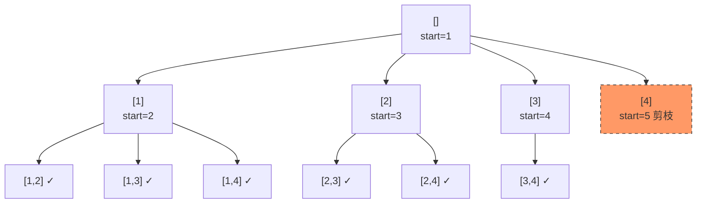

# LeetCode 77. Combinations（组合） — **中等**

## 考点
Backtracking

## 题目描述
给定两个整数 `n` 和 `k`，返回范围 `[1, n]` 中所有可能的 `k` 个数的组合。

你可以按 **任何顺序** 返回答案。

### 示例 1
```
输入：n = 4, k = 2
输出：
[
  [2,4],
  [3,4],
  [2,3],
  [1,2],
  [1,3],
  [1,4],
]
```

### 示例 2
```
输入：n = 1, k = 1
输出：[[1]]
```

### 约束
- `1 <= n <= 20`
- `1 <= k <= n`

## 图解



## 解题思路

### 核心思路
回溯枚举所有 k 个数的组合。用 `start` 参数只往后选，保证 [1,2] 和 [2,1] 只会出现前者。**剪枝**大幅减少搜索：剩余可选数 < 还需要的数时立即终止。

**关键洞察：** 组合无序性由递增选择保证；搜索空间从全排列的 P(n,k) 降到组合的 C(n,k)；剪枝进一步砍掉无意义分支。

### 算法步骤

1. 创建 result 列表和 path 列表
2. backtrack(start):
   - 若 path.length == k: result 加入 path 拷贝，返回
   - 剪枝: 若 n - start + 1 < k - path.length: 返回
   - for i = start..n:
     - path 加入 i
     - backtrack(i + 1)
     - path 移除末尾元素
3. 调用 backtrack(1)，返回 result

### 图解示例

**n = 4, k = 2 决策树：**

```
                          []
              ┌────┬────┬────┬────┐
             1/   2/   3/   4/
           [1]   [2]   [3]   [4]
         ┌──┤──┐ ┌┤──┐ ┌┤
        2/ 3| 4\ 3/4\ 4/
     [1,2][1,3][1,4] [2,3][2,4] [3,4]
       ✓    ✓    ✓     ✓    ✓     ✓

剪枝:
  path=[1], i=5 时: n-i+1=0 < k-len(path)=1 → 跳过第5个分支
  path=[2], i=4 时: n-i+1=1 >= 1 → 可以继续
```

**递归调用栈 (n=4,k=2)：**

```
backtrack(1): path=[]
  → i=1: path=[1], backtrack(2)
           → i=2: [1,2]✓, i=3: [1,3]✓, i=4: [1,4]✓
  → i=2: path=[2], backtrack(3)
           → i=3: [2,3]✓, i=4: [2,4]✓
  → i=3: path=[3], backtrack(4)
           → i=4: [3,4]✓
  → i=4: path=[4], backtrack(5) → 无操作
```

### 逐步追踪

**n=4, k=2，逐层执行：**

| 深度 | start | path | i取值 | 动作 |
|------|-------|------|-------|------|
| 0 | 1 | [] | 1,2,3,4 | 分别递归 |
| 1 | 2 | [1] | 2,3,4 | 各得 [1,2][1,3][1,4] |
| 1 | 3 | [2] | 3,4 | 各得 [2,3][2,4] |
| 1 | 4 | [3] | 4 | 得 [3,4] |
| 1 | 5 | [4] | - | 返回(剪枝) |

### 边界情况

| 情况 | 输入 | 处理 | 结果 |
|------|------|------|------|
| k=1 | n=4,k=1 | 每个数一个组合 | [[1],[2],[3],[4]] |
| k=n | n=3,k=3 | 唯一一组全选 | [[1,2,3]] |
| 小n | n=1,k=1 | 直接返回 | [[1]] |
| 大n | n=20,k=10 | 剪枝重要 | C(20,10)=184756 |

### 方法对比

**回溯+剪枝（推荐）：** 时间 O(C(n,k)*k)，空间 O(k)
**迭代枚举：** 模拟 next_combination，时间相同但不够直观
**DP公式法：** C(n,k)=C(n-1,k-1)+C(n-1,k)，不推荐（不需要组合数本身）

### 复杂度分析

- **时间：** O(C(n,k) * k)，每个组合复制需要 O(k)
- **空间：** O(k)，递归栈深度 + path 大小
