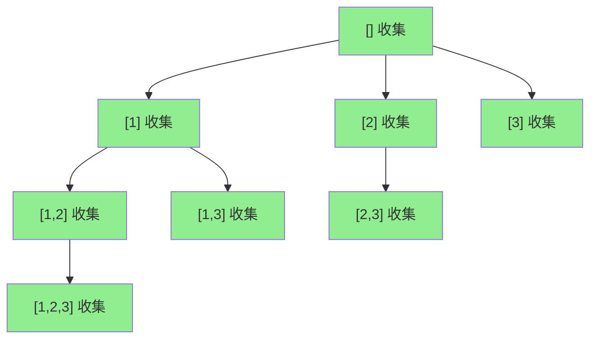

# LeetCode 78. Subsets（子集） — **中等**

## 考点
Bit Manipulation, Array, Backtracking

## 题目描述
给你一个整数数组 `nums`，数组中的元素 **互不相同**。返回该数组所有可能的子集（幂集）。

解集 **不能** 包含重复的子集。你可以按 **任意顺序** 返回解集。

### 示例 1
```
输入：nums = [1,2,3]
输出：[[],[1],[2],[1,2],[3],[1,3],[2,3],[1,2,3]]
```

### 示例 2
```
输入：nums = [0]
输出：[[],[0]]
```

### 约束
- `1 <= nums.length <= 10`
- `-10 <= nums[i] <= 10`
- `nums` 中的所有元素互不相同

## 图解



## 解题思路

### 核心思路
求幂集（power set），共 2^n 个子集。两种主流解法：
1. **回溯：** 用 start 参数生成递增子集，每个递归节点都是有效子集
2. **位运算：** 每个子集对应一个 n 位的二进制掩码，0 表示不选，1 表示选

**关键洞察：** 与 LeetCode 77 组合问题不同，这里不限制子集大小，所以每个决策节点都要收集结果。

### 算法步骤

**方法一：回溯**

1. 创建 result 和 path 列表
2. backtrack(start):
   - 将 path 拷贝加入 result（每个节点都是合法子集！）
   - for i = start..n-1:
     - path 加入 nums[i]
     - backtrack(i + 1)
     - path 移除末尾
3. 调用 backtrack(0)，返回 result

**方法二：位运算**

1. 总子集数 total = 1 << n
2. for mask = 0..total-1:
   - 创建子集 subset
   - for i = 0..n-1:
     - 若 mask & (1 << i) != 0: subset 加入 nums[i]
   - result 加入 subset
3. 返回 result

### 图解示例

**nums = [1,2,3]，回溯决策树：**

```
                        []           ← 加入 result
              ┌─────┬───┴───┬─────┐
             1/    2|      3|
           [1]     [2]      [3]         ← 每层都加入 result
        ┌───┼───┐  ┌┼┐
       2/  3|     3|
    [1,2] [1,3]  [2,3]                   ← 加入 result
     ┌┼┐
    3|
  [1,2,3]                                ← 加入 result
```

**位运算映射（nums=[1,2,3]）：**

```
mask  | 二进制 | 子集
------+--------+------
  0   |  000   | []
  1   |  001   | [1]
  2   |  010   | [2]
  3   |  011   | [1,2]
  4   |  100   | [3]
  5   |  101   | [1,3]
  6   |  110   | [2,3]
  7   |  111   | [1,2,3]
```

### 逐步追踪

**回溯法，nums=[1,2,3]：**

| 调用 | start | path | 加入result | 下一步 |
|------|-------|------|-----------|--------|
| b(0) | 0 | [] | [] | i=0,1,2 |
| b(1) | 1 | [1] | [1] | i=1: [1,2], i=2: [1,3] |
| b(2) | 2 | [1,2] | [1,2] | i=2: [1,2,3] |
| b(3) | 3 | [1,2,3] | [1,2,3] | 无(i=3>=3) |
| 回溯 | 2 | [1,2] | - | i=3>=3 |
| 回溯 | 1 | [1] | [1] | i=2: [1,3] |
| b(3) | 3 | [1,3] | [1,3] | 无 |
| 回溯 | 0 | [] | - | i=1: [2] |
| b(2) | 2 | [2] | [2] | i=2: [2,3] |
| b(3) | 3 | [2,3] | [2,3] | 无 |
| 回溯 | 0 | [] | - | i=2: [3] |
| b(3) | 3 | [3] | [3] | 无 |

收集: [[],[1],[1,2],[1,2,3],[1,3],[2],[2,3],[3]]

### 边界情况

| 情况 | 输入 | 处理 | 结果数 |
|------|------|------|--------|
| 空数组 | [] | 只有空子集 | 1 (2^0) |
| 单元素 | [1] | [],[1] | 2 (2^1) |
| n=10 | [0..9] | 回溯/位运算 | 1024 (2^10) |
| 负数元素 | [-1,-2] | 与正数无异 | 4 |

### 方法对比

**回溯（推荐）：** 每个节点都是子集，直接在递归中收集。时间 O(n*2^n)，空间 O(n)
**位运算：** 最简洁，直接枚举掩码。时间 O(n*2^n)，空间 O(1)（不计输出）
**迭代追加：** result=[[]]; for each num: 将已有子集都加上 num 再并入。时间 O(n*2^n)

### 复杂度分析

- **时间：** O(n * 2^n)，每个子集平均长度 n/2，共 2^n 个子集
- **空间：** O(n) 递归栈（回溯）或 O(1)（位运算），均不计输出
- n ≤ 10 保证了 2^10=1024 子集完全可行
