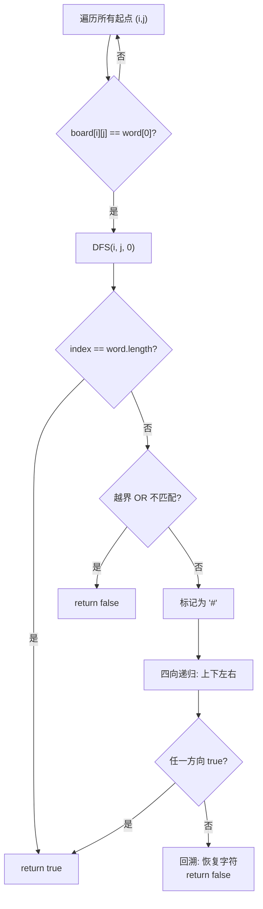

# LeetCode 79. Word Search（单词搜索） — **中等**

## 考点
Array, String, Backtracking, Matrix, DFS

## 题目描述
给定一个 `m x n` 二维字符网格 `board` 和一个字符串单词 `word`。如果 `word` 存在于网格中，返回 `true`；否则，返回 `false`。

单词必须按照字母顺序，通过相邻的单元格内的字母构成，其中"相邻"单元格是那些水平相邻或垂直相邻的单元格。同一个单元格内的字母不允许被重复使用。

### 示例 1
```
输入：board = [["A","B","C","E"],["S","F","C","S"],["A","D","E","E"]], word = "ABCCED"
输出：true
```

### 示例 2
```
输入：board = [["A","B","C","E"],["S","F","C","S"],["A","D","E","E"]], word = "SEE"
输出：true
```

### 示例 3
```
输入：board = [["A","B","C","E"],["S","F","C","S"],["A","D","E","E"]], word = "ABCB"
输出：false
```

### 约束
- `m == board.length`
- `n == board[i].length`
- `1 <= m, n <= 6`
- `1 <= word.length <= 15`
- `board` 和 `word` 仅由大小写英文字母组成

## 图解



## 解题思路

### 核心思路
从每个网格单元格出发，用 DFS 在四个方向搜索匹配单词的连续字符。当前字符匹配后标记为已访问，向四个方向递归，不匹配则回溯恢复。

**关键洞察：** 这是典型的网格回溯/DFS 问题。核心是"选择→探索→撤销"三步。优化技巧：先统计字符频率，如果 word 中某字符比 board 中多，直接返回 false。

### 算法步骤

1. 统计 board 字符频率，若不够覆盖 word，提前返回 false
2. 对每个单元格 (i,j)，若 board[i][j] == word[0]，调用 dfs(i, j, 0)
3. dfs(i, j, index):
   - 若 index == word.length: 返回 true（全部匹配）
   - 若越界或 board[i][j] != word[index]: 返回 false
   - 暂存当前字符 temp = board[i][j]，标记 board[i][j] = '#'（已访问）
   - 对四个方向递归: dfs(i+1,j,idx+1), dfs(i-1,j,idx+1), dfs(i,j+1,idx+1), dfs(i,j-1,idx+1)
   - 只要任一方向返回 true，立即返回 true
   - 回溯: board[i][j] = temp（恢复原字符）
   - 返回 false
4. 若所有起点都未找到，返回 false

### 图解示例

**board = [["A","B","C","E"],["S","F","C","S"],["A","D","E","E"]], word = "ABCCED"**

```
网格:
    ┌───┬───┬───┬───┐
  0 │ A │ B │ C │ E │
    ├───┼───┼───┼───┤
  1 │ S │ F │ C │ S │
    ├───┼───┼───┼───┤
  2 │ A │ D │ E │ E │
    └───┴───┴───┴───┘
      0   1   2   3

DFS 搜索路径 (从 (0,0) 的 'A' 开始):

Step 1: (0,0)='A' ✓ → 标记# → 四个方向
  → 找 'B': 上(越界),右(0,1)='B'✓,下(1,0)='S'✗,左(越界)

Step 2: (0,1)='B' ✓ → 标记# → 四个方向
  → 找 'C': 上(越界),右(0,2)='C'✓,下(1,1)='F'✗,左(0,0)='#'✗

Step 3: (0,2)='C' ✓ → 标记# → 四个方向
  → 找 'C': 上(越界),右(0,3)='E'✗,下(1,2)='C'✓,左(0,1)='#'✗

Step 4: (1,2)='C' ✓ → 标记# → 四个方向
  → 找 'E': 上(0,2)='#'✗,右(1,3)='S'✗,下(2,2)='E'✓,左(1,1)='F'✗

Step 5: (2,2)='E' ✓ → 标记# → 四个方向
  → 找 'D': 上(1,2)='#'✗,右(2,3)='E'✗,下(越界),左(2,1)='D'✓

Step 6: (2,1)='D' ✓ → 标记# → index=6=word.length ✓ 找到!

路径: (0,0)→(0,1)→(0,2)→(1,2)→(2,2)→(2,1)
     A    B    C    C    E    D
```

**word = "ABCB" 失败示例：**

```
从(0,0)='A'开始:
  → (0,1)='B' → 四个方向找 'C': (0,2)='C'✓
  → (0,2)='C' → 四个方向找 'B': 
      上(越界),右(0,3)='E'✗,
      下(1,2)='C'✗(第二个C,不是B),
      左(0,1)='#'✓(已访问,不可用)
  → 回溯到(0,2)尝试(1,2)的'C'? 已经在另一个分支了
  
从(0,2)='C'开始:
  → (2,2)='E'? 不,第二步需要'B', (0,2)='C'不是'B'起始

所有路径都失败 → false
```

### 逐步追踪

**word = "ABCCED"，从 (0,0) 出发：**

| 深度 | (i,j) | 字符 | index | word[index] | 匹配? | 下一动作 |
|------|-------|------|-------|-------------|-------|----------|
| 0 | (0,0) | A | 0 | A | ✓ | 标记#, 探索四向 |
| 1 | (0,1) | B | 1 | B | ✓ | 标记#, 探索四向 |
| 2 | (0,2) | C | 2 | C | ✓ | 标记#, 探索四向 |
| 3 | (1,2) | C | 3 | C | ✓ | 标记#, 探索四向 |
| 4 | (2,2) | E | 4 | E | ✓ | 标记#, 探索四向 |
| 5 | (2,1) | D | 5 | D | ✓ | index=6=len ✓ |

**回溯时恢复标记：**

```
搜索到(0,2)时board状态:
  #  B  C  E
  S  F  C  S
  A  D  E  E

从(0,2)→(1,2)进入: 标记(1,2)为#
  #  B  #  E
  S  F  #  S
  A  D  E  E

搜索失败回溯: (1,2)恢复为'C'
  #  B  #  E
  S  F  C  S
  A  D  E  E
```

### 边界情况

| 情况 | 输入 | 处理 | 结果 |
|------|------|------|------|
| word 为空 | word="" | index=0=len, 直接true | true |
| 单格匹配 | [[a]], "a" | 一个方向都没有匹配到 | true |
| 字符不够 | board缺word某字符 | 频率检查提前排除 | false |
| 路径回头 | 左右上下走回起点 | 标记#防止重复使用 | 正确 |
| 全板搜索 | 所有起点都不匹配 | 遍历完所有单元格 | false |

### 方法对比

**DFS 回溯（推荐）：** 从每个匹配起点开始四向搜索。时间 O(m*n*4^L)，空间 O(L)
**BFS：** 也可以但需要记录路径状态，不如 DFS 简洁
**Trie（单词搜索 II）：** 多个单词时用前缀树，单单词用 DFS 即可

### 优化技巧

1. **字符频率预检：** 若 word 某字符出现次数 > board 中该字符出现次数，直接 false
2. **单词反转：** 若 word 尾字符在 board 中出现更少，反转 word 减少搜索起点
3. **原地标记：** 用 '#' 或特殊字符标记已访问，省去 visited 数组

### 复杂度分析

- **时间：** O(m * n * 4^L)，m*n 个起点，每个起点最坏展开 4^L 条路径（L=word长度）
- **空间：** O(L)，递归栈深度最多 word 长度（原地标记时）
- m,n ≤ 6, L ≤ 15 时，最坏 = 36 * 4^15 ≈ 36 * 10^9，但剪枝和提前终止使实际远小于此
