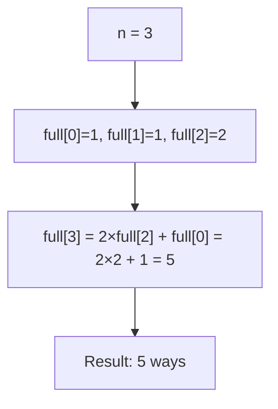
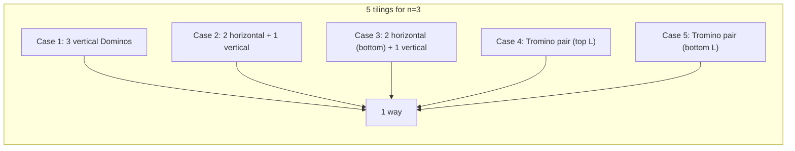
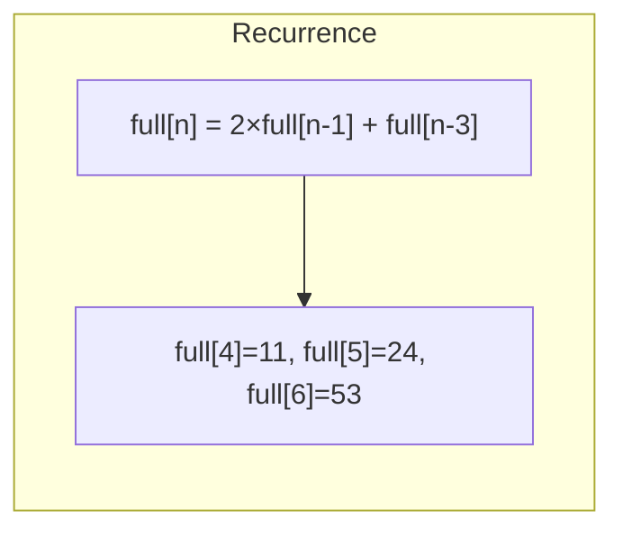

# LeetCode 790. Domino and Tromino Tiling（多米诺和托米诺平铺） — **中等**

## 考点
动态规划

## 题目描述
有两种形状的瓷砖：一种是 2 x 1 的多米诺形（Domino），另一种是"L"形的托米诺形（Tromino）。两种形状都可以旋转。

给定整数 n，返回可以平铺一个 2 x n 的面板的方法数量。由于答案可能非常大，请返回对 10^9 + 7 取模的值。

在平铺中，每个方格都必须被一块瓷砖覆盖。平铺意味着不能有空缺，瓷砖不能重叠。

**示例 1:**
```
输入: n = 3
输出: 5
解释: 五种不同的方法如上文所示。
```

**示例 2:**
```
输入: n = 1
输出: 1
```

**约束条件:**
- 1 <= n <= 1000

## 图解







## 解题思路

### 核心思路

**递推型 DP**。铺满 2×n 的面板，瓷砖有两种：2×1 多米诺（Domino）和 L 形托米诺（Tromino）。考虑最后一列如何被覆盖，推导状态转移方程。

### 算法步骤

**完整的状态 DP 定义：**

1. `full[0] = 1`, `full[1] = 1`, `full[2] = 2`
2. `partial[0] = 0`, `partial[1] = 1`, `partial[2] = 2`
3. 对于 i ≥ 3：
   - `full[i] = full[i-1] + full[i-2] + 2 × partial[i-1]`
   - `partial[i] = partial[i-1] + full[i-1]`
4. 化简后可得：`full[i] = 2 × full[i-1] + full[i-3]`
5. 返回 `full[n] % MOD`

### 图解示例

```
n = 3 的所有 5 种铺法:

方案1: 3个竖放Domino        方案2: 2横Domino + 1竖Domino
  ┌─┬─┬─┐                    ┌───┬─┐
  │ │ │ │                    │   │ │
  │ │ │ │   →  1种           │   │ │   →  1种
  └─┴─┴─┘                    ├───┤ │ (横放在顶上)
                              │   │ │

方案3: 同上(横放在底)        方案4: Tromino组合1
  ┌─┬───┐                    ┌─┬───┐
  │ │   │                    │ │  ┌┘
  │ │   │   →  1种           │ └──┘   →  1种
  └─┴───┘                    └─┴───┘

方案5: Tromino组合2
  ┌───┬─┐
  └┐  │ │
   └──┴─┤   →  1种
  ┌──┐│ │
  └──┴┴─┘

总: 5种 ✓
```

```
递推公式推导:

考虑 2×n 最后一列:

情况1: 竖放一个 Domino
  ┌───┬─┐
  │   │█│  ← 剩  2×(n-1) 要填
  │   │█│
  └───┴─┘
  full[n-1] 种

情况2: 横放两个 Domino
  ┌───┬───┐
  │   │   │  ← 剩  2×(n-2) 要填
  ├───┤   │
  │   │   │
  └───┴───┘
  full[n-2] 种

情况3+4: L 形 Tromino 组合(2种方向)
  ┌───┬───┐
  │   │  ┌┘  (或镜像)
  │   └──┘
  └───┴───┘
  需要 partial[n-1] 来填充

状态转移:
  full[n] = full[n-1] + full[n-2] + 2×partial[n-1]
  partial[n] = full[n-1] + partial[n-1]  (递推)
  
化简:
  full[n] - full[n-1] = full[n-1] - full[n-2] + full[n-3]
  整理得: full[n] = 2×full[n-1] + full[n-3]
```

### 逐步追踪

以 n = 1 到 6 为例：

| n | full[n-1] | full[n-2] | full[n-3] | full[n] = 2×full[n-1] + full[n-3] |
|---|-----------|-----------|-----------|-----------------------------------|
| 0 | - | - | - | 1 (空面板) |
| 1 | 1 | - | - | 1 (一个竖Domino) |
| 2 | 1 | 1 | - | 2 (两竖/两横) |
| 3 | 2 | 1 | 1 | 2×2+1 = 5 |
| 4 | 5 | 2 | 1 | 2×5+1 = 11 |
| 5 | 11 | 5 | 2 | 2×11+2 = 24 |
| 6 | 24 | 11 | 5 | 2×24+5 = 53 |

### 边界情况

- `n = 1`：返回 1（只能竖放一个 Domino）
- `n = 2`：返回 2（两竖或两横）
- `n = 3`：返回 5
- n 较大时取模 MOD = 10^9+7

### 复杂度分析

- **时间复杂度**：O(n)
- **空间复杂度**：O(1)，只需要存 full[n-1], full[n-2], full[n-3]

### 方法对比

| 方法 | 时间复杂度 | 空间复杂度 | 说明 |
|------|-----------|-----------|------|
| 递推公式 | O(n) | O(1) | 最优 |
| 双状态 DP | O(n) | O(1) | full+partial 双状态 |
| 矩阵快速幂 | O(log n) | O(1) | 利用矩阵加速递推 |
| 二维 DP | O(n) | O(n) | 列递推 |
