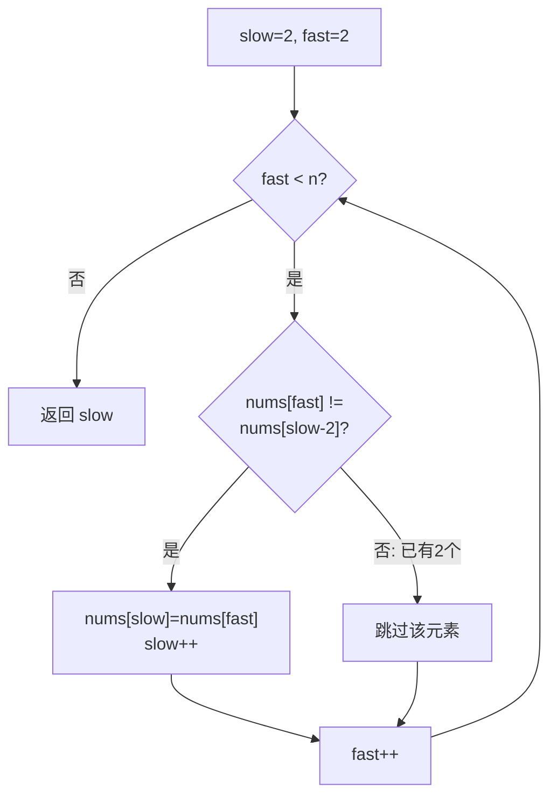

# LeetCode 80. Remove Duplicates from Sorted Array II（删除有序数组中的重复项 II） — **中等**

## 考点
Array, Two Pointers

## 题目描述
给你一个有序数组 `nums`，请你 **原地** 删除重复出现的元素，使得出现次数超过两次的元素 **只出现两次**，返回删除后数组的新长度。

不要使用额外的数组空间，你必须在 **原地修改输入数组** 并在使用 O(1) 额外空间的条件下完成。

### 示例 1
```
输入：nums = [1,1,1,2,2,3]
输出：5, nums = [1,1,2,2,3]
解释：函数应返回新长度 length = 5，并且原数组的前五个元素被修改为 1, 1, 2, 2, 3。
不需要考虑数组中超出新长度后面的元素。
```

### 示例 2
```
输入：nums = [0,0,1,1,1,1,2,3,3]
输出：7, nums = [0,0,1,1,2,3,3]
解释：函数应返回新长度 length = 7，并且原数组的前七个元素被修改为 0,0,1,1,2,3,3。
```

### 约束
- `1 <= nums.length <= 3 * 10^4`
- `-10^4 <= nums[i] <= 10^4`
- `nums` 已按升序排列

## 图解



## 解题思路

### 核心思路
这是 LeetCode 26（保留 1 个重复）的扩展——保留至多 2 个重复。双指针：fast 扫描全数组，slow 指向下一个可写入位置。当 count ≤ 2 时写入，否则跳过。

**关键洞察：** 有序数组保证相同元素相邻，因此可以用 count 变量跟踪当前数字连续出现次数。另一种更简洁的写法：nums[fast] != nums[slow-2] 时写入，利用"允许 2 个重复"的性质直接比较。

### 算法步骤

**方法一：计数法**

1. 若 n ≤ 2: 返回 n（前 2 个元素一定保留）
2. slow = 1, count = 1
3. for fast = 1..n-1:
   - 若 nums[fast] == nums[fast-1]: count++
   - 否则: count = 1
   - 若 count ≤ 2: nums[slow] = nums[fast]; slow++
4. 返回 slow

**方法二：间隔比较法（更简洁）**

1. 若 n ≤ 2: 返回 n
2. slow = 2
3. for fast = 2..n-1:
   - 若 nums[fast] != nums[slow-2]: nums[slow] = nums[fast]; slow++
4. 返回 slow

### 图解示例

**例子：nums = [1,1,1,2,2,3]**

```
方法一（计数法）:

初始: slow=1, count=1
   [1, 1, 1, 2, 2, 3]
       ↑
    fast=1

Step 1: fast=1, nums[1]=1 == nums[0]=1 → count=2 ≤ 2
  nums[slow=1] = 1, slow=2
  [1, 1, 1, 2, 2, 3]
          ↑
       slow=2

Step 2: fast=2, nums[2]=1 == nums[1]=1 → count=3 > 2
  不写入! slow=2 不变
  [1, 1, 1, 2, 2, 3]
          ↑
       slow=2  (第3个1被跳过)

Step 3: fast=3, nums[3]=2 != nums[2]=1 → count=1 ≤ 2
  nums[slow=2] = 2, slow=3
  [1, 1, 2, 2, 2, 3]
             ↑
          slow=3

Step 4: fast=4, nums[4]=2 == nums[3]=2 → count=2 ≤ 2
  nums[slow=3] = 2, slow=4
  [1, 1, 2, 2, 2, 3]
                ↑
             slow=4

Step 5: fast=5, nums[5]=3 != nums[4]=2 → count=1 ≤ 2
  nums[slow=4] = 3, slow=5
  [1, 1, 2, 2, 3, 3]
                   ↑
                slow=5

返回 slow=5, 有效数组: [1,1,2,2,3]
```

```
方法二（间隔比较法，更优雅）:

原理: 因为最多允许2个重复，所以 nums[slow-2] 一定是上一个"有效保留的不同数字"
若 nums[fast] == nums[slow-2]，说明这个数字已经保留了2个，跳过

初始: slow=2
   [1, 1, 1, 2, 2, 3]
          ↑
       fast=2

Step 1: fast=2, nums[2]=1 == nums[slow-2=0]=1 → 跳过!
  slow=2 不变

Step 2: fast=3, nums[3]=2 != nums[slow-2=0]=1 → 写入!
  nums[2]=2, slow=3
  [1, 1, 2, 2, 2, 3]
             ↑
          slow=3

Step 3: fast=4, nums[4]=2 != nums[slow-2=1]=1 → 写入!
  nums[3]=2, slow=4
  [1, 1, 2, 2, 2, 3]
                ↑
             slow=4

Step 4: fast=5, nums[5]=3 != nums[slow-2=2]=2 → 写入!
  nums[4]=3, slow=5
  [1, 1, 2, 2, 3, 3]
                   ↑
                slow=5

返回 slow=5 ✓
```

### 逐步追踪

**计数法，nums = [0,0,1,1,1,1,2,3,3]：**

| fast | nums[fast] | 与上一位比较 | count | count≤2? | slow位置 | 数组状态 |
|------|------------|-------------|-------|----------|----------|----------|
| 0 | 0 | (初始) | 1 | ✓ | 1 | [0,...] |
| 1 | 0 | =0,count=2 | 2 | ✓写入 | 2 | [0,0,...] |
| 2 | 1 | ≠0,count=1 | 1 | ✓写入 | 3 | [0,0,1,...] |
| 3 | 1 | =1,count=2 | 2 | ✓写入 | 4 | [0,0,1,1,...] |
| 4 | 1 | =1,count=3 | 3 | ✗跳过 | 4 | 不变 |
| 5 | 1 | =1,count=4 | 4 | ✗跳过 | 4 | 不变 |
| 6 | 2 | ≠1,count=1 | 1 | ✓写入 | 5 | [0,0,1,1,2,...] |
| 7 | 3 | ≠2,count=1 | 1 | ✓写入 | 6 | [0,0,1,1,2,3,...] |
| 8 | 3 | =3,count=2 | 2 | ✓写入 | 7 | [0,0,1,1,2,3,3] |

结果: slow=7, 有效数组前7个: [0,0,1,1,2,3,3]

### 边界情况

| 情况 | 输入 | 处理 | slow |
|------|------|------|------|
| 长度 ≤ 2 | [1] 或 [1,1] | 无需处理 | n |
| 无重复 | [1,2,3,4] | 全部保留 | n |
| 全相同3个 | [1,1,1] | 保留2个 | 2 |
| 全相同很多 | [2,2,2,2,2] | 保留2个 | 2 |
| 每数恰好2个 | [1,1,2,2,3,3] | 全部保留 | n |

### 方法对比

**计数法：** 显式维护 count，逻辑清晰。时间 O(n)，空间 O(1)
**间隔比较法：** nums[fast] != nums[slow-2] 直接判断，代码最简洁。但需要注意 slow 初始为 2
**通用 k-重复：** 计数法可扩展为保留 k 个重复，只需将 count ≤ 2 改为 count ≤ k

### 复杂度分析

- **时间：** O(n)，遍历数组一次
- **空间：** O(1)，原地修改，只使用两个指针/变量
- 与 LeetCode 26 对比：26 只允许 1 个重复，用 nums[fast] != nums[slow-1] 即可；80 允许 2 个，用 nums[fast] != nums[slow-2]
