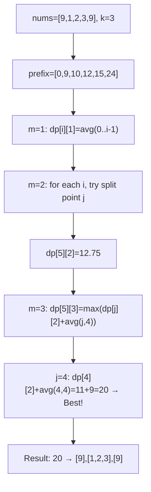
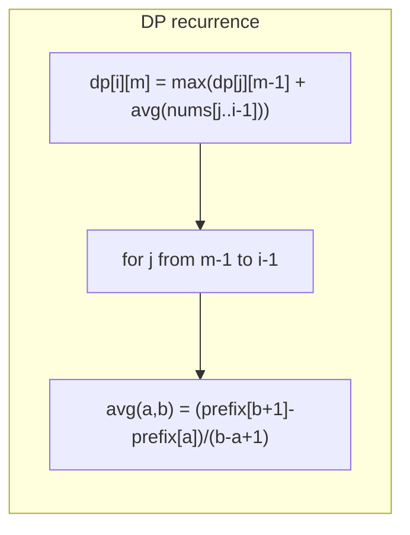
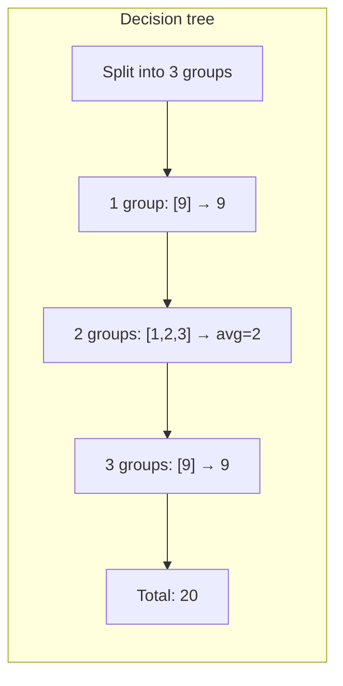

# LeetCode 813. Largest Sum of Averages（最大平均值和的分组） — **中等**

## 考点
数组, 数学, 动态规划, 前缀和

## 题目描述
给定数组 nums 和一个整数 k。我们将给定的数组 nums 分成最多 k 个非空子数组（连续），且分数由每个子数组内的平均值的总和构成。

注意我们必须使用 nums 数组中的每一个数进行分组，并且分数不一定需要是整数。

返回我们所能得到的最大分数是多少。答案误差在 10^-6 内被视为是正确的。

**示例 1:**
```
输入: nums = [9,1,2,3,9], k = 3
输出: 20
解释: 
nums 的最优分组是 [9], [1, 2, 3], [9]。得到的分数是 9 + (1+2+3)/3 + 9 = 20。
我们也可以把 nums 分成 [9, 1], [2], [3, 9]。
这样的分数是 (9+1)/2 + 2 + (3+9)/2 = 5 + 2 + 6 = 13。
```

**示例 2:**
```
输入: nums = [1,2,3,4,5,6,7], k = 4
输出: 20.5
```

**约束条件:**
- 1 <= nums.length <= 100
- 1 <= nums[i] <= 10^4
- 1 <= k <= nums.length

## 图解







## 解题思路

### 核心思路

**分组 DP + 前缀和**。`dp[i][m]` 表示将前 i 个元素分成 m 组的最大分数。对于每组，枚举最后一组的起始位置 j，将 `[j, i-1]` 作为最后一组。平均值通过前缀和快速计算。

### 算法步骤

1. 计算前缀和 `prefix[i] = sum(nums[0..i-1])`
2. 定义 `dp[i][m]`：将前 i 个元素分成 m 组的最大分数
3. 初始化 `dp[i][1] = prefix[i] / i`（1 组就是整体平均）
4. 对于 m 从 2 到 k，i 从 m 到 n：
   - `dp[i][m] = max(dp[j][m-1] + avg(j, i-1))` for j in [m-1, i-1]
   - 其中 `avg(j, i-1) = (prefix[i] - prefix[j]) / (i - j)`
5. 返回 `dp[n][k]`

### 图解示例

```
nums = [9, 1, 2, 3, 9], k = 3

前缀和:
  prefix[0]=0, prefix[1]=9, prefix[2]=10,
  prefix[3]=12, prefix[4]=15, prefix[5]=24

dp 表 (行i: 前i个元素, 列m: 分m组):

m=1 (初始化):
  dp[1][1] = 9/1 = 9     [9]
  dp[2][1] = 10/2 = 5    [9,1]
  dp[3][1] = 12/3 = 4    [9,1,2]
  dp[4][1] = 15/4 = 3.75 [9,1,2,3]
  dp[5][1] = 24/5 = 4.8  [9,1,2,3,9]

m=2:
  dp[2][2]: 前2个分2组 → 必须 [9],[1] → dp[1][1] + avg(1,1) = 9 + 1/1 = 10
  dp[3][2]: 前3个分2组:
    j=1: dp[1][1]+avg(1,2) = 9 + (10-9)/(3-1) = 9 + 0.5 = 9.5
    j=2: dp[2][1]+avg(2,2) = 5 + (12-10)/(3-2) = 5 + 2 = 7
    max = 9.5  → 分组 [9],[1,2]
    
  dp[4][2]:
    j=1: 9 + avg(1,3) = 9 + (15-9)/(4-1) = 9+2 = 11
    j=2: 5 + avg(2,3) = 5 + (15-10)/(4-2) = 5+2.5 = 7.5
    j=3: 4 + avg(3,3) = 4 + (15-12)/(4-3) = 4+3 = 7
    max = 11  → [9],[1,2,3]
    
  dp[5][2]:
    j=1: 9 + (24-9)/(5-1) = 9+3.75 = 12.75
    j=2: 5 + (24-10)/(5-2) = 5+4.67 = 9.67
    j=3: 4 + (24-12)/(5-3) = 4+6 = 10
    j=4: 3.75 + (24-15)/(5-4) = 3.75+9 = 12.75
    max = 12.75

m=3:
  dp[3][3]: j=2: dp[2][2]+avg(2,2) = 10+2 = 12  → [9],[1],[2]
  dp[4][3]:
    j=2: dp[2][2]+avg(2,3) = 10+2.5 = 12.5
    j=3: dp[3][2]+avg(3,3) = 9.5+3 = 12.5
    max = 12.5
  dp[5][3]:
    j=2: dp[2][2]+avg(2,4) = 10+(24-10)/(5-2) = 10+4.67 = 14.67
    j=3: dp[3][2]+avg(3,4) = 9.5+(24-12)/(5-3) = 9.5+6 = 15.5
    j=4: dp[4][2]+avg(4,4) = 11+(24-15)/(5-4) = 11+9 = 20  ← 最大
    max = 20

结果: dp[5][3] = 20
分组: [9], [1,2,3], [9] → 9 + (1+2+3)/3 + 9 = 9 + 2 + 9 = 20 ✓
```

### 逐步追踪（dp 表）

| m=1 | dp[1][1]=9 | dp[2][1]=5 | dp[3][1]=4 | dp[4][1]=3.75 | dp[5][1]=4.8 |
|-----|-----------|-----------|-----------|--------------|-------------|
| m=2 | - | 10 | 9.5 | 11 | **12.75** |
| m=3 | - | - | 12 | 12.5 | **20** |

### 边界情况

- `k = 1`：返回整个数组的平均值
- `k = n`：返回 sum(nums)（每组一个元素）
- 数组长度 ≤ 100：O(n²k) 可接受

### 复杂度分析

- **时间复杂度**：O(n² × k)，n 为数组长度
- **空间复杂度**：O(n × k)，可优化至 O(n)（m 维压缩）

### 方法对比

| 方法 | 时间复杂度 | 空间复杂度 | 说明 |
|------|-----------|-----------|------|
| DP + 前缀和 | O(n²k) | O(nk) | 标准解法 |
| 滚动 DP | O(n²k) | O(n) | 空间优化 |
| DFS + 记忆化 | O(n²k) | O(nk) | 自顶向下 |
