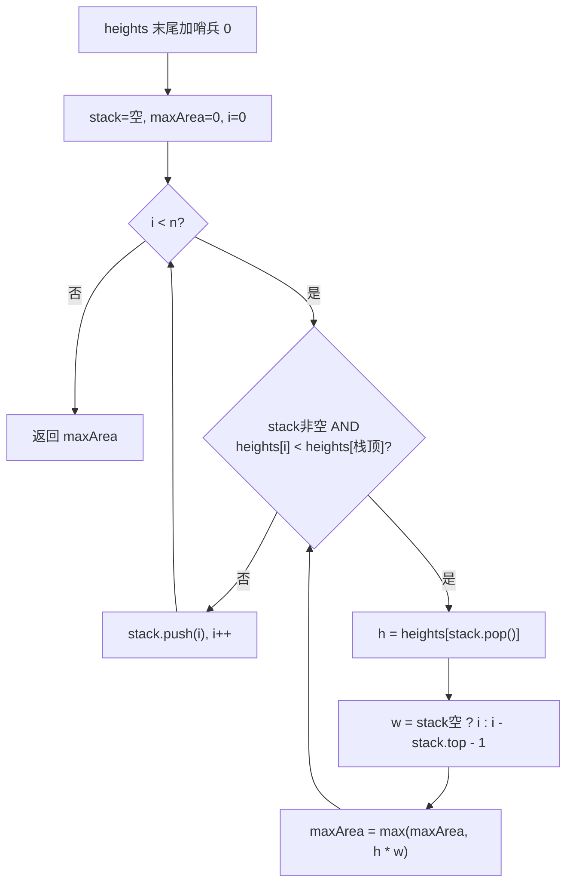

# LeetCode 84. Largest Rectangle in Histogram（柱状图中最大的矩形） — **困难**

## 考点
Stack, Array, Monotonic Stack

## 题目描述
给定 `n` 个非负整数，用来表示柱状图中各个柱子的高度。每个柱子彼此相邻，且宽度为 1。

求在该柱状图中，能够勾勒出来的矩形的最大面积。

### 示例 1
```
输入：heights = [2,1,5,6,2,3]
输出：10
解释：最大的矩形为图中红色区域，面积为 10。
（高为 5 和 6 组成的宽为 2 的矩形，面积 = 5 × 2 = 10）
```

### 示例 2
```
输入：heights = [2,4]
输出：4
```

### 约束
- `1 <= heights.length <= 10^5`
- `0 <= heights[i] <= 10^4`

## 图解



## 解题思路

### 核心思路

对于每个柱子 `i`，以它的高度 `h` 为矩形的高，能向左右扩展多远？答案是扩展到左右第一个比它矮的位置。如果能找到每个柱子的「左边界」和「右边界」（第一个严格小于它的柱子），就能在 O(n) 内求出最大面积。

单调递增栈的性质：遇到一个比栈顶矮的柱子时，栈顶柱子的右边界就确定了（就是当前柱子）；而栈顶下面那个元素就是它的左边界（因为栈是单调递增的，下一个栈内元素一定比它矮）。

### 方法一：单调递增栈（一次遍历）

**算法步骤：**

1. 在 `heights` 末尾追加哨兵 `0`（保证所有柱子都有机会出栈计算面积）。
2. 初始化空栈 `stack`（存放柱子下标），`maxArea = 0`。
3. 遍历 `i = 0` 到 `len(heights) - 1`：
   - 当栈非空且 `heights[i] < heights[stack.peek()]`:
     - `h = heights[stack.pop()]`（以 `h` 为高的柱子，右边界是 `i`）。
     - `w = stack.isEmpty() ? i : i - stack.peek() - 1`（左边界是新栈顶 / 或 -1）。
     - `maxArea = max(maxArea, h * w)`。
   - `stack.push(i)`。
4. 返回 `maxArea`。

**图解示例：**

```
heights = [2, 1, 5, 6, 2, 3, 0]  (哨兵 0 追加在末尾)

i=0, h=2:
  栈空 → push 0
  栈: [0]

i=1, h=1:
  heights[1]=1 < heights[peek=0]=2 → pop 0, h=2, i=1
    栈空 → w=1, area=2×1=2, maxArea=2
  push 1
  栈: [1]

i=2, h=5:
  heights[2]=5 > heights[peek=1]=1 → push 2
  栈: [1, 2]

i=3, h=6:
  heights[3]=6 > heights[peek=2]=5 → push 3
  栈: [1, 2, 3]

i=4, h=2:
  heights[4]=2 < heights[peek=3]=6:
    pop 3, h=6, peek=2
    w = 4 - 2 - 1 = 1, area=6×1=6, maxArea=6
  heights[4]=2 < heights[peek=2]=5:
    pop 2, h=5, peek=1
    w = 4 - 1 - 1 = 2, area=5×2=10, maxArea=10
  heights[4]=2 > heights[peek=1]=1 → push 4
  栈: [1, 4]

i=5, h=3:
  heights[5]=3 > heights[peek=4]=2 → push 5
  栈: [1, 4, 5]

i=6, h=0 (哨兵):
  heights[6]=0 < heights[peek=5]=3:
    pop 5, h=3, peek=4
    w = 6 - 4 - 1 = 1, area=3×1=3, maxArea=10
  heights[6]=0 < heights[peek=4]=2:
    pop 4, h=2, peek=1
    w = 6 - 1 - 1 = 4, area=2×4=8, maxArea=10
  heights[6]=0 < heights[peek=1]=1:
    pop 1, h=1, 栈空
    w = 6, area=1×6=6, maxArea=10
  push 6

结果: maxArea = 10
```

**逐步追踪（以 [2,1,5,6,2,3] 为例）：**

```
柱子编号:   0  1  2  3  4  5
高度:       2  1  5  6  2  3

遍历过程:
  i=0: 入栈 [0]                              — 还没遇到右边界
  i=1: 1<2, 弹出0, h=2 左=-1 右=1 w=1 area=2
       入栈 [1]                               — 柱子1的左边界是-1（左边没了）
  i=2: 5>1, 入栈 [1,2]                       — 仍在找右边界
  i=3: 6>5, 入栈 [1,2,3]                     — 仍在找右边界
  i=4: 2<6, 弹出3, h=6 左=2 右=4 w=1 area=6
       2<5, 弹出2, h=5 左=1 右=4 w=2 area=10  ← 最大
       2>1, 入栈 [1,4]
  i=5: 3>2, 入栈 [1,4,5]
  哨兵: 0<3, 弹出5 → area=3
        0<2, 弹出4 → area=8
        0<1, 弹出1 → area=6

结果: max = 10 (柱子2和3: 宽2 x 高5)
```

**边界情况：**

| 情况 | 处理方式 |
|------|---------|
| 空数组 | 直接返回 0 |
| 单个柱子 | 哨兵触发计算，w=1，area = heights[0] |
| 全部递增 [1,2,3,4] | 哨兵 0 触发全部出栈 |
| 全部递减 [4,3,2,1] | 每个新元素都触发前面出栈 |
| 包含大量 0 | width 会很大，但 area 为 0，不影响 max |
| 极大值 10^4 | 乘法可能溢出 32bit 需要用 long/64bit |

### 方法二：左右边界预处理（双数组）

对每个柱子，向左找到第一个比它矮的位置 `left[i]`，向右找 `right[i]`。面积 = `heights[i] * (right[i] - left[i] - 1)`。用栈通过一次扫描同时确定每个柱子的最近更矮左/右位置。

**复杂度分析：**

| 方法 | 时间复杂度 | 空间复杂度 |
|------|-----------|-----------|
| 单调栈（一次遍历+哨兵） | O(n) | O(n) |
| 左右边界预处理 | O(n) | O(n) |
| 暴力枚举 | O(n²) | O(1) |

**关键点：**

- 哨兵 0 是精髓：避免了循环结束后栈内残留元素的特殊处理。
- 宽度公式 `w = stack.isEmpty() ? i : i - stack.peek() - 1` 需要充分理解：左边界「新的栈顶」可能不存在（空栈 = 左边没有更矮的）。
- 单调栈入栈/出栈各一次，因此是线性的。
