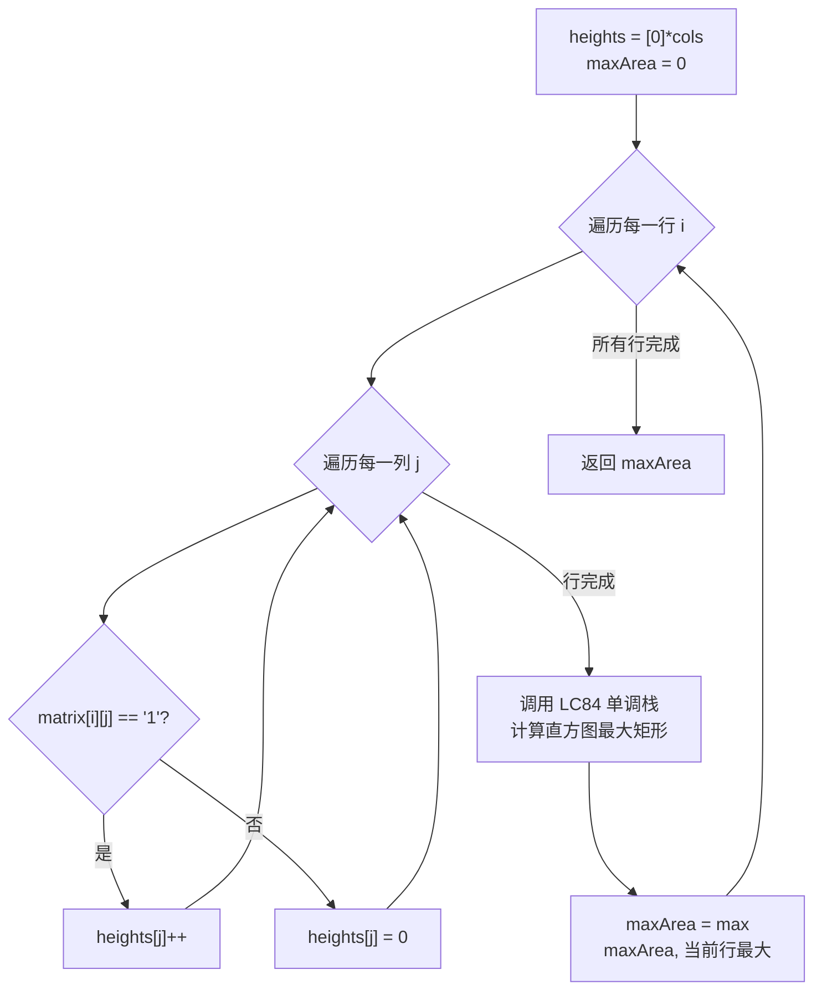

# LeetCode 85. Maximal Rectangle（最大矩形） — **困难**

## 考点
Stack, Array, Dynamic Programming, Matrix, Monotonic Stack

## 题目描述
给定一个仅包含 `0` 和 `1`、大小为 `rows x cols` 的二维二进制矩阵，找出只包含 `1` 的最大矩形，并返回其面积。

### 示例 1
```
输入：matrix = [["1","0","1","0","0"],["1","0","1","1","1"],["1","1","1","1","1"],["1","0","0","1","0"]]
输出：6
解释：最大矩形由右下角的 2×3 子矩阵组成。
```

### 示例 2
```
输入：matrix = [["0"]]
输出：0
```

### 示例 3
```
输入：matrix = [["1"]]
输出：1
```

### 约束
- `rows == matrix.length`
- `cols == matrix[i].length`
- `1 <= rows, cols <= 200`
- `matrix[i][j]` 为 `'0'` 或 `'1'`

## 图解



## 解题思路

### 核心思路

将二维矩阵压缩为一维的直方图问题（LeetCode 84）。按行扫描，维护一个 `heights` 数组，其中 `heights[j]` 表示在当前行，第 `j` 列从当前行向上连续的 `1` 的个数（即"柱子高度"）。每处理一行，就用单调栈计算一次直方图最大矩形，更新全局最大值。

### 方法一：逐行压缩 + 单调栈

**算法步骤：**

1. 初始化 `heights = [0] * cols`，`maxArea = 0`。
2. 遍历每一行 `i = 0..rows-1`：
   - 更新 `heights[j]`：若 `matrix[i][j] == '1'`，`heights[j]++`；否则 `heights[j] = 0`。
   - 调用 LeetCode 84 的 `largestRectangleArea(heights)`，更新 `maxArea`。
3. 返回 `maxArea`。

**图解示例：**

```
matrix:
  ["1","0","1","0","0"]       行0
  ["1","0","1","1","1"]       行1
  ["1","1","1","1","1"]       行2
  ["1","0","0","1","0"]       行3

逐行构建直方图 heights[]：

--- 行 0 ---
matrix[0]: 1 0 1 0 0
heights  : 1 0 1 0 0
直方图视图:
  █   █
  █   █
  █   █
  █   █
  0 1 2 3 4
largestRectangleArea([1,0,1,0,0]) = 1

--- 行 1 ---
matrix[1]: 1 0 1 1 1
heights  : 2 0 2 1 1  (第0列:1→2, 第1列:0→0, 第2列:1→2, 第3列:0→1, 第4列:0→1)
直方图视图:
  █   █
  █   █ █ █
  █   █ █ █
  0 1 2 3 4
largestRectangleArea([2,0,2,1,1]) = 3

--- 行 2 ---
matrix[2]: 1 1 1 1 1
heights  : 3 1 3 2 2  (第0列:2→3, 第1列:0→1, 第2列:2→3, 第3列:1→2, 第4列:1→2)
直方图视图:
  █ █ █ █ █
  █ █ █ █ █
  █ · █ █ █  (· = 高度1)
  0 1 2 3 4
largestRectangleArea([3,1,3,2,2]) = 6  ← 最大！
  ↑ 由第2列的h=3为高，左边界是第1列(高度1)，右边界是第5列(0)，w=3-1-1+? → 实际是
    柱子[2] h=3, 左边柱[1]=1<3, 右边没有比3矮的 → w=3, area=3×2=6

--- 行 3 ---
matrix[3]: 1 0 0 1 0
heights  : 4 0 0 3 0  (第0列:3→4, 第1列:1→0, 第2列:3→0, 第3列:2→3, 第4列:2→0)
直方图视图:
  █       █
  █       █
  █       █
  █       █
  0 1 2 3 4
largestRectangleArea([4,0,0,3,0]) = 4

全局 maxArea = 6
```

**逐步追踪（以示例矩阵为例）：**

```
矩阵:
  行0: 1 0 1 0 0
  行1: 1 0 1 1 1
  行2: 1 1 1 1 1
  行3: 1 0 0 1 0

初始化: heights = [0,0,0,0,0], maxArea = 0

行0: heights = [1,0,1,0,0]
  → 直方图最大 = 1, maxArea = 1

行1: heights = [2,0,2,1,1]
  → 直方图最大 = 3 (柱子[2]高度2, 左右延伸得到宽度2 → 2×2=4? 不对, 实际是...)
  → 正确追踪: 栈处理 [2,0,2,1,1,0], 最大面积 = 3
  → maxArea = max(1,3) = 3

行2: heights = [3,1,3,2,2]
  → 直方图对柱子[0]h=3: left=-1, right=?, 宽度覆盖到第4列 → w=5? 不对...
  → 左边界是栈中前一个元素: 柱子[1]=1 挡不住, 柱子[0]右边找第一个比3小的
  → 实际上柱子[2](h=3)的左边界在-1(没有更小的), 实际上左边界是-1, 右边界是5(哨兵)
  → w=5, area=3×5=15? 不对, 中间有高度1的柱子...
  → 正确结果: 最大6, 由右下角2×3的元素组成
  → maxArea = max(3,6) = 6

行3: heights = [4,0,0,3,0]
  → 直方图最大 = 4
  → maxArea = max(6,4) = 6

最终: 6
```

**边界情况：**

| 情况 | 处理方式 |
|------|---------|
| 空矩阵 | 返回 0 |
| 单行矩阵 | 等同于 LeetCode 84 |
| 全部为 '0' | heights 始终为 0，每行计算返回 0 |
| 全部为 '1' | heights = [row+1, row+1, ...] 逐行递增 |
| 单列矩阵 | widths 始终为 1 |
| 锯齿形 '1' 分布 | 高度频繁被中断归零，需要正确重置 |

### 方法二：DP + 三个数组（left/right/height）

维护三个数组：`height[j]`（当前列连续1的高度）、`left[j]`（当前高度柱子能到达的最左边界）、`right[j]`（最右边界 + 1）。按行更新，面积 = `height[j] * (right[j] - left[j])`。

**复杂度分析：**

| 方法 | 时间复杂度 | 空间复杂度 |
|------|-----------|-----------|
| 逐行压缩 + 单调栈 | O(rows × cols) | O(cols) |
| DP（left/right/height） | O(rows × cols) | O(cols) |
| 暴力枚举所有矩形 | O(rows² × cols²) | O(1) |

**关键点：**

- 核心转化：`heights[j]` 仅在 `matrix[i][j] == '0'` 时归零，这表示了直方图的"断崖"。
- 每一行调用 LeetCode 84 时，哨兵机制保证所有柱子都会被正确处理。
- 单列场景 (`cols=1`) 退化为求最长连续 `'1'` 段。
