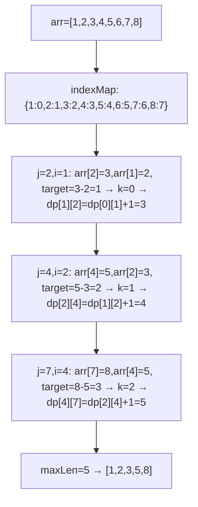
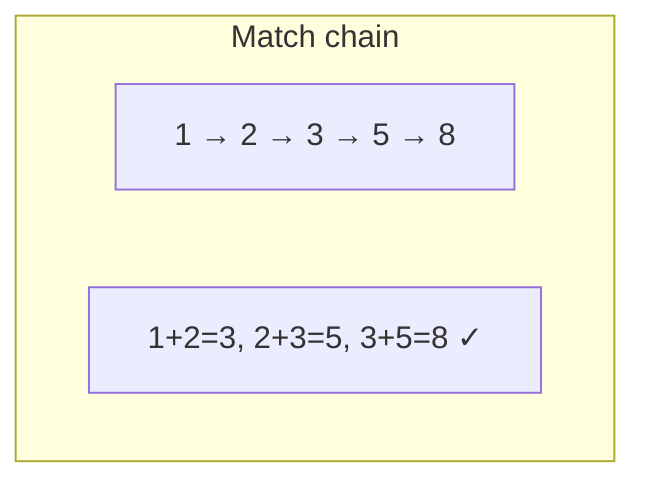
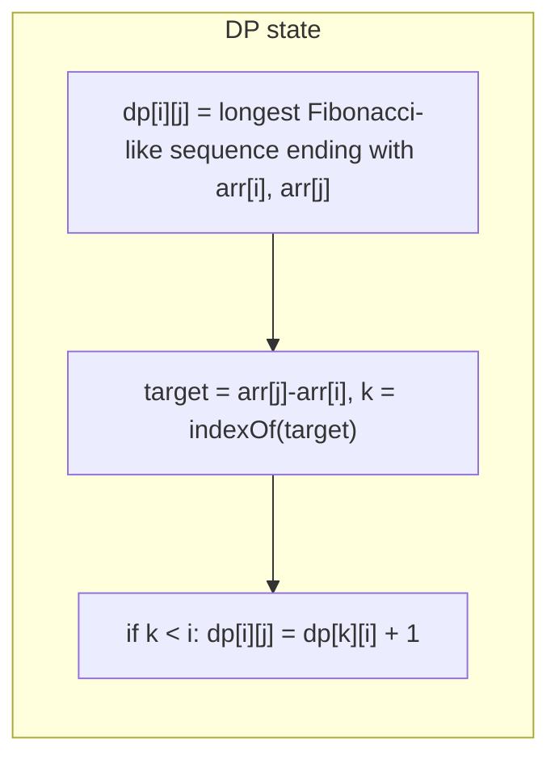

# LeetCode 873. Length of Longest Fibonacci Subsequence（最长的斐波那契子序列的长度） — **中等**

## 考点
数组, 哈希表, 动态规划

## 题目描述
如果序列 X_1, X_2, ..., X_n 满足下列条件，就说它是斐波那契式的：
- n >= 3
- 对于所有 i + 2 <= n，都有 X_i + X_{i+1} = X_{i+2}

给定一个严格递增的正整数数组 arr，找到 arr 中最长的斐波那契式的子序列的长度。如果一个不存在，返回 0。

回想一下，子序列是从原序列 arr 中派生出来的，它从 arr 中删掉任意数量的元素（也可以不删），而不改变其余元素的顺序。例如，[3, 5, 8] 是 [3, 4, 5, 6, 7, 8] 的一个子序列。

**示例 1:**
```
输入: arr = [1,2,3,4,5,6,7,8]
输出: 5
解释: 最长的斐波那契式子序列为 [1,2,3,5,8]。
```

**示例 2:**
```
输入: arr = [1,3,7,11,12,14,18]
输出: 3
解释: 最长的斐波那契式子序列有 [1,11,12]、[3,11,14] 以及 [7,11,18]。
```

**约束条件:**
- 3 <= arr.length <= 1000
- 1 <= arr[i] < arr[i+1] <= 10^9

## 图解







## 解题思路

### 核心思路

**DP + 哈希表**。`dp[i][j]` 表示以 `arr[i]` 和 `arr[j]` 作为最后两个元素的斐波那契子序列长度。由于 arr 严格递增，前一个元素必然由 `arr[j] - arr[i]` 推算，通过哈希表快速定位其索引。

### 算法步骤

1. 构建哈希表 `indexMap`：`arr[值] -> 索引`
2. 定义 `dp[i][j]`：以 arr[i] 和 arr[j] 结尾的最长斐波那契长度（i < j），初始至少为 2
3. 遍历 j 从 0 到 n-1，i 从 0 到 j-1：
   - `target = arr[j] - arr[i]`
   - 若 `target < arr[i]` 且 `target` 存在于 indexMap 中：
     - `k = indexMap[target]`
     - `dp[i][j] = dp[k][i] + 1`
   - 否则：`dp[i][j] = 2`
   - `maxLen = max(maxLen, dp[i][j])`
4. 返回 `maxLen >= 3 ? maxLen : 0`

### 图解示例

```
arr = [1, 2, 3, 4, 5, 6, 7, 8]
indexMap: {1:0, 2:1, 3:2, 4:3, 5:4, 6:5, 7:6, 8:7}

遍历过程:

j=2, i=0: arr[2]=3, arr[0]=1, target=3-1=2
  target=2 < arr[0]=1? No (2>1) → dp[0][2]=2

j=2, i=1: arr[2]=3, arr[1]=2, target=3-2=1
  target=1 < arr[1]=2? Yes, target=1在indexMap中(k=0)
  dp[1][2] = dp[0][1] + 1 = 2 + 1 = 3  → [1,2,3] ✓

j=3, i=0: arr[3]=4, arr[0]=1, target=4-1=3
  target=3 < 1? No → dp[0][3]=2

j=3, i=1: 4,2 → target=2 < 2? No → dp[1][3]=2

j=3, i=2: 4,3 → target=1 < 3? Yes, k=0
  dp[2][3] = dp[0][2] + 1 = 2 + 1 = 3  → [1,3,4]?不对, 是[...1,3,4]长度3

等等... arr[0]=1, arr[2]=3, arr[3]=4
  dp[0][2]代表以(1,3)结尾的斐波那契子序列长度=2
  dp[2][3] = dp[0][2] + 1 = 3 → 序列是 [1,3,4]? 不对, 1+3=4 ✓

j=4, i=2: 5,3 → target=2 < 3? Yes, k=1
  dp[2][4] = dp[1][2] + 1 = 3 + 1 = 4  → [1,2,3,5] ✓

j=5, i=3: 6,4 → target=2 < 4? Yes, k=1
  dp[3][5] = dp[1][3] + 1 = 2 + 1 = 3  → [2,4,6] ✓

j=5, i=4: 6,5 → target=1 < 5? Yes, k=0
  dp[4][5] = dp[0][4] + 1 = 2 + 1 = 3  → [1,5,6] ✓

j=6, i=4: 7,5 → target=2 < 5? Yes, k=1
  dp[4][6] = dp[1][4] + 1 = 2 + 1 = 3  → [2,5,7] ✓

j=7, i=5: 8,6 → target=2 < 6? Yes, k=1
  dp[5][7] = dp[1][5] + 1 = 2 + 1 = 3  → [2,6,8] ✓

j=7, i=4: 8,5 → target=3 < 5? Yes, k=2
  dp[4][7] = dp[2][4] + 1 = 4 + 1 = 5  → [1,2,3,5,8] ✓✓

maxLen = 5 → 返回 5
```

### 逐步追踪

| j | i | arr[j] | arr[i] | target | target<arr[i]? | target存在? | k | dp[i][j] | maxLen |
|---|----|--------|--------|--------|--------------|-----------|----|----------|--------|
| 2 | 0 | 3 | 1 | 2 | N(2>1) | - | - | 2 | 2 |
| 2 | 1 | 3 | 2 | 1 | Y(1<2) | Y | 0 | dp[0][1]+1=3 | 3 |
| 3 | 0 | 4 | 1 | 3 | N | - | - | 2 | 3 |
| 3 | 1 | 4 | 2 | 2 | N(2<2?N) | - | - | 2 | 3 |
| 3 | 2 | 4 | 3 | 1 | Y | Y | 0 | dp[0][2]+1=3 | 3 |
| 4 | 0 | 5 | 1 | 4 | N | - | - | 2 | 3 |
| 4 | 1 | 5 | 2 | 3 | N | - | - | 2 | 3 |
| 4 | 2 | 5 | 3 | 2 | Y | Y | 1 | dp[1][2]+1=4 | 4 |
| 4 | 3 | 5 | 4 | 1 | Y | Y | 0 | dp[0][3]+1=3 | 4 |
| ... | ... | ... | ... | ... | ... | ... | ... | ... | ... |
| 7 | 4 | 8 | 5 | 3 | Y | Y | 2 | dp[2][4]+1=5 | 5 |

### 边界情况

- 长度不足 3：返回 0
- 严格递增数组但没有斐波那契子序列：返回 0
- 所有元素满足斐波那契关系：最长序列可涉及所有元素

### 复杂度分析

- **时间复杂度**：O(n²)，双重循环遍历所有 (i,j) 对
- **空间复杂度**：O(n²)，dp 二维数组

### 方法对比

| 方法 | 时间复杂度 | 空间复杂度 | 说明 |
|------|-----------|-----------|------|
| DP + 哈希 | O(n²) | O(n²) | 标准解法，可优化空间 |
| 暴力三重循环 | O(n³) | O(1) | 枚举第三个元素 |
| 两数之和扩展 | O(n²logn) | O(n) | 用双指针判断扩展序列 |
