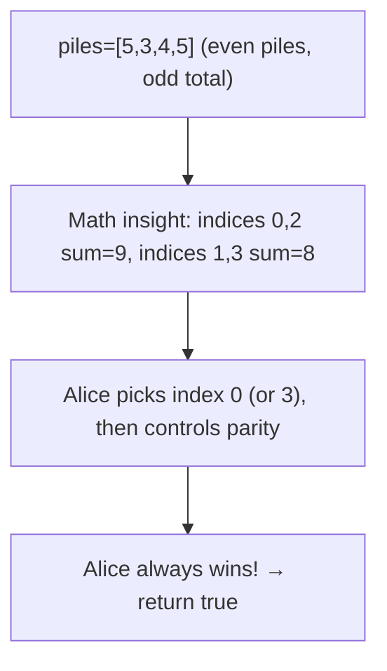
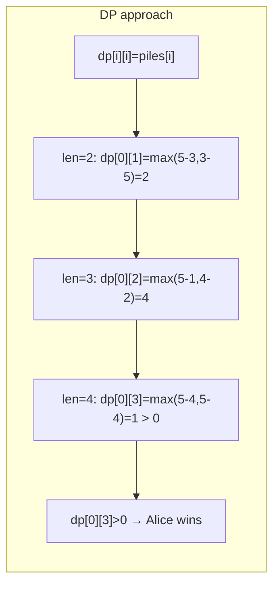
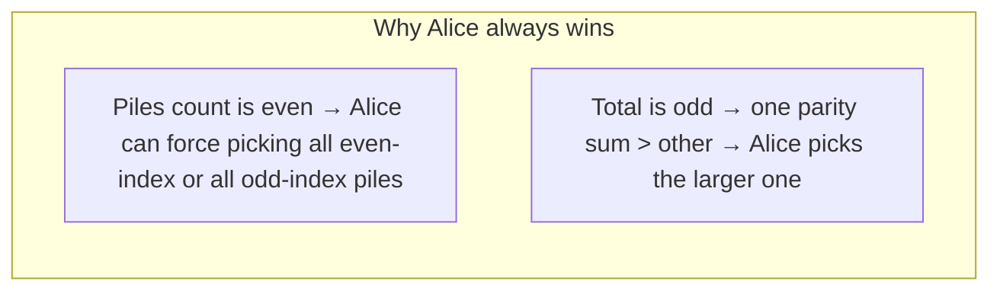

# LeetCode 877. Stone Game（石子游戏） — **中等**

## 考点
数组, 数学, 动态规划, 博弈论

## 题目描述
Alice 和 Bob 用几堆石子在做游戏。一共有偶数堆石子，排成一行；每堆都有正整数颗石子，数目为 piles[i]。

游戏以谁手中的石子最多来决出胜负。石子的总数是奇数，所以没有平局。

Alice 和 Bob 轮流进行，Alice 先开始。每回合，玩家从行的开始或结束处取走整堆石头。这种情况一直持续到没有更多的石子堆为止，此时手中石子最多的玩家获胜。

假设 Alice 和 Bob 都发挥出最佳水平，当 Alice 赢得比赛时返回 true，当 Bob 赢得比赛时返回 false。

**示例 1:**
```
输入：piles = [5,3,4,5]
输出：true
解释：
Alice 先开始，只能拿前 5 颗或后 5 颗石子。
假设他取了前 5 颗，这一行就变成了 [3,4,5]。
如果 Bob 拿走前 3 颗，那么剩下的是 [4,5]，Alice 拿走后 5 颗赢得 10 分。
如果 Bob 拿走后 5 颗，那么剩下的是 [3,4]，Alice 拿走后 4 颗赢得 9 分。
这表明，取前 5 颗石子对 Alice 来说是一个胜利的举动，所以返回 true。
```

**示例 2:**
```
输入：piles = [3,7,2,3]
输出：true
```

**约束条件:**
- 2 <= piles.length <= 500
- piles.length 是偶数
- 1 <= piles[i] <= 500
- sum(piles[i]) 是奇数

## 图解







## 解题思路

### 核心思路

**博弈型 DP**，与 486 Predict the Winner 完全相同。`dp[i][j]` 表示在 `piles[i..j]` 中先手能获得的最大净胜分（先手得分 - 后手得分）。由于堆数为偶数、总数为奇数，**数学上 Alice 必胜**（先手总能选到全部奇数索引或偶数索引堆中较大的那个）。

### 算法步骤

**方法一：数学 O(1)**

1. 直接返回 `true`（由于偶数堆 + 总数为奇数，Alice 必胜）

**方法二：区间 DP O(n²)**

1. 定义 `dp[i][j]`：先手在 piles[i..j] 中的最大净胜分
2. 初始化 `dp[i][i] = piles[i]`
3. 按区间长度递推：
   - `dp[i][j] = max(piles[i] - dp[i+1][j], piles[j] - dp[i][j-1])`
4. 返回 `dp[0][n-1] > 0`

### 图解示例

```
piles = [5, 3, 4, 5]

数学证明 (为什么先手必胜):
  偶数索引: 索引 0,2 → 值 5,4 → 和=9
  奇数索引: 索引 1,3 → 值 3,5 → 和=8

  Alice 先手可以控制自己始终拿偶数索引的堆:
    选 piles[0]=5 → 剩下 [3,4,5], Bob 无论选哪个, 剩下的首尾又都是偶数索引
  
  Alice 也可以控制自己始终拿奇数索引的堆:
    选 piles[3]=5 → 剩下 [5,3,4], 同理
  
  因为 9 > 8, Alice 选择偶数索引策略, 必胜!
```

```
DP 追踪:
  piles = [5, 3, 4, 5]

  dp[0][0]=5, dp[1][1]=3, dp[2][2]=4, dp[3][3]=5

  len=2:
    dp[0][1] = max(5-3, 3-5) = max(2, -2) = 2
    dp[1][2] = max(3-4, 4-3) = max(-1, 1) = 1
    dp[2][3] = max(4-5, 5-4) = max(-1, 1) = 1

  len=3:
    dp[0][2] = max(5-dp[1][2], 4-dp[0][1]) = max(5-1, 4-2) = max(4, 2) = 4
    dp[1][3] = max(3-dp[2][3], 5-dp[1][2]) = max(3-1, 5-1) = max(2, 4) = 4

  len=4:
    dp[0][3] = max(5-dp[1][3], 5-dp[0][2]) = max(5-4, 5-4) = max(1, 1) = 1

  dp[0][3] = 1 > 0 → Alice 获胜 ✓
```

### 逐步追踪

| len | i | j | 选piles[i] | 选piles[j] | dp[i][j] |
|-----|---|---|-----------|-----------|----------|
| 1 | 0 | 0 | - | - | 5 |
| 1 | 1 | 1 | - | - | 3 |
| 1 | 2 | 2 | - | - | 4 |
| 1 | 3 | 3 | - | - | 5 |
| 2 | 0 | 1 | 5-3=2 | 3-5=-2 | 2 |
| 2 | 1 | 2 | 3-4=-1 | 4-3=1 | 1 |
| 2 | 2 | 3 | 4-5=-1 | 5-4=1 | 1 |
| 3 | 0 | 2 | 5-1=4 | 4-2=2 | 4 |
| 3 | 1 | 3 | 3-1=2 | 5-1=4 | 4 |
| 4 | 0 | 3 | 5-4=1 | 5-4=1 | 1 |

### 边界情况

- `n = 2`：由于偶数堆，Alice 选较大的即可，`max(piles[0], piles[1])`
- 通用情况：由于约束条件保证 Alice 必胜，直接 return true

### 复杂度分析

- 数学方法：时间 O(1)，空间 O(1)
- DP 方法：时间 O(n²)，空间 O(n²)（可优化至 O(n)）

### 方法对比

| 方法 | 时间复杂度 | 空间复杂度 | 说明 |
|------|-----------|-----------|------|
| 数学法 | O(1) | O(1) | 利用题目特殊条件 |
| 区间 DP | O(n²) | O(n²) | 通用解法 |
| 一维滚动 DP | O(n²) | O(n) | 空间优化 |
| 记忆化递归 | O(n²) | O(n²) | 自顶向下 |
