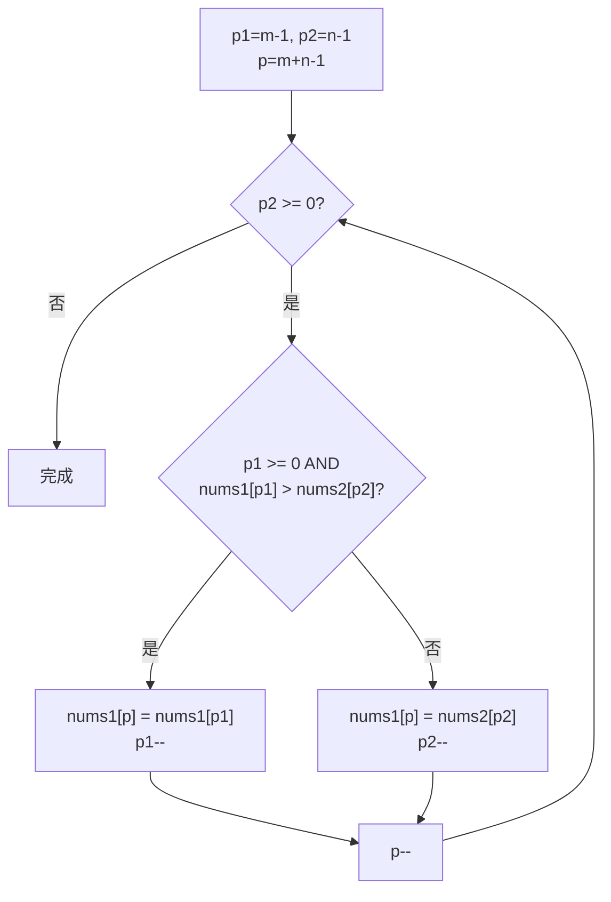

# LeetCode 88. Merge Sorted Array（合并两个有序数组） — **简单**

## 考点
Array, Two Pointers, Sorting

## 题目描述
给你两个按 **非递减顺序** 排列的整数数组 `nums1` 和 `nums2`，另有两个整数 `m` 和 `n`，分别表示 `nums1` 和 `nums2` 中的元素数目。

请你 **合并** `nums2` 到 `nums1` 中，使合并后的数组同样按 **非递减顺序** 排列。

**注意：** 最终，合并后数组不应由函数返回，而是存储在数组 `nums1` 中。为了应对这种情况，`nums1` 的初始长度为 `m + n`，其中前 `m` 个元素表示应合并的元素，后 `n` 个元素为 `0`，应忽略。`nums2` 的长度为 `n`。

### 示例 1
```
输入：nums1 = [1,2,3,0,0,0], m = 3, nums2 = [2,5,6], n = 3
输出：[1,2,2,3,5,6]
解释：需要合并 [1,2,3] 和 [2,5,6]。
```

### 示例 2
```
输入：nums1 = [1], m = 1, nums2 = [], n = 0
输出：[1]
```

### 示例 3
```
输入：nums1 = [0], m = 0, nums2 = [1], n = 1
输出：[1]
```

### 约束
- `nums1.length == m + n`
- `nums2.length == n`
- `0 <= m, n <= 200`
- `1 <= m + n <= 200`
- `-10^9 <= nums1[i], nums2[j] <= 10^9`

## 图解



## 解题思路

### 核心思路

`nums1` 的后半部分是预留的空白空间（值为 0 的占位区域）。如果从前向后合并，写入较小值时可能覆盖 `nums1` 中还未处理的元素。因此从后向前填充：每次都取两个数组当前剩余部分中的最大值，放到 `nums1` 的末尾写入位置。

### 方法一：双指针从后向前

**算法步骤：**

1. 设置 `p1 = m - 1`（nums1 有效元素末尾），`p2 = n - 1`（nums2 末尾），`p = m + n - 1`（写入位置）。
2. 当 `p1 >= 0 && p2 >= 0`：
   - 若 `nums1[p1] > nums2[p2]`，`nums1[p] = nums1[p1--]`。
   - 否则，`nums1[p] = nums2[p2--]`。
   - `p--`。
3. 若 `p2 >= 0`（nums1 先耗尽），将 `nums2[0..p2]` 复制到 `nums1[0..p]`。
4. 若 `p1 >= 0`（nums2 先耗尽），nums1 剩余元素已在正确位置，无需操作。

**图解示例：**

```
Example: nums1 = [1,2,3,0,0,0], m=3, nums2 = [2,5,6], n=3

初始状态:
  nums1: [ 1, 2, 3, 0, 0, 0 ]
           ↑p1       ↑p
  nums2: [ 2, 5, 6 ]
           ↑p2

Step 1: 比较 nums1[p1]=3 vs nums2[p2]=6
  6 > 3 → nums1[p] = 6, p2--, p--
  nums1: [ 1, 2, 3, 0, 0, 6 ]
           ↑p1       ↑p
  nums2: [ 2, 5, 6 ]
              ↑p2

Step 2: 比较 nums1[p1]=3 vs nums2[p2]=5
  5 > 3 → nums1[p] = 5, p2--, p--
  nums1: [ 1, 2, 3, 0, 5, 6 ]
           ↑p1    ↑p
  nums2: [ 2, 5, 6 ]
           ↑p2

Step 3: 比较 nums1[p1]=3 vs nums2[p2]=2
  3 > 2 → nums1[p] = 3, p1--, p--
  nums1: [ 1, 2, 3, 3, 5, 6 ]
           ↑p1 ↑p

Step 4: 比较 nums1[p1]=2 vs nums2[p2]=2
  2 >= 2 → nums1[p] = 2, p2--, p--
  nums1: [ 1, 2, 2, 3, 5, 6 ]
        ↑p1 ↑p

Step 5: p2 < 0 循环结束
  nums1 剩余 [1] 已在正确位置

结果: nums1 = [1, 2, 2, 3, 5, 6]
```

**逐步追踪：**

```
p1=2, p2=2, p=5:
  nums1[p1]=3  nums2[p2]=6 → 6更大, put 6 at p=5, p2→1, p→4

p1=2, p2=1, p=4:
  nums1[p1]=3  nums2[p2]=5 → 5更大, put 5 at p=4, p2→0, p→3

p1=2, p2=0, p=3:
  nums1[p1]=3  nums2[p2]=2 → 3更大, put 3 at p=3, p1→1, p→2

p1=1, p2=0, p=2:
  nums1[p1]=2  nums2[p2]=2 → 等于, 取nums2, put 2 at p=2, p2→-1, p→1

p2=-1 → 循环结束, nums1=[1,2,2,3,5,6] 完成
```

**边界情况：**

| 情况 | 处理方式 |
|------|---------|
| m=0, n>0 | nums1 为空壳，直接把 nums2 复制过去 |
| n=0 | 无需任何操作，nums1 已经排好序 |
| 两数组都非空 | 正常双指针 |
| nums1 元素全部大于 nums2 | 先耗尽 p2，然后 nums1 元素自动到位 |
| nums1 元素全部小于 nums2 | 先耗尽 p1，再把 nums2 剩余复制到前面 |
| 包含负数 | 比较逻辑不变（整数比较） |
| 元素值极大（接近 10^9） | 类型用 int 即可，无溢出风险 |

### 方法二：从前向后 + 临时数组

将 `nums1` 前 m 个复制到临时数组，然后双指针从前面归并到 `nums1`。这是归并排序中合并两个有序数组的标准做法。

**复杂度分析：**

| 方法 | 时间复杂度 | 空间复杂度 |
|------|-----------|-----------|
| 从后向前双指针 | O(m+n) | O(1) |
| 临时数组 + 从前向后 | O(m+n) | O(m) |
| 调库 sort | O((m+n)log(m+n)) | O(1) |

**关键点：**

- 从后向前是本题的最优解，充分利用了 nums1 后部的空闲空间。
- 循环条件可以简化为 `while (n > 0)`，因为当 n 耗尽时 nums1 已经到位。
- 元素相等时放哪边都一样（都是稳定合并）。
