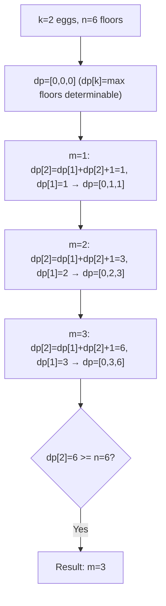
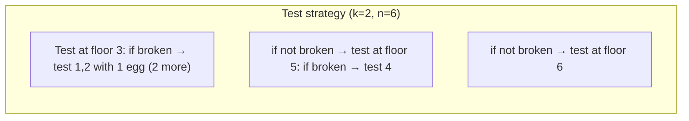
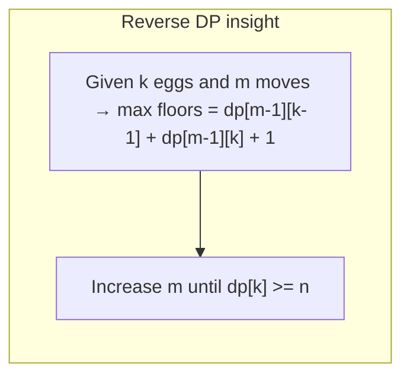

# LeetCode 887. Super Egg Drop（鸡蛋掉落） — **困难**

## 考点
数学, 二分搜索, 动态规划

## 题目描述
给你 k 枚相同的鸡蛋，并可以使用一栋从第 1 层到第 n 层共有 n 层楼的建筑。

已知存在楼层 f，满足 0 <= f <= n，任何从高于 f 的楼层落下的鸡蛋都会碎，从 f 楼层或比它低的楼层落下的鸡蛋都不会破。

每次操作，你可以取一枚没有碎的鸡蛋并把它从任一楼层 x 扔下（满足 1 <= x <= n）。如果鸡蛋碎了，你就不能再次使用它。如果某枚鸡蛋扔下后没有摔碎，则可以在之后的操作中重复使用这枚鸡蛋。

请你计算并返回要确定 f 确切的值的最小操作次数是多少？

**示例 1:**
```
输入：k = 1, n = 2
输出：2
解释：
鸡蛋从 1 楼掉落。如果它碎了，肯定能得出 f = 0。
否则，鸡蛋从 2 楼掉落。如果它碎了，肯定能得出 f = 1。
如果它没碎，那么肯定能得出 f = 2。
因此，在最坏的情况下我们需要移动 2 次以确定 f 是多少。
```

**示例 2:**
```
输入：k = 2, n = 6
输出：3
```

**示例 3:**
```
输入：k = 3, n = 14
输出：4
```

**约束条件:**
- 1 <= k <= 100
- 1 <= n <= 10^4

## 图解







## 解题思路

### 核心思路

**逆向思维 DP**：不直接求「k 个鸡蛋、n 层楼的最少次数」，而是求「k 个鸡蛋、m 次移动最多能确定多少层楼」。当这个值 >= n 时，m 就是答案。

### 算法步骤

1. 创建一维数组 `dp[k+1]`，初始全 0（使用滚动数组，m 递增）
2. `m = 0`
3. 循环直到 `dp[k] >= n`：
   - `m++`
   - 倒序遍历 k2 从 k 到 1：`dp[k2] = dp[k2-1] + dp[k2] + 1`
4. 返回 m

### 图解示例

```
k = 2, n = 6

m=0: dp = [0, 0, 0]    (dp[k]表示k个鸡蛋时能确定的最大楼层)

m=1: 
  dp[2] = dp[1] + dp[2] + 1 = 1  ← 2个鸡蛋1次扔, 最多确定1层
  dp[1] = dp[0] + dp[1] + 1 = 1
  dp = [0, 1, 1]

m=2:
  dp[2] = dp[1] + dp[2] + 1 = 1 + 1 + 1 = 3  (2个鸡蛋2次→3层)
  dp[1] = dp[0] + dp[1] + 1 = 0 + 1 + 1 = 2
  dp = [0, 2, 3]

m=3:
  dp[2] = dp[1] + dp[2] + 1 = 2 + 3 + 1 = 6  (2个鸡蛋3次→6层) ✓ >= 6!
  dp[1] = dp[0] + dp[1] + 1 = 0 + 2 + 1 = 3
  dp = [0, 3, 6]

dp[2]=6 >= n=6 → m=3 就是答案
```

```
策略验证 (k=2, n=6, m=3):

第1次在 3 层扔:
  如果碎了: 只剩1个鸡蛋, 必须从1层开始逐层测试 → 最多2次 (层1,2) 共3次
  如果没碎: 还有2个鸡蛋和2次机会, 从5层扔
    - 碎了: 剩1蛋, 测试第4层
    - 没碎: 剩2蛋, 测试第6层

总策略能覆盖: 1,2,3,4,5,6 层 ✓
```

### 逐步追踪

以 `k = 3, n = 14` 为例：

| m | dp[3]=dp[2]+dp[3]+1 | dp[2]=dp[1]+dp[2]+1 | dp[1]=dp[0]+dp[1]+1 | dp[3] >= 14? |
|---|---------------------|---------------------|---------------------|-------------|
| 0 | 0 | 0 | 0 | N |
| 1 | 0+0+1=1 | 0+0+1=1 | 0+0+1=1 | N |
| 2 | 1+1+1=3 | 1+1+1=3 | 0+1+1=2 | N |
| 3 | 3+3+1=7 | 2+3+1=6 | 0+2+1=3 | N |
| 4 | 6+7+1=14 | 3+6+1=10 | 0+3+1=4 | Y |

结果 m = 4

### 边界情况

- `k = 1`：只有 1 个鸡蛋，只能从 1 层开始逐层测试 → m = n
- `n = 0`：返回 0
- `k >= log₂(n)`：可以进行二分搜索，m = ⌈log₂(n+1)⌉

### 复杂度分析

- **时间复杂度**：O(k × m)，m 是答案（≤ n）
- **空间复杂度**：O(k)

### 方法对比

| 方法 | 时间复杂度 | 空间复杂度 | 说明 |
|------|-----------|-----------|------|
| 逆向 DP（m → 楼层） | O(k·m) | O(k) | 最优，适合 n 大的情况 |
| 正向 DP（楼层 → m） | O(k·n) | O(k·n) | 直观，但 n=10^4 时 O(kn) 可行 |
| 二分 + 数学公式 | O(k·log n) | O(1) | 利用 dp 公式的数学性质二分 m |
| 决策单调性优化 | O(k·n) | O(n) | 可进一步优化到 O(k·log n) |
