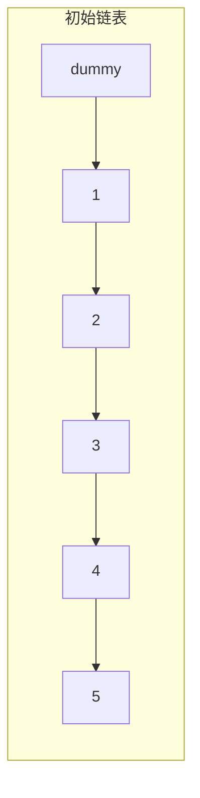
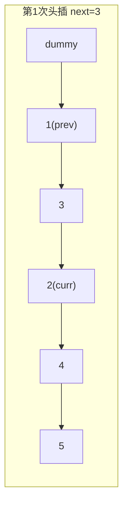
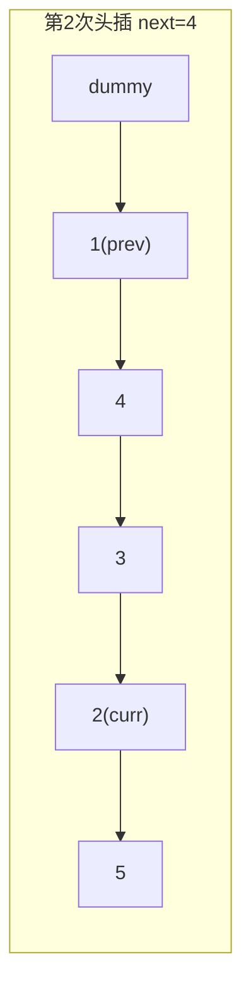
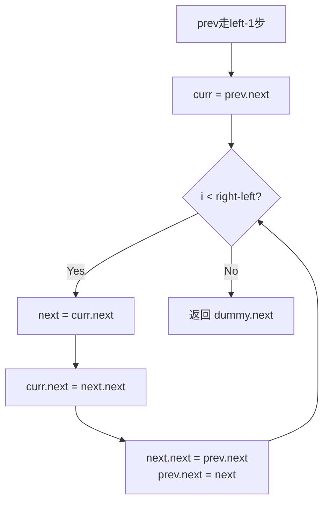

# LeetCode 92. Reverse Linked List II（反转链表 II） — **中等**

## 考点
Linked List

## 题目描述
给你单链表的头指针 `head` 和两个整数 `left` 和 `right`，其中 `left <= right`。请你反转从位置 `left` 到位置 `right` 的链表节点，返回 **反转后的链表**。

### 示例 1
```
输入：head = [1,2,3,4,5], left = 2, right = 4
输出：[1,4,3,2,5]
```

### 示例 2
```
输入：head = [5], left = 1, right = 1
输出：[5]
```

### 约束
- 链表中节点数目为 `n`
- `1 <= n <= 500`
- `-500 <= Node.val <= 500`
- `1 <= left <= right <= n`

## 图解









## 解题思路

### 核心思路

反转链表的子区间。关键是定位区间边界，然后对区间内节点进行**头插法反转**——每次将当前节点的下一个节点摘出来，插到反转区间的头部（即 `prev` 后面）。这样经过 `right - left` 次操作，区间内的节点顺序就被反转了。

### 方法一：头插法（穿针引线）

**算法步骤：**

1. 创建哑节点 `dummy`，`dummy.next = head`。
2. `prev = dummy`，向前走 `left - 1` 步，使 `prev` 指向待反转区间的前驱。
3. `curr = prev.next`（待反转区间的第一个节点，反转后会变成最后一个）。
4. 循环 `right - left` 次：
   - `next = curr.next`（当前要头插的节点）。
   - `curr.next = next.next`（从链中摘除 `next`）。
   - `next.next = prev.next`（将 `next` 接到区间头部）。
   - `prev.next = next`（更新区间头部指针）。
5. 返回 `dummy.next`。

**图解示例：**

```
初始: head = [1 → 2 → 3 → 4 → 5], left=2, right=4

dummy → 1 → 2 → 3 → 4 → 5
         ↑    ↑
        prev curr

目标: 反转 [2,3,4] → [4,3,2]

--- 第1次头插 (next = curr.next = 3) ---
步骤:
  摘除 3: curr(2).next = 3.next = 4
  3 插到头部: 3.next = prev.next(2)
  prev.next = 3

dummy → 1 → 3 → 2 → 4 → 5
         ↑        ↑
        prev     curr(2)

--- 第2次头插 (next = curr.next = 4) ---
步骤:
  摘除 4: curr(2).next = 4.next = 5
  4 插到头部: 4.next = prev.next(3)
  prev.next = 4

dummy → 1 → 4 → 3 → 2 → 5
         ↑            ↑
        prev         curr(2)

循环 2 次完成 (right - left = 2)

结果: [1 → 4 → 3 → 2 → 5]
```

**逐步追踪：**

```
链表:  1 → 2 → 3 → 4 → 5
       0    1    2    3    4  (索引, 0-indexed)

初始化:
  dummy → 1 → 2 → 3 → 4 → 5
  prev 走 left-1=1 步:  prev → 1
  curr = prev.next = 2

操作1 (i=0 of right-left=2):
  next = curr.next = 3
  curr.next = next.next → 2.next = 4, 链表: 1→2→4→5 (3 被摘出)
  next.next = prev.next → 3.next = 2
  prev.next = 3 → 1.next = 3
  链表变: 1→3→2→4→5

操作2 (i=1 of right-left=2):
  next = curr.next → 4 (curr 仍是 2)
  curr.next = next.next → 2.next = 5
  next.next = prev.next → 4.next = 3
  prev.next = 4 → 1.next = 4
  链表变: 1→4→3→2→5

完成, 返回 dummy.next = 1→4→3→2→5
```

**边界情况：**

| 情况 | 处理方式 |
|------|---------|
| left == right | 无需反转，循环执行 0 次，直接返回原链表 |
| left == 1 | 哑节点确保 `prev` 不为空 |
| right == n (末尾) | `curr.next` 最终指向 null，无问题 |
| 单节点链表 | left==right==1，直接返回 |
| 区间大小=2 | 只需一次头插（标准相邻交换） |

### 方法二：截断 → 反转 → 拼接

找到区间，截断成三部分，中间部分用标准反转，再拼接回去。

**复杂度分析：**

| 方法 | 时间复杂度 | 空间复杂度 |
|------|-----------|-----------|
| 头插法（一次遍历） | O(n) | O(1) |
| 截断 + 反转 + 拼接 | O(n) | O(1) |
| 递归 | O(n) | O(n)（递归栈） |

**关键点：**

- `curr` 在整个头插过程中保持不变（始终指向区间反转后的最后一个节点）。
- 操作顺序不能乱：必须先摘除 `next`，再插入头部。
- 头插的次数 = `right - left`，不是 `right - left + 1`。
