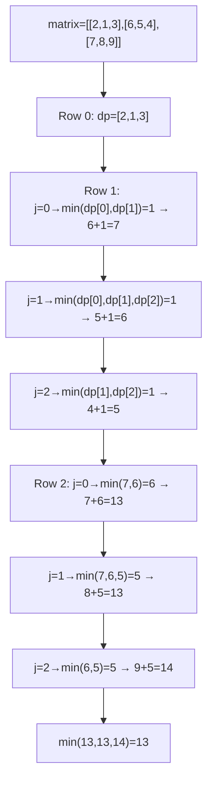
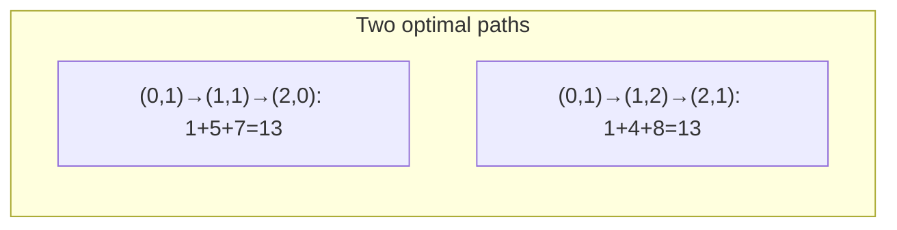
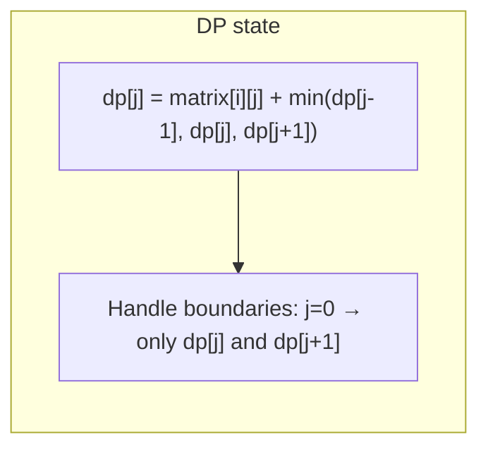

# LeetCode 931. Minimum Falling Path Sum（下降路径最小和） — **中等**

## 考点
数组, 动态规划, 矩阵

## 题目描述
给你一个 n x n 的方形整数数组 matrix，请你找出并返回通过 matrix 的下降路径的最小和。

下降路径可以从第一行中的任何元素开始，并从每一行中选择一个元素。在下一行选择的元素和当前行所选元素最多相隔一列（即位于正下方或沿对角线向左/向右移动一列）。具体来说，位置 (row, col) 的下一个元素应当是 (row + 1, col - 1)、(row + 1, col) 或者 (row + 1, col + 1)。

**示例 1:**
```
输入：matrix = [[2,1,3],[6,5,4],[7,8,9]]
输出：13
解释：如图所示，有两种下降路径的最小和（除了此例）：[1,5,7] 和 [1,4,8]。
```

**示例 2:**
```
输入：matrix = [[-19,57],[-40,-5]]
输出：-59
解释：如图所示，和最小的下降路径是 [-19,-40]，和为 -59。
```

**约束条件:**
- n == matrix.length == matrix[i].length
- 1 <= n <= 100
- -100 <= matrix[i][j] <= 100

## 图解







## 解题思路

### 核心思路

**矩阵路径 DP**。从第一行任意列出发，每步只能向下、左下或右下移动。`dp[i][j]` 表示到达 `(i, j)` 的下降路径最小和。最终取最后一行的最小值。

### 算法步骤

1. 获取 n × n 矩阵
2. 定义 `dp[j]`（滚动数组）：到达当前行的第 j 列的最小路径和
3. 初始化 `dp[j] = matrix[0][j]`（第一行）
4. 对于 i 从 1 到 n-1：
   - 创建 `newDp[n]`
   - 对于 j 从 0 到 n-1：
     - `prevMin = dp[j]`（正下方）
     - `prevMin = min(prevMin, j>0 ? dp[j-1] : INF)`
     - `prevMin = min(prevMin, j<n-1 ? dp[j+1] : INF)`
     - `newDp[j] = matrix[i][j] + prevMin`
   - `dp = newDp`
5. 返回 `min(dp)`

### 图解示例

```
matrix = [[2, 1, 3],
          [6, 5, 4],
          [7, 8, 9]]

dp 递推过程:

第0行 (初始化):
  dp = [2, 1, 3]

第1行计算:
  j=0: 来源 dp[0]=2, dp[1]=1 → min=1
       newDp[0] = 6 + 1 = 7
       path: (0,1)→(1,0)  [经过1→6]
  
  j=1: 来源 dp[0]=2, dp[1]=1, dp[2]=3 → min=1
       newDp[1] = 5 + 1 = 6
       path: (0,1)→(1,1)  [经过1→5]
  
  j=2: 来源 dp[1]=1, dp[2]=3 → min=1
       newDp[2] = 4 + 1 = 5
       path: (0,1)→(1,2)  [经过1→4]
  
  newDp = [7, 6, 5]

第2行计算:
  j=0: 来源 newDp[0]=7, newDp[1]=6 → min=6
       dp[0] = 7 + 6 = 13
       path: (0,1)→(1,1)→(2,0) [1→5→7]
  
  j=1: 来源 7,6,5 → min=5
       dp[1] = 8 + 5 = 13
       path: (0,1)→(1,2)→(2,1) [1→4→8]
  
  j=2: 来源 6,5 → min=5
       dp[2] = 9 + 5 = 14
       path: (0,1)→(1,2)→(2,2) [1→4→9]

结果: min(13, 13, 14) = 13
路径: [1, 5, 7] 或 [1, 4, 8]
```

```
可视化两条最优路径:

  [2] [1] [3]           [2] [1] [3]
   ↓   ↓                   ↓ ↘
  [6] [5] [4]           [6] [5] [4]
   ↓                       ↓
  [7] [8] [9]           [7] [8] [9]

  1→5→7 = 13           1→4→8 = 13
```

### 逐步追踪

| 行 | j | matrix[i][j] | dp[j-1] | dp[j] | dp[j+1] | prevMin | newDp[j] |
|----|---|-------------|---------|-------|---------|---------|----------|
| 0 | 0 | 2 | - | - | - | - | 2 |
| 0 | 1 | 1 | - | - | - | - | 1 |
| 0 | 2 | 3 | - | - | - | - | 3 |
| 1 | 0 | 6 | - | 2 | 1 | 1 | 7 |
| 1 | 1 | 5 | 2 | 1 | 3 | 1 | 6 |
| 1 | 2 | 4 | 1 | 3 | - | 1 | 5 |
| 2 | 0 | 7 | - | 7 | 6 | 6 | 13 |
| 2 | 1 | 8 | 7 | 6 | 5 | 5 | 13 |
| 2 | 2 | 9 | 6 | 5 | - | 5 | 14 |

### 边界情况

- `n = 1`：返回 `matrix[0][0]`
- 第一列/最后一列只有两个合法来源（少一个邻居）
- 负数元素：算法依然正确，取 min 会自动处理

### 复杂度分析

- **时间复杂度**：O(n²)
- **空间复杂度**：O(n)，使用滚动数组

### 方法对比

| 方法 | 时间复杂度 | 空间复杂度 | 说明 |
|------|-----------|-----------|------|
| 滚动 DP | O(n²) | O(n) | 最优 |
| 原地修改 DP | O(n²) | O(1) | 直接在 matrix 上修改 |
| 二维 DP | O(n²) | O(n²) | 直观但空间浪费 |
| 自底向上 DP | O(n²) | O(n) | 从最后一行往前推 |
