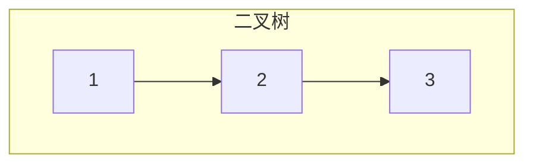
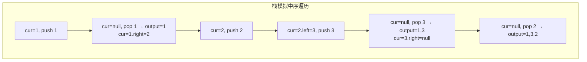
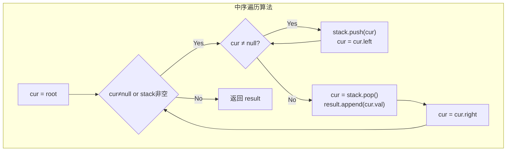

# LeetCode 94. Binary Tree Inorder Traversal（二叉树的中序遍历） — **简单**

## 考点
Stack, Tree, DFS, Binary Tree

## 题目描述
给定一个二叉树的根节点 `root`，返回它的 **中序** 遍历。

### 示例 1
```
输入：root = [1,null,2,3]
输出：[1,3,2]
```

### 示例 2
```
输入：root = []
输出：[]
```

### 示例 3
```
输入：root = [1]
输出：[1]
```

### 约束
- 树中节点数目在范围 `[0, 100]` 内
- `-100 <= Node.val <= 100`

## 图解







## 解题思路

### 核心思路

中序遍历的顺序是：**左子树 → 根节点 → 右子树**。递归实现非常直观；迭代实现需要用栈来模拟递归调用的"回到上一级"的行为——先将左子链全部入栈，弹出栈顶即为应该访问的节点，再转向其右子树。

### 方法一：DFS 递归

**算法步骤：**

1. 定义 `result = []`。
2. 递归函数 `inorder(node)`：
   - 若 `node == null`，返回。
   - `inorder(node.left)`。
   - `result.append(node.val)`。
   - `inorder(node.right)`。
3. 调用 `inorder(root)`，返回 `result`。

### 方法二：迭代（栈模拟）

**算法步骤：**

1. 初始化 `stack = []`，`result = []`，`cur = root`。
2. 当 `cur != null 或 stack 非空`：
   - 内层循环：`while (cur != null)`: `stack.push(cur); cur = cur.left`
     （沿着左子树一路到底，节点全部入栈）。
   - `cur = stack.pop()`，`result.append(cur.val)`。
   - `cur = cur.right`（转向右子树）。
3. 返回 `result`。

**图解示例：**

```
二叉树:
      1
       \
        2
       /
      3

中序遍历步骤:

栈模拟过程:
  cur=1: 1入栈, cur=1.left=null
  pop 1 → result=[1], cur=1.right=2
  cur=2: 2入栈, cur=2.left=3
  cur=3: 3入栈, cur=3.left=null
  pop 3 → result=[1,3], cur=3.right=null
  pop 2 → result=[1,3,2], cur=null
结束, 返回 [1,3,2]
```

**另一棵树的中序遍历图解：**

```
       F
     /   \
    B     G
   / \     \
  A   D     I
     / \   /
    C   E H

中序遍历结果: A B C D E F G H I
(左 → 根 → 右, 有序输出, BST 特性)

栈可视化:
  入栈阶段                      访问阶段
  F            
  F B          
  F B A        
  F B           → pop A
  F B D         
  F B D C       
  F B D         → pop C
  F B D         → pop D (访问了C后)
  F B D E
  F B D         → pop E
  F B           → pop D
  F             → pop B
  (空)          → pop F
  G             
  (空)          → pop G
  G I           
  G I H
  G I           → pop H
  G             → pop I
```

**逐步追踪（以 `[4,2,6,1,3,5,7]` 的 BST 为例）：**

```
       4
     /   \
    2     6
   / \   / \
  1   3 5   7

栈迭代:
  cur=4: push 4, cur→2
  cur=2: push 2, cur→1
  cur=1: push 1, cur→null
  pop 1 → result=[1], cur=1.right=null
  pop 2 → result=[1,2], cur=3
  cur=3: push 3, cur→null
  pop 3 → result=[1,2,3], cur=null
  pop 4 → result=[1,2,3,4], cur=6
  cur=6: push 6, cur→5
  cur=5: push 5, cur→null
  pop 5 → result=[1,2,3,4,5], cur=null
  pop 6 → result=[1,2,3,4,5,6], cur=7
  cur=7: push 7, cur→null
  pop 7 → result=[1,2,3,4,5,6,7], cur=null

结果: [1, 2, 3, 4, 5, 6, 7]  (BST 中序遍历就是升序)
```

**边界情况：**

| 情况 | 处理方式 |
|------|---------|
| 空树 | 返回 []（递归直接返回，迭代不进入循环） |
| 单节点树 | 递归/迭代各执行一次访问 |
| 左斜树（链表） | 栈深度 = n，所有节点依次入栈再出栈 |
| 右斜树（链表） | 每次入一个，出栈后转向右 |
| 完全二叉树 | 栈最大深度 = log(n+1) |

### 方法三：Morris 遍历（O(1) 空间）

利用叶子节点的空闲指针（线索化），避免使用额外空间。找到前驱节点后将 `right` 指针指向当前节点建立临时的返回路径。

**复杂度分析：**

| 方法 | 时间复杂度 | 空间复杂度 |
|------|-----------|-----------|
| 递归 | O(n) | O(h) ≈ O(n) 最坏 |
| 迭代（栈） | O(n) | O(h) ≈ O(n) 最坏 |
| Morris | O(n) | O(1) |

**关键点：**

- 迭代法的精髓是「左链入栈」：沿着左子树一直走到底，弹出就意味着向左已经遍历完了。
- 中序遍历 BST 的结果是有序的，这是验证 BST 的重要方法。
- 递归写法最简洁，但迭代写法面试常考。
