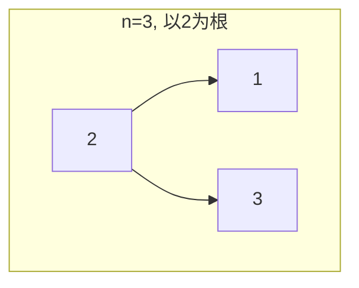
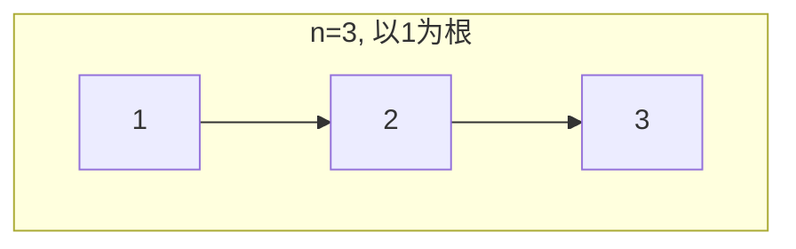
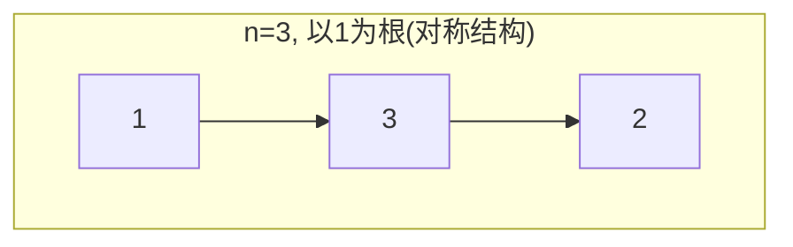
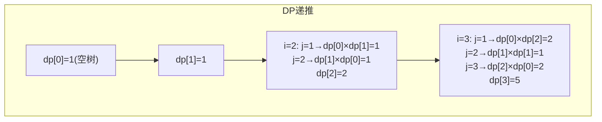

# LeetCode 96. Unique Binary Search Trees（不同的二叉搜索树） — **中等**

## 考点
Tree, BST, Math, Dynamic Programming, Binary Tree

## 题目描述
给你一个整数 `n`，求恰由 `n` 个节点组成且节点值从 `1` 到 `n` 互不相同的 **二叉搜索树** 有多少种？返回满足题意的二叉搜索树的种数。

### 示例 1
```
输入：n = 3
输出：5
```

### 示例 2
```
输入：n = 1
输出：1
```

### 约束
- `1 <= n <= 19`

## 图解









## 解题思路

### 核心思路

BST 的性质：对于有序序列 `[1, 2, ..., n]`，选择任意元素 `k` 作为根，则：
- 左子树由 `k-1` 个较小元素 `[1, ..., k-1]` 组成。
- 右子树由 `n-k` 个较大元素 `[k+1, ..., n]` 组成。

设 `dp[n]` = n 个节点能组成的 BST 结构数，那么：
`dp[n] = Σ(k=1..n) dp[k-1] * dp[n-k]`

这正好是卡特兰数（Catalan Number）的定义。

### 方法一：动态规划

**算法步骤：**

1. 初始化 `dp[0] = 1`（空树有 1 种结构），`dp[1] = 1`。
2. 外层循环 `i = 2` 到 `n`（节点数）：
   - 内层循环 `j = 1` 到 `i`（以 j 为根）：
     - `dp[i] += dp[j-1] * dp[i-j]`。
3. 返回 `dp[n]`。

**图解示例：**

```
n = 3, 节点值 {1, 2, 3}

以 1 为根:
  左子树: [] (0个节点, dp[0]=1 种)
  右子树: {2,3} (2个节点, dp[2]=2 种)
  组合: 1 × 2 = 2 种
  结构:
    1          1
     \          \
      2          3
       \        /
        3      2

以 2 为根:
  左子树: {1} (1个节点, dp[1]=1 种)
  右子树: {3} (1个节点, dp[1]=1 种)
  组合: 1 × 1 = 1 种
  结构:
      2
     / \
    1   3

以 3 为根:
  左子树: {1,2} (2个节点, dp[2]=2 种)
  右子树: [] (0个节点, dp[0]=1 种)
  组合: 2 × 1 = 2 种
  结构:
    3          3
   /          /
  1          2
   \        /
    2      1

总计: dp[3] = 2 + 1 + 2 = 5
```

**逐步追踪（DP 表格）：**

```
n=4

dp[0] = 1
dp[1] = 1

i=2:
  j=1: dp[1]*dp[0] = 1*1 = 1
  j=2: dp[0]*dp[1] = 1*1 = 1
  dp[2] = 2

i=3:
  j=1: dp[1]*dp[2] = 1*2 = 2
  j=2: dp[0]*dp[1] = 1*1 = 1
  j=3: dp[2]*dp[0] = 2*1 = 2
  dp[3] = 5

i=4:
  j=1: dp[1]*dp[3] = 1*5 = 5
  j=2: dp[0]*dp[2] = 1*2 = 2
  j=3: dp[2]*dp[0] = 2*1 = 2
  j=4: dp[3]*dp[1] = 5*1 = 5
  dp[4] = 14

n    : 0  1  2  3   4   5    6    7     8     9     10
dp[n]: 1  1  2  5  14  42  132  429  1430  4862  16796
```

**边界情况：**

| 情况 | 处理方式 |
|------|---------|
| n = 1 | dp[1] = 1，单独节点 |
| n = 0 | dp[0] = 1（空树，仅数学意义） |
| n = 19 | dp[19] 很大但仍在 int 范围内（约 1.7×10^9） |
| n 超出 19 | 需要大整数处理 |

### 方法二：数学公式（卡特兰数通项公式）

`C_n = C(2n, n) / (n + 1) = (2n)! / ((n+1)! * n!)`

可以直接用组合数计算，O(n) 时间，O(1) 空间。但需要注意整数溢出（n 较大时需用 long）。

### 方法三：递推公式优化

卡特兰数也有递推关系（O(n) 时间）：
`C_{n+1} = C_n * 2(2n+1) / (n+2)`

**复杂度分析：**

| 方法 | 时间复杂度 | 空间复杂度 |
|------|-----------|-----------|
| DP 二维 | O(n²) | O(n) |
| 卡特兰通项公式 | O(n) | O(1) |
| 卡特兰递推 | O(n) | O(1) |

**关键点：**

- 节点值具体是什么不重要（只要是连续的 n 个数），只关心「有多少种结构」。
- `dp[0] = 1` 是合理的，因为空树也是一种合法的 BST 结构（方便递推）。
- 这是典型的「将一个问题分解为左右两个独立子问题」的思路——左子树的形状和右子树的形状是独立的，所以是笛卡尔积（乘法）。
